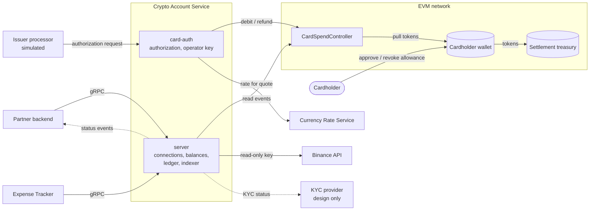

# BRD — Crypto Account Service (CAS)

## 1. Document Overview

- **Document Owner:** Igor (DigitLock)
- **Date / Version:** 2026-10-03 / 0.9, pre-approved
- **Related Initiatives / Projects:** Currency Rate Service (CRS), Expense Tracker (ET)
- **Main Stakeholders:** see §5
- **Project type:** reference implementation. Card spend runs on test networks only. Exchange access is read-only.

---

## 2. Executive Summary

- **What:** a backend service that
  - gives consuming systems one view of a user's crypto accounts: exchange accounts and self-custody wallets;
  - lets a card program charge a self-custody wallet without taking custody of the funds.
- **Why:**
  - A non-custodial card must answer a card authorization within seconds, over funds the issuer does not hold.
  - Every exchange and chain exposes account data differently. Consumers should integrate once.
- **Value:**
  - The cardholder keeps custody. The platform can move only approved amounts, and only from the wallet to the settlement treasury.
  - One canonical ledger for exchange and on-chain operations.
  - Several partners run on one platform as isolated tenants.

---

## 3. Business Context

- **General business goal:** provide the core of a B2B crypto card platform. A partner launches a card program, the cardholder pays in fiat, the matching token amount is debited from the cardholder's own wallet.
- **Problem or opportunity:**
  - Card authorization is synchronous; on-chain settlement is asynchronous. Between the balance check and the debit the user can spend the funds or revoke the allowance, and a chain reorganization can revert the debit.
  - Exchange APIs differ in request signing, rate limiting and history format.
  - Crypto holdings are missing from the user's financial picture in ET.
- **Market or regulatory factors:**
  - Two non-custodial card patterns exist: a token allowance on a regular wallet (e.g. MetaMask Card) and a smart account with spending modules (e.g. Gnosis Pay). CAS implements the first and documents the second (ADR-9).
  - Card issuance requires KYC. CAS consumes a KYC status from an external provider and stores no personal data.
- **Impact on existing systems:**
  - CRS stays the only source of rates. CAS consumes them.
  - ET becomes a consumer of balances (milestone E1). Its transaction model does not change.

---

## 4. Objectives and Goals

Time bound: each goal is met when its milestone ships (§7.3).

| ID | Goal | KPI / Metric | Expected Benefit | Priority |
|---|---|---|---|---|
| G-1 | Authorize card payments against a self-custody wallet and settle them on-chain (S2) | End-to-end authorization on a public testnet; decision p95 ≤ 2 s | Shows the non-custodial model fits card timing | High |
| G-2 | Exclude double debits (S2) | 0 duplicate debits in replay, restart and concurrency tests | Money safety | High |
| G-3 | Hold no user funds and no excess privileges (S1, X1) | Contract token balance = 0; 0 keys with trade, withdrawal or transfer rights accepted; 0 secrets in logs | Minimal damage if any component is compromised | High |
| G-4 | Keep one ledger for exchange and on-chain data (S3, X2) | 0 schema changes when the second source type is added; 0 duplicates on repeated sync | Consumers integrate once | High |
| G-5 | Show exchange holdings to consumers (X1) | Binance spot, funding and Earn balances equal the exchange UI | Complete financial picture in ET | Medium |
| G-6 | Be ready for partners (C1) | Tenant isolation test passes; partner flows specified | Supports the B2B model | Medium |

---

## 5. Stakeholders

| Name | Department / Role | Responsibility / Interest | Influence |
|---|---|---|---|
| Igor (DigitLock) | Product owner, analyst, developer | Requirements, design, delivery | High |
| Partner | Card program operator (tenant) | Launches a card program through the API; receives status notifications | High |
| Cardholder | End user, wallet owner | Grants and revokes the allowance; pays by card | High |
| Issuer processor | External, simulated | Sends authorization requests; expects a decision within its time budget | High |
| Settlement treasury | Issuer finance | Receives debited tokens; reconciles them with fiat clearing | Medium |
| Expense Tracker | Consumer system | Reads balances and ledger | Medium |
| Currency Rate Service | Supplier system | Provides rates for quotes and valuation | Low |
| KYC provider | External, design only | Provides KYC status before wallet binding | Low |

---

## 6. Current State (As-Is)

- CRS serves fiat rates. ET tracks fiat accounts (RSD, EUR, USD). No service handles crypto accounts.
- Exchange holdings are checked manually in the exchange UI.
- No component can charge a self-custody wallet for a card payment.
- No shared model exists for operations coming from exchanges and from chains.

---

## 7. Future State (To-Be)

### 7.1 Context

Solution overview with the flow of funds. C4 diagrams: [context](c4/context.md), [containers](c4/container.md).

### 7.2 Key changes

- Consumers read balances and the ledger of all connected accounts through one gRPC API.
- A card authorization is answered in real time and settled by an on-chain debit from the cardholder's wallet to the settlement treasury.
- The cardholder controls the exposure: allowance cap, revocation at any time.
- On-chain debits and refunds land in the same ledger as exchange operations.
- Partners are isolated tenants.

### 7.3 Milestones

Tracks S and X are independent of each other and can run in parallel. Both build on C1; S1 depends on nothing.

| ID | Content | Depends on |
|---|---|---|
| C1 | Core: tenants, connections, encrypted secrets, gRPC API, CI | — |
| S1 | Contracts `CardSpendController` and `MockUSDC`, tests on a local chain | — |
| S2 | `card-auth`: end-to-end authorization locally, then on Base Sepolia | S1, C1 |
| S3 | Event indexer into the ledger; reconciliation | S2, C1 |
| X1 | Binance balances: spot, funding, Earn; key permission check; rate limiter | C1 |
| X2 | Binance ledger: deposits, withdrawals, trades, fees, conversions, rewards; backfill and incremental sync; completeness check | X1 |
| W1 | Real-time triggers: Binance account events start the sync at once | X2 |
| X3 | Second exchange; selection criterion: public test environment | X2 |
| X4 | Kraken | X3 |
| E1 | ET shows crypto balances valued with CRS rates | X1 |

### 7.4 Dependencies

- CRS: rates for quotes, from the authorization currency to USD.
- EVM RPC provider: reads, transaction submission, event logs.
- Binance API: account data.

---

## 8. Business Requirements

| ID | Requirement | Description | Priority | Milestone | Acceptance Criteria |
|---|---|---|---|---|---|
| BR-1 | Connect account sources | The system must let a tenant register exchange accounts (API key) and self-custody wallets (address + network) for an owner. | Must | C1 | A connection of each type can be created, listed and deleted through the API. |
| BR-2 | Least-privilege keys | The system must accept only read-only exchange keys. | Must | X1 | A key with trade, withdrawal or transfer permission is rejected at creation. |
| BR-3 | Balances | The system must provide current balances per connection, including Earn products, with a staleness flag. | Must | X1 | Balances equal the source at snapshot time. When sync fails, the last value is still returned; it is marked stale once it is older than the allowed age. |
| BR-4 | Unified ledger | The system must provide the operation history of all sources in one canonical model. | Must | X2, S3 | Deposits, withdrawals, trades, fees, rewards, card debits and refunds are returned by one query. A repeated sync adds 0 duplicates. |
| BR-5 | Extensibility | The system must allow adding a source without changes to the ledger model or the sync engine. | Should | X3 | The second exchange passes the shared connector test suite. The change set is its adapter and seed data only. |
| BR-6 | Non-custodial spend | The system must debit card payments directly from the cardholder's wallet to the settlement treasury and never hold user funds. | Must | S1, S2 | Contract token balance is 0 after every operation. After the cardholder revokes the allowance, the next authorization is declined. |
| BR-7 | Real-time authorization | The system must return approve or decline within the processor's time budget. | Must | S2 | Decision p95 ≤ 2 s on testnet. No decision within the deadline (default 2.5 s) → decline. |
| BR-8 | No double debit | The system must debit once per authorization, whatever the number of retries. | Must | S1, S2 | The same authorization ID sent N times produces one on-chain debit. The service and the contract enforce this independently. |
| BR-9 | Spending controls | The system must enforce daily limits per card and per wallet, a card freeze and an emergency pause. | Must | S1, S2 | A debit above the limit is declined. While paused, all authorizations are declined. |
| BR-10 | Reversals and refunds | The system must return funds fully or partially, up to the debited amount. | Must | S1, S2 | Total refunds ≤ debit. A repeated refund ID causes no second transfer. |
| BR-11 | Fiat-to-token quote | The system must convert the fiat authorization amount into a token amount using CRS rates plus a buffer. | Must | S2 | The quote is stored with the authorization. A stale rate → decline. |
| BR-12 | Reconciliation | The system must match every approved authorization to exactly one on-chain debit event, and every debit event to an authorization. | Should | S3 | The report lists unmatched items. A debit event without an authorization raises an alert. |
| BR-13 | Tenant isolation | The system must keep partners' data separate. | Must | C1 | A token of tenant A cannot read or change data of tenant B. |
| BR-14 | Partner notifications | The system must notify partner systems of authorization outcomes and settlement status changes. | Could | Design only | Each status change is delivered at least once as a signed event with a unique event ID. |
| BR-15 | Wallet binding | The system must link a card to a wallet only after proof of wallet ownership and a passed KYC check. | Could | Design only | Binding is rejected without a valid wallet signature (SIWE) or when the KYC status is not `approved`. |

---

## 9. Functional and Non-Functional Needs

### 9.1 Functional Needs

- **Accounts:** connection management, key permission check, asset code mapping.
- **Sync:** polling with cursors, backfill and incremental modes, health per connection; real-time events as triggers.
- **Ledger:** normalization into the canonical model, idempotent import.
- **Card spend:** limits → quote → on-chain read → debit → confirmations; authorization state machine; reversal, refund. Design only: incremental authorization, clearing with a different amount.
- **On-chain:** spend contract, event indexer, reconciliation.
- **Integrations:**
  - Binance REST, signed requests;
  - EVM JSON-RPC;
  - CRS gRPC;
  - issuer processor, simulated;
  - partner webhooks and KYC provider, design only.

### 9.2 Non-Functional Needs

- **Performance:** authorization decision p95 ≤ 2 s; deadline 2.5 s → decline. The deadline is set per processor: the default fits a 3 s budget (Marqeta JIT Funding); a 2 s budget (Stripe Issuing) needs a lower value.
- **Reliability:**
  - authorization is fail-closed when the RPC or the rate source is unavailable;
  - sync resumes from its cursor after a restart;
  - a failed sync never fails a read: the last balance is returned and marked stale once it is too old.
- **Security:**
  - exchange secrets are encrypted at rest and never appear in logs, errors or API responses;
  - the operator key lives only in the `card-auth` process;
  - one service token per tenant, not shared with other services.
- **Money precision:** decimal or integer base units end to end; amounts are strings in the API.
- **Audit:** the raw source payload is stored with each ledger entry; authorization status history is append-only.
- **Rate limits:** the limiter is in place before the first live exchange call.
- **Environments:** local chain and Base Sepolia only, no mainnet; exchange testnet and recorded fixtures for the public demo; real balances never appear in the demo.
- **Compliance:** no personal data in CAS; the owner is an opaque reference.

---

## 10. Risks and Dependencies

| Risk | Impact | Probability | Mitigation |
|---|---|---|---|
| Funds move or the allowance is revoked between the check and the debit | High | Medium | Approve only after the debit transaction is preconfirmed or included in a block; deadline → decline (ADR-12) |
| The debit is included after the decline deadline | High | Low | On-chain debit expiry bounds the window; automatic refund of a late debit; alert (ADR-9, ADR-12) |
| A chain reorganization reverts an included debit | High | Low | The final status is set only by the finality rule of the network; the indexer reads final blocks only |
| The operator key is compromised | High | Low | Tokens can move only wallet → treasury, or back as refunds of existing debits; daily limit and allowance cap bound the loss; pause; key isolated in `card-auth` |
| An unlimited allowance exposes the cardholder's whole token balance | High | Medium | Capped allowance as the default recommendation; daily limit in the contract |
| An operator transaction is stuck or gas spikes | Medium | Medium | Nonce persisted before send; replacement with the same nonce; timeout → decline |
| The RPC provider is unavailable | Medium | Medium | Fail-closed decline; fallback RPC endpoint |
| The stablecoin loses its peg or the rate is stale | Medium | Low | Stale rate → decline. A depeg is an accepted risk in v1: the quote assumes 1 token = 1 USD |
| The exchange bans the IP after a rate-limit breach | Medium | Low | Weight budget read from response headers; back off on HTTP 429 |
| The Binance testnet does not serve wallet, Earn and key-permission endpoints | Medium | High | Recorded fixtures and a shared connector test suite; verification on a read-only real account |
| Trades on delisted pairs are missed (trade history is per pair) | Low | Medium | Documented limitation; file import as a later option |
| The scope is wider than one person's capacity | Medium | High | `Design only` tags; independent milestones per track |

---

## 11. Expected Benefits and ROI

- **Qualitative:**
  - a working model of a non-custodial card: the user keeps custody, the issuer gets real-time authorization;
  - consumers integrate one API instead of one per exchange and chain;
  - design decisions and their trade-offs are recorded as ADRs.
- **Quantitative:** ROI is N/A — reference implementation with no revenue. Measurable outcomes are the KPIs in §4.

---

## 12. Approval and Sign-Off

N/A — single-owner project. Approval is a merge to `main`.
