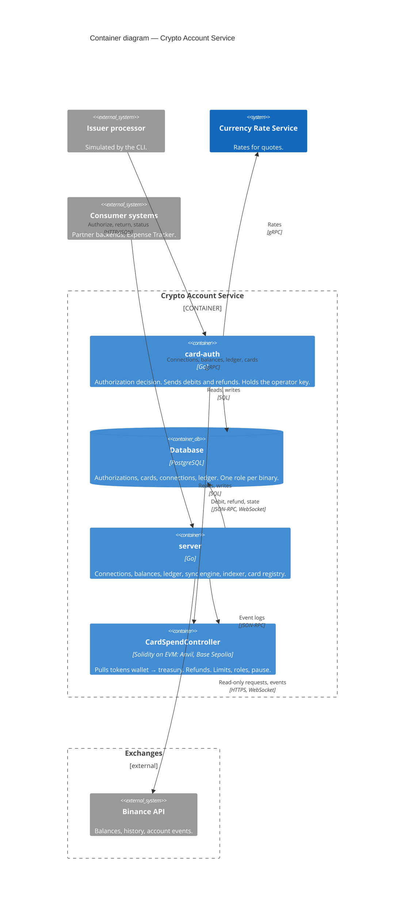

# C4 Level 2 — Containers

- Notation: C4 model, Mermaid `C4Container`. Blue: CAS containers and systems of the same owner. Grey: external systems.
- Consumer systems: partner backends and Expense Tracker, same gRPC API.
- Not drawn: `MockUSDC` (the contract moves it with `transferFrom`) and the CLI `casctl` (plays the issuer processor, runs the registry admin of tenants, tokens and processor credentials).

## Containers

| Container | Technology | Responsibility | Secrets it holds |
|---|---|---|---|
| `card-auth` | Go | Authorization decision, quote, debit and refund submission, confirmation tracking | Operator private key (env) |
| `server` | Go | Tenants, connections, card registry, balances, ledger, sync engine, event indexer, reconciliation | Master key for exchange secrets (env) |
| Database | PostgreSQL | One database, one migration set, one role per binary | Encrypted exchange secrets |
| `CardSpendController` | Solidity, deployed on the EVM network: Anvil, Base Sepolia | Pull debit to the treasury, refund, daily limit, roles, pause. Holds no tokens. | None |
| `MockUSDC` | Solidity, ERC-20, 6 decimals | Test funding token | None |
| CLI `casctl` | Go | `casctl sim authorize\|return\|get`: simulates the processor over the processor API. `casctl processor issue\|list\|revoke`, `tenant`, `token`, `source add-fake`: registry admin on the database. Signs no transaction | Owner-role connection string (env); processor password of `sim` (env) |

## Rules

- `card-auth` is the only service that writes to the chain (ADR-3). Admin transactions (limits, pause) are sent with `cast` and the separate `ADMIN` key ([Deployment Guide](../deployment-guide.md) §6); no service and no CLI of S2 holds that key.
- The processor-facing API of `card-auth` is HTTP/JSON: the processor defines the contract. Consumer APIs on `server` are gRPC (ADR-7).
- Real-time signals arrive over WebSocket: account events from Binance to `server`, preconfirmed logs from the RPC provider to `card-auth`. Stored data still comes from polling (ADR-13).
- `card-auth` and `server` use separate database roles. The `card-auth` role cannot read exchange secrets; the `server` process never sees the operator key.
- `card-auth` reads the card registry from the database, not through `server`: no extra hop inside the decision time budget.
- Contract roles: `OPERATOR` = `card-auth` key, `ADMIN` = separate key for limits and pause (ADR-9).
- Tokens can move only wallet → treasury (debit) and treasury → wallet (refund). The treasury and token addresses are fixed at deployment.
