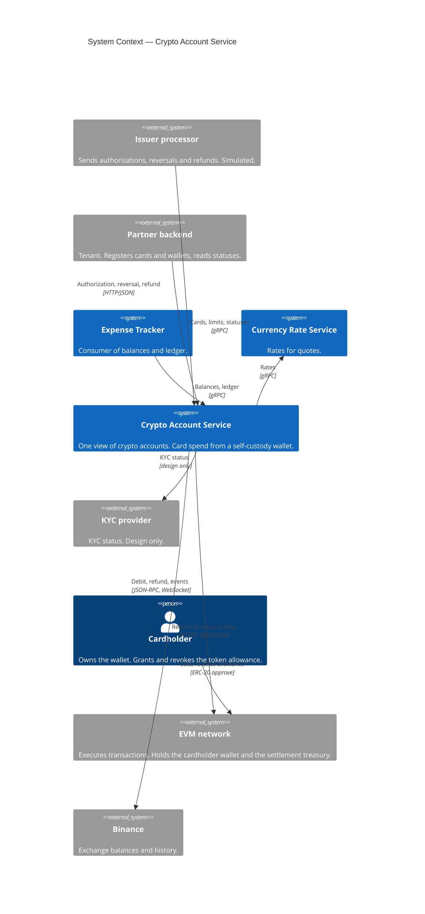

# C4 Level 1 — System Context

- Notation: C4 model, Mermaid `C4Context`. Blue: CAS and other systems of the same owner. Grey: external systems.
- Not drawn: status events from CAS to the partner backend (design only).

## Actors and systems

| Element | Type | Relationship with CAS |
|---|---|---|
| Cardholder | Person | Owns the wallet. Never calls CAS directly: acts on-chain (allowance) and through the partner's app. |
| Partner backend | External system | Tenant. Registers cards and wallets, sets limits, reads statuses. Receives status events (design only). |
| Issuer processor | External system, simulated | Sends authorizations, reversals and refunds. Sets the decision time budget. |
| Expense Tracker | System of the same owner, consumer | Reads balances and the ledger. |
| Currency Rate Service | System of the same owner, supplier | Rates for fiat-to-token quotes. |
| KYC provider | External system, design only | KYC status before a wallet is bound to a card. |
| EVM network | External system | Hosts the cardholder wallet, the spend contract and the settlement treasury. CAS submits debits and refunds and reads events. |
| Binance | External system | Source of exchange balances and history through a read-only API key. Account events over WebSocket (ADR-13). |

## Boundaries

- CAS never holds user funds and never signs for the cardholder.
- CAS never serves rates (ADR-1) and never trades or withdraws on exchanges (ADR-3).
- CAS stores no personal data: the owner is an opaque reference (ADR-7).
