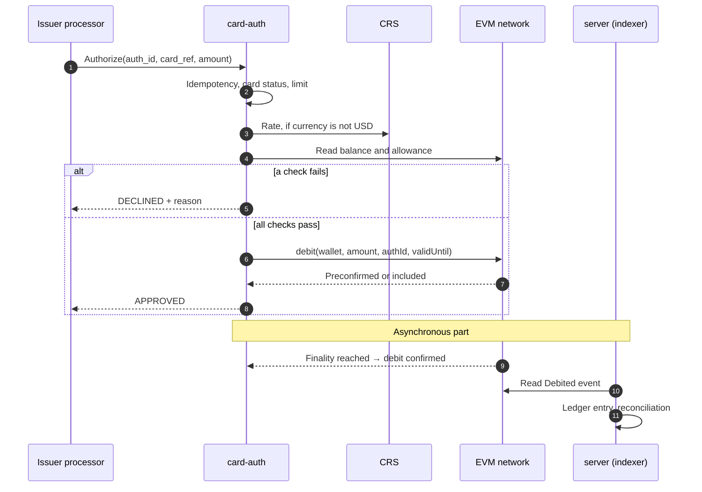

# PRD — Card Spend

## 1. Overview

- **Document Owner:** Igor (DigitLock)
- **Initiative Link:** [BRD](../brd.md)
- **Main stakeholder:** Partner (card program operator)
- **Link to architecture documentation:** [C4](../c4/), [ADR](../adr/README.md) 3, 7–13
- **Link to Rollout plan:** §4
- **Other related documents:** SRS — Card Spend (`../srs/card-spend.md`)
- **Document Version:** 1.0, 2026-10-04, approved. §5 issue 3 updated on 2026-10-05 with the provider decision of S2

---

## 2. Problem Alignment

### 2.1 Background and Objective

- A partner runs a card program for users who keep stablecoins in their own wallets.
- **Objective:** the cardholder pays at any card-accepting merchant; tokens leave the wallet only at the moment of purchase. No pre-funding, no custody.
- **Fit:** implements BR-6 … BR-12, BR-14, BR-15; relies on BR-1 and BR-13 of the core; delivers G-1, G-2, G-3 and the partner flows of G-6.

### 2.2 Problem Statement and Affected Users

| Problem | Internal or External User | User Role | Percentage of Users | Frequency |
|---|---|---|---|---|
| I want to pay by card from my wallet, but custodial cards make me pre-fund a balance I do not control. | External | Cardholder | 100% | Every top-up |
| I must answer an authorization within 2–3 s, but I cannot place a hold on a wallet I do not control. | Internal | Authorization service | n/a | Every authorization |
| The same authorization can reach the platform twice: a retry, a repeated delivery. It must not charge the cardholder twice. | External | Issuer processor | n/a | Every repeated authorization |
| I want to launch a card program without building on-chain settlement. | External | Partner | 100% | Once per program |
| I must prove that every approved card transaction is backed by exactly one on-chain movement. | Internal | Finance, reconciliation | n/a | Daily |

### 2.3 High Level Approach

- For partners running card programs
- whose cardholders keep stablecoins in self-custody wallets
- the Card Spend module
- is an authorization and on-chain settlement service
- that debits the exact purchase amount from the wallet during authorization
- unlike custodial cards, which need a pre-funded balance held by the issuer
- our solution leaves the funds with the user until the purchase and bounds what the platform can move: allowance cap, daily limit, wallet → treasury only.

### 2.4 Goals, Values, Metrics and Business Outcome

| Goal (SMART) | Measurable Metrics | Value | Business Outcome | Priority |
|---|---|---|---|---|
| No approval without secured funds (G-1, MVP) | 100% of approvals are sent after the debit is preconfirmed or included; decision p95 ≤ 2 s | Card timing is met without credit risk | The issuer does not fund purchases from its own money | High |
| One charge per payment (G-2, MVP) | 0 duplicate debits in replay, restart and concurrency tests | Cardholder trust | No manual corrections | High |
| Bounded platform power (G-3, MVP) | Contract balance = 0; tokens move only wallet → treasury and back as refunds, within allowance and daily limit | A compromised operator key has a capped effect | Lower security exposure | High |
| Money returns automatically (BR-10, MVP) | 100% of reversals and late debits are refunded without manual action | No funds stuck in the treasury | Fewer support cases | High |
| Books match the chain (BR-12, Stage 2) | 100% of debits and refunds matched to authorizations in the next indexer cycle | Provable settlement | Audit-ready records | Medium |

**Non-goals:**

- Custody or pre-funded balances — contradicts BR-6.
- Card issuing, PAN storage, PCI scope — the card is an opaque `card_ref` from the processor.
- Fiat settlement with the scheme and clearing files — simulated as API calls.
- KYC execution — only the status is consumed.
- Volatile funding assets (ETH, BTC) — v1 is stablecoin only.
- Smart-account model (Safe modules, ERC-4337) — documented alternative, not built.
- Chargeback processing — handled off-chain by the issuer; on-chain it results in a refund.
- Stand-in approvals when the chain is unavailable — fail-closed in v1.
- Mainnet.

### 2.5 Assumptions and Constraints

| Type | Description |
|---|---|
| **Assumptions** | The cardholder holds the funding token in a regular wallet (EOA) on the supported network and has approved an allowance to the spend contract. |
| | The processor calls the platform for each authorization (JIT funding pattern) and waits 2–3 s: 2 s at Stripe Issuing, 3 s at Marqeta. |
| | The processor sends a unique authorization ID. A repeated delivery of the same authorization carries the same ID. |
| | Reversals and refunds reference the original authorization. Unlinked refunds, common in real card schemes, are out of scope. |
| | The network gives a preconfirmation in ~200 ms and a block every 2 s (Base). Preconfirmation or inclusion is enough to approve; finality follows asynchronously. |
| | 1 token = 1 USD for the quote. Other currencies use the CRS rate plus a buffer. |
| | The operator pays gas. The cost is not passed to the cardholder in v1. |
| **Constraints** | Test networks and an own mock token only. |
| | ERC-20 has no hold: the user can spend or revoke at any moment before the debit. |
| | One operator key = one nonce sequence. Debits of one operator are sent in order. |
| | Every decision depends on RPC availability. |
| | No real processor: authorizations come from a simulator. |

---

## 3. Stakeholders' Requirements

### 3.1 Stakeholders and Approvers

- Stakeholders: see BRD §5.
- Approvers: N/A — single-owner project.

### 3.2 Requested Business Functions

Stage: `MVP` = milestones S1 + S2, `Stage 2` = S3, `Design only` = outlined in SRS — Card Spend §2.3.5, not built.

| ID | Role | Capability | BR | Stage |
|---|---|---|---|---|
| US-1 | Cardholder | Link my wallet to my card by signing a message, so only my wallet funds my card | BR-15 | Design only |
| US-2 | Cardholder | Set a spending cap with a token allowance and revoke it at any time | BR-6 | MVP |
| US-3 | Cardholder | Pay by card and have the exact amount debited from my wallet | BR-6, BR-7 | MVP |
| US-4 | Cardholder | Get my tokens back when a payment is reversed or refunded | BR-10 | MVP |
| US-5 | Cardholder | Never be charged twice for one payment | BR-8 | MVP |
| US-6 | Partner | Register cards and wallets of my cardholders under my tenant | BR-1, BR-13 | MVP |
| US-7 | Partner | Set a daily limit per card; freeze and unfreeze a card | BR-9 | MVP |
| US-8 | Partner | Query the status and history of an authorization | BRD §9.2 Audit | MVP |
| US-9 | Partner | Receive signed events on decision, debit confirmation and refund | BR-14 | Design only |
| US-10 | Processor | Send an authorization and receive approve or decline with a reason code within the time budget | BR-7 | MVP |
| US-11 | Processor | Send a full or partial reversal and a refund that reference the original authorization | BR-10 | MVP |
| US-12 | Processor | Send an incremental authorization and a clearing message with the final amount | BR-7, BR-10 | Design only |
| US-13 | Finance | Get a reconciliation report: authorizations ↔ on-chain events ↔ treasury balance | BR-12 | Stage 2 |
| US-14 | Platform admin | Pause the program in an emergency | BR-9 | MVP |
| US-15 | Operations | Be alerted on a late debit, a stuck transaction and low operator gas (MVP), and on an unmatched event (Stage 2) | BR-7, BR-10, BR-12 | MVP, Stage 2 |

### 3.3 Solution Alignment

#### 3.3.1 Solution Ideas

**A. Where the funds sit (ADR-9)**

| Option | Pros | Cons, risks | Verdict |
|---|---|---|---|
| Token allowance on a regular wallet: `approve` once, `transferFrom` per purchase | Standard ERC-20; works with any wallet; user revokes at any time; small contract | No hold — funds can leave before the debit; unlimited approvals are risky | **Chosen** |
| Smart account with spend and delay modules | The issuer's debit always wins the race; fine-grained limits on-chain | User must move funds to a new account; modules add attack surface; the delay slows the user's own transfers | Documented alternative |
| Pre-funded escrow contract | Funds guaranteed; simplest authorization | Custodial in effect | Rejected: breaks BR-6 |

**B. When the processor gets the answer (ADR-12)**

| Option | Latency | Cons, risks | Verdict |
|---|---|---|---|
| Approve after checks, debit asynchronously | < 1 s | The debit can fail after approval → issuer loss | Rejected |
| Approve after the debit is preconfirmed or included in a block | 0.3–2.5 s | A debit can land after the deadline; a preconfirmed debit can be dropped (rare) | **Chosen** |
| Approve after finality | Minutes | Exceeds the time budget | Rejected |

**C. When the tokens move**

| Option | Pros | Cons, risks | Verdict |
|---|---|---|---|
| Debit at authorization | Funds are secured for clearing | Reversals and lower clearing amounts need refunds | **Chosen** |
| Debit at clearing | No refunds for reversed authorizations | Funds can be gone days later → issuer loss | Rejected |

**D. Two levels of limits**

- Service level: card status and per-card daily limit — the business control.
- Contract level: per-wallet daily limit and pause — the backstop if the operator key is compromised.

#### 3.3.2 Product Flow

Critical edge cases. The full list with states is in the SRS.

| ID | Case | Expected behaviour |
|---|---|---|
| EC-1 | Same `auth_id` again, same amount | The stored decision is returned. No new debit. |
| EC-2 | Same `auth_id`, different amount | Rejected as a conflict. No debit. |
| EC-3 | Balance or allowance below the amount at read time | Decline with reason. No transaction sent. |
| EC-4 | Funds spent or allowance revoked between read and debit | The debit reverts → decline. |
| EC-5 | Debit not preconfirmed or included by the deadline | Decline. The debit carries an on-chain expiry and cannot execute after it. A stuck transaction is replaced to free the nonce. |
| EC-6 | Debit lands after the decline, before its expiry | Automatic full refund. Alert. |
| EC-7 | An approved debit is dropped (failed preconfirmation, reorg) | Resubmit with the same `authId`. If it fails: status `DEBIT_LOST`, alert, the amount is recorded as issuer exposure. |
| EC-8 | Full or partial reversal | Refund of the reversed amount. Total refunds ≤ debit. |
| EC-9 | Same refund ID again | No second transfer. |
| EC-10 | RPC or CRS unavailable, rate stale | Decline (fail-closed). |
| EC-11 | Program paused, card frozen, daily limit exceeded | Decline with reason. |
| EC-12 | The treasury cannot fund a refund | The refund stays pending and is retried. Alert. |

#### 3.3.3 System Consumers and Contributors

Who calls the authorization API:

- Chain of a card payment: cardholder → merchant → acquirer → card scheme → **issuer processor** → `card-auth`.
- The issuer processor holds the scheme connection and manages the cards. It calls `card-auth` server-to-server on every authorization and waits for approve or decline.
- Market names for this call: JIT Funding (Marqeta), real-time authorization (Stripe Issuing), EHI (Thredd).
- The processor defines the contract: HTTP and JSON. `card-auth` therefore exposes HTTP/JSON; partners and ET use gRPC on `server` (ADR-7).
- The cardholder, the merchant, the scheme and the partner never call `card-auth`.

| System | Role | Dependency |
|---|---|---|
| Issuer processor (simulated) | Sends authorizations, reversals, refunds | Sets the time budget, the API contract and the idempotency key |
| EVM network, RPC provider | Executes debits and refunds; source of events | Availability and preconfirmation behaviour drive latency |
| Currency Rate Service | Rate for non-USD authorizations | Stale rate → decline |
| CAS `server` | Card and wallet registry, indexer, ledger, reconciliation | Shares the database with `card-auth` |
| Partner backend | Registers cards, sets limits, reads statuses | Tenant token |
| KYC provider (design only) | KYC status before wallet binding | None in MVP |

#### 3.3.4 Business Risks

Platform-wide risks are in BRD §10. Card-specific additions:

| Risk | Severity | Mitigation Plan | Status | Owner |
|---|---|---|---|---|
| The clearing amount exceeds the debited amount (tips, currency conversion) and the extra debit fails | MEDIUM | Extra debit linked to the original authorization; on failure the difference is recorded as issuer exposure | TO CONFIRM | Igor |
| The treasury is swept to off-ramp and cannot fund refunds | MEDIUM | Refund float kept in the treasury; alert below a threshold | TO CONFIRM | Igor |
| The sequencer or RPC is down → every authorization is declined | MEDIUM | Fail-closed in v1; fallback RPC; stand-in limits as a later option | CONFIRMED | Igor |
| The token issuer freezes the cardholder's address | LOW | The debit reverts → decline as `DEBIT_REVERTED`. Not reproducible with the mock token (ADR-8) | CONFIRMED | Igor |
| Many small authorizations burn operator gas | LOW | Minimum authorization amount; alert on low operator balance | TO CONFIRM | Igor |
| An authorization is never cleared and the tokens stay in the treasury | MEDIUM | Expiry period, then automatic refund | TO CONFIRM | Igor |

---

## 4. Rollout Readiness

### 4.1 Stages

#### 4.1.1 MVP (S1 + S2)

1. Spend contract: debit with expiry, refund, daily limit, roles, pause, idempotency by `authId` and `refundId`.
2. HTTP/JSON authorization API for the simulated processor, modelled on JIT Funding: authorize, reverse, refund, get status.
3. Quote: USD 1:1; other currencies through CRS.
4. Decision after preconfirmation or inclusion; deadline → decline; automatic refund of a late debit.
5. Confirmation tracking up to the final status.
6. Card and wallet registry per tenant; freeze.
7. Run on a local chain, then on Base Sepolia.

#### 4.1.2 Out of MVP

- **Stage 2 (S3):** event indexer into the ledger, reconciliation report and its alerts.
- **Design only** (outlined in SRS — Card Spend §2.3.5):
  - incremental authorization, clearing with a different amount, authorization expiry;
  - partner webhooks;
  - wallet binding with SIWE and KYC status.
- **Not planned in v1:**
  - `permit` (EIP-2612) instead of a separate approve transaction (ADR-9);
  - volatile funding assets, stand-in approvals, smart-account model (non-goals, §2.4).

### 4.2 Deliverables

- Contracts with tests.
- `card-auth` binary and its API definition (OpenAPI).
- CLI that simulates the processor and runs the full cycle.
- Deployed contract addresses and transaction links on Base Sepolia.
- SRS — Card Spend; ADR 3, 7–13.

### 4.3 Operating Environment

| Environment | Chain | Purpose |
|---|---|---|
| Local | Anvil | Development, automated tests |
| Public test | Base Sepolia (chain ID 84532) | Demo, latency measurement |

- Runtime: Go service in Docker, PostgreSQL, one RPC provider plus a fallback.
- Development on a self-hosted home server; the public demo on a VPS.

---

## 5. Open Issues

| # | Issue | Contact Point | Decision |
|---|---|---|---|
| 1 | Processor-facing API: gRPC like the rest of CAS, or HTTP/JSON as real processors call it | Igor | Decided: HTTP/JSON for `card-auth` only, modelled on JIT Funding. gRPC stays for partners and ET |
| 2 | Decision deadline and target budget | Igor | Decided: p95 ≤ 2 s, deadline 2.5 s, configurable per processor |
| 3 | Access to preconfirmed data on Base Sepolia | Igor | Decided (ADR-13): WebSocket subscription through an RPC provider, with polling beside it. The public endpoints are HTTP only and rate-limited. Provider decided in S2 on 2026-10-05: Alchemy with Flashblocks, checked on the free plan (SRS §4, issue 1) |
| 4 | Finality rule for the final status | Igor | Decided: block tag `finalized` on Base Sepolia, about 20 minutes after the debit; N confirmations on the local chain (SRS — EVM Connector §2.1.1) |
| 5 | Who pays gas | Igor | Decided: the operator, v1 |
| 6 | Clearing above the debited amount | Igor | Open; out of MVP |
| 7 | Authorization expiry before automatic refund | Igor | Open; out of MVP |
| 8 | Default allowance: capped or unlimited; `permit` | Igor | Decided: a capped allowance is the recommended default (BRD §10); `permit` is not in v1 (ADR-9) |
