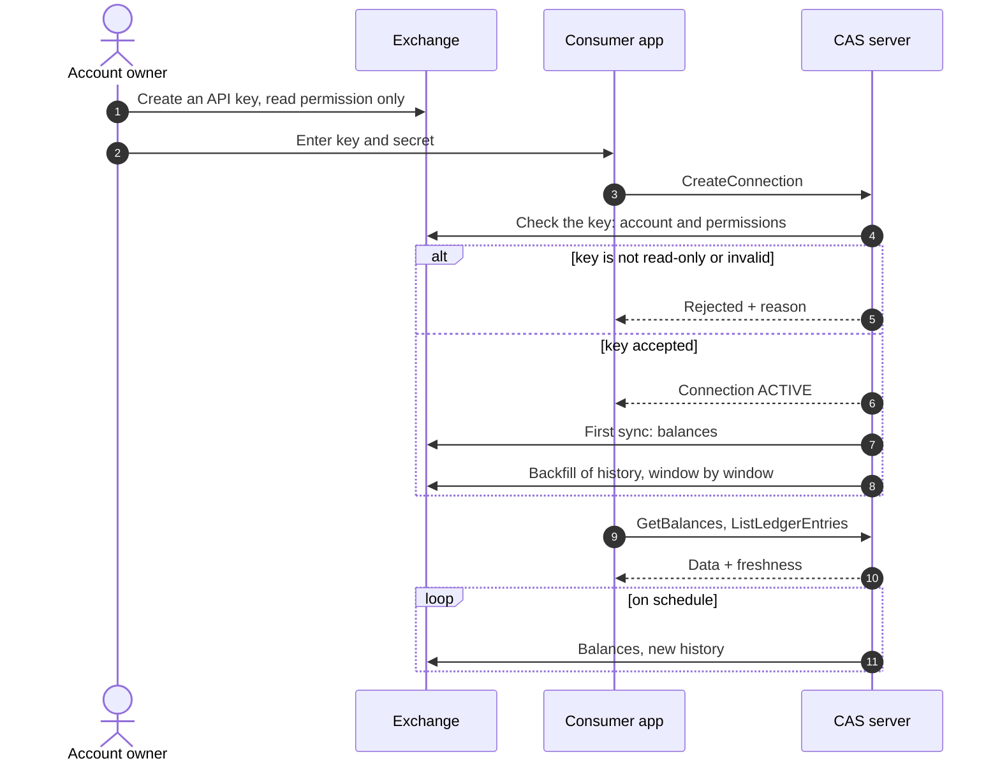

# PRD — Exchange Accounts

## 1. Overview

- **Document Owner:** Igor (DigitLock)
- **Initiative Link:** [BRD](../brd.md)
- **Main stakeholder:** Expense Tracker (first consumer)
- **Link to architecture documentation:** [C4](../c4/), [ADR](../adr/README.md) 1–6, 13, [SRS — Core](../srs/core.md)
- **Link to Rollout plan:** §4
- **Other related documents:** SRS — Binance (`../srs/exchange-binance.md`)
- **Document Version:** 0.9, 2026-10-03, pre-approved

---

## 2. Problem Alignment

### 2.1 Background and Objective

- Users hold crypto on centralized exchanges. Consumer systems — ET, partner apps — need these holdings next to bank accounts and wallets.
- **Objective:** connect an exchange account with a read-only key and get its balances and full operation history through the same API and model as on-chain wallets.
- **Fit:** implements BR-1 … BR-5; delivers G-3, G-4, G-5.

### 2.2 Problem Statement and Affected Users

| Problem | Internal or External User | User Role | Percentage of Users | Frequency |
|---|---|---|---|---|
| I hold crypto on an exchange, but my finance app shows only fiat accounts. | External | Account owner | 100% | Daily |
| I must give an app access to my exchange account and fear it could trade or withdraw. | External | Account owner | 100% | At connection |
| Every exchange has its own signing, limits and history format; I would integrate each one separately. | Internal | Consumer developer | n/a | Per exchange |
| Exchange history comes as several partial lists; a repeated import creates duplicates. | Internal | Consumer developer | n/a | Every sync |
| One mistake with rate limits gets the IP banned for all users. | Internal | Operations | n/a | Rare, high impact |

### 2.3 High Level Approach

- For consumer systems
- whose users hold assets on centralized exchanges
- the Exchange Accounts module
- is a read-only synchronization service
- that turns each exchange account into balances and a canonical ledger behind one API
- unlike per-exchange integrations, or aggregator libraries that hide signing, limits and history gaps
- our solution accepts read-only keys only, imports idempotently, and adds an exchange as an adapter without touching the core.

### 2.4 Goals, Values, Metrics and Business Outcome

| Goal (SMART) | Measurable Metrics | Value | Business Outcome | Priority |
|---|---|---|---|---|
| Balances match the exchange (G-5, X1) | Spot, funding and Earn balances equal the exchange UI at snapshot time on the test account | Trust in the numbers | ET shows complete holdings | High |
| Least privilege (G-3, X1) | 0 keys with a non-read permission accepted; permissions re-checked daily | The owner risks no funds by connecting | Lower barrier to connect | High |
| No rate-limit bans (X1) | 0 "rate limit exceeded" answers in normal operation | One user cannot break sync for all | Stable service on a shared IP | High |
| No duplicates in history (G-4, X2) | A repeated sync adds 0 entries | Consumers can re-pull safely | No clean-up logic in consumers | High |
| History completeness is visible (X2) | Per asset: ledger sum vs current balance; the difference is reported | Gaps are known, not hidden | Honest data quality | Medium |
| Second exchange without core changes (BR-5, X3) | Change set = adapter and seed data; shared connector test suite passes | The model is proven, not claimed | Cheaper next exchanges | Medium |

**Non-goals:**

- Trading, withdrawals, transfers — excluded by design (ADR-3).
- Prices and portfolio valuation — CRS and the consumer (ADR-1).
- Tax accounting: cost basis, profit and loss.
- Futures, margin, options, sub-accounts.
- Importing data from real-time streams — streams only trigger the sync (ADR-13).
- Mapping exchange operations to ET transactions — a later ET version.

### 2.5 Assumptions and Constraints

| Type | Description |
|---|---|
| **Assumptions** | The owner can create an API key with the read permission only. |
| | Balances every 15 min and history every hour are fresh enough. No consumer needs real time. |
| | Production sync runs from one static IP; the owner restricts the key to it. |
| | The exchange reports key permissions. Binance does; where an exchange does not, a manual check is accepted. |
| **Constraints** | Binance counts request weight per IP: all connections share one budget. |
| | Binance trade history is per trading pair; deposits and withdrawals are read in windows below 90 days. |
| | The Binance test network has no wallet, Earn or key-permission endpoints: those parts are tested on recorded fixtures and a read-only real account. |
| | Trades on pairs that were delisted may be unreachable through the API. |
| | Kraken offers its spot test environment on request only: fixtures are the only test data. |
| | Real balances never appear in the public demo. |

---

## 3. Stakeholders' Requirements

### 3.1 Stakeholders and Approvers

- Stakeholders: see BRD §5.
- Approvers: N/A — single-owner project.

### 3.2 Requested Business Functions

Stage = milestone from BRD §7.3. `Backlog` = recorded, not specified yet.

| ID | Role | Capability | BR | Stage |
|---|---|---|---|---|
| US-201 | Account owner | Connect my exchange account with a read-only key | BR-1, BR-2 | X1 |
| US-202 | Account owner | Be refused with a clear reason if my key can trade, withdraw or transfer | BR-2 | X1 |
| US-203 | Account owner | See the balances of all wallets of the exchange: spot, funding, Earn | BR-3 | X1 |
| US-204 | Account owner | See when the data was last updated and whether it is stale | BR-3 | X1 |
| US-205 | Account owner | Disconnect the account and have my key and data removed | BR-1 | X1 |
| US-206 | Account owner | See my history: deposits, withdrawals, trades, fees, conversions, rewards | BR-4 | X2 |
| US-207 | Account owner | Get my past history after connecting, not only new operations | BR-4 | X2 |
| US-208 | Consumer developer | Read balances and history of any exchange through one API and model | BR-4, BR-5 | X1, X2 |
| US-209 | Consumer developer | Pull only what is new since my last request | BR-4 | X2 |
| US-210 | Consumer developer | Start a sync on demand | BR-3 | X1 |
| US-211 | Operations | Stay inside the exchange rate limits and see how much of the budget is used | BRD §9.2 | X1 |
| US-212 | Operations | Be alerted when a key is rejected or a sync keeps failing | BR-3 | X1 |
| US-213 | Product owner | Add the next exchange as an adapter only | BR-5 | X3 |
| US-214 | Account owner | Import old history from an exchange export file where the API cannot reach it | BR-4 | Backlog |
| US-215 | Account owner | See a new trade or balance change within seconds, not at the next scheduled sync | BR-3 | W1 |

### 3.3 Solution Alignment

#### 3.3.1 Solution Ideas

**A. How an exchange is integrated (ADR-2)**

| Option | Pros | Cons, risks | Verdict |
|---|---|---|---|
| Code adapter per exchange behind one interface | Signing, limits and pagination are explicit and testable | Code per exchange | **Chosen** |
| Config-driven generic adapter, as in CRS | New source without code | Cannot express request signing and history pagination | Rejected |
| Aggregator library (CCXT) | Many exchanges at once | Hides limits and history gaps; maturity of the Go port; less control over what a key is used for | Rejected |

**B. How data is kept fresh (ADR-6)**

| Option | Pros | Cons, risks | Verdict |
|---|---|---|---|
| Polling with cursors | Simple, restart-safe, same pattern as CRS and ET | Data is minutes old | **Chosen** |
| WebSocket user streams as the data source | Real time | Connection state, reconnects, gaps to refill anyway | Rejected as a source; used as a trigger in W1 (ADR-13) |
| Fetch at read time | Always fresh | Slow reads; every read spends the rate budget; no history | Rejected |

**C. How history is stored (ADR-5)**

| Option | Pros | Cons, risks | Verdict |
|---|---|---|---|
| Canonical ledger with legs, raw record kept beside each entry | One model for every source; remapping possible from raw | Mapping work per exchange | **Chosen** |
| Native records per exchange | No mapping | Every consumer learns every exchange | Rejected |

**D. Earn products**

- Balances: Earn positions are account types inside the snapshot (`EARN_FLEXIBLE`, `EARN_LOCKED`).
- History: rewards are ledger entries of type `REWARD`.
- Without Earn the balances would not match the exchange (G-5).

#### 3.3.2 Product Flow

Critical edge cases. Handling details are in SRS — Core and SRS — Binance.

| ID | Case | Expected behaviour |
|---|---|---|
| EC-201 | The key can trade, withdraw or transfer | Rejected; nothing stored; the reason is returned |
| EC-202 | The key is restricted to another IP, or mistyped | Rejected as invalid, with a hint about IP restriction |
| EC-203 | The key is revoked or expires later | Sync stops; alert; stored data stays readable and is marked stale |
| EC-204 | The key gains a trade, withdrawal or transfer permission later | Found by the daily re-check; sync stops; alert |
| EC-205 | The exchange answers "rate limit exceeded" | All requests that count against the exceeded limit pause for the time the exchange demands |
| EC-206 | The same operation is returned twice | Imported once |
| EC-207 | A deposit or withdrawal is still pending | Not imported until final |
| EC-208 | Unknown asset code | Imported under the exchange's code; reported |
| EC-209 | An Earn position also shows in the spot wallet under a wrapper code | Counted once |
| EC-210 | The backfill is interrupted | Continues from the cursor |
| EC-211 | The exchange is down or under maintenance | The last data stays readable and is flagged stale once it is too old; retry with backoff |
| EC-212 | Trades on a delisted pair | Not reachable by API: reported as a known gap |

#### 3.3.3 System Consumers and Contributors

| System | Role | Dependency |
|---|---|---|
| Binance API | First source | Rate budget, endpoint stability, account region rules |
| Expense Tracker | First consumer | Pulls balances, later history; values them with CRS rates |
| Partner backend | Consumer | Same API, own tenant |
| Currency Rate Service | Rates for the consumer | Crypto pairs needed for valuation; not called by CAS for this module |
| VPS | Runs production sync | Static IP for key restriction |

#### 3.3.4 Business Risks

Platform-wide risks are in BRD §10. Module-specific additions:

| Risk | Severity | Mitigation Plan | Status | Owner |
|---|---|---|---|---|
| The exchange changes or retires an endpoint | MEDIUM | Connector tests on recorded fixtures; the exchange changelog is checked before each milestone | CONFIRMED | Igor |
| The exchange limits API access for the owner's region or account type | MEDIUM | Verify on the real account at X1 | TO CONFIRM | Igor |
| The ledger does not explain the balance: delisted pairs, operation kinds not covered | MEDIUM | Completeness check per asset; gaps documented; file import as a later option | CONFIRMED | Igor |
| A leaked read-only key exposes balances and history | MEDIUM | Encryption at rest; key restricted to the sync IP; no secrets in logs | CONFIRMED | Igor |
| Real balances show up in the public demo | HIGH | The demo uses the test network and fixtures only; the real connection lives in a separate environment | CONFIRMED | Igor |
| The next exchange has no usable test environment | LOW | Test environment is a selection criterion for X3; Kraken on fixtures | CONFIRMED | Igor |

---

## 4. Rollout Readiness

### 4.1 Stages

#### 4.1.1 MVP (X1) — Binance balances

1. Connect with a key check: valid, read-only.
2. Balances: spot, funding, Earn flexible and locked.
3. Freshness: `as_of` and the stale flag.
4. Rate limiter in front of every request.
5. Sync on schedule and on demand.
6. Daily permission re-check.
7. Disconnect with full removal.

#### 4.1.2 Out of MVP

- **X2 — Binance history:** deposits, withdrawals, trades with fees, conversions, rewards; backfill and incremental sync; completeness check.
- **X3 — second exchange.** Selection criteria:
  - public test environment that covers balances and history;
  - differs from Binance in signing and in history shape, to test BR-5.
- **X4 — Kraken.**
- **W1 — real-time triggers:** Binance account events start the sync at once (ADR-13).
- **Backlog:** import from an export file.

### 4.2 Deliverables

- Binance connector with recorded fixtures.
- Shared connector test suite that every adapter must pass.
- Seed data: source, asset aliases.
- SRS — Binance; ADR 1–6, 13.
- Guide: how to create a read-only key.

### 4.3 Operating Environment

| Environment | Data | Purpose |
|---|---|---|
| Development (self-hosted home server) | Binance test network, fixtures | Development, automated tests |
| Production sync (VPS) | Real account, read-only key restricted to the VPS IP | Real balances for ET |
| Public demo | Test network and fixtures only | Portfolio |

---

## 5. Open Issues

| # | Issue | Contact Point | Decision |
|---|---|---|---|
| 1 | Which exchange is second (X3) | Igor | Open; decided after X1. Candidates to check against the criteria: Bybit, OKX |
| 2 | API restrictions for the owner's Binance account and region | Igor | Verify on the real account at X1 |
| 3 | Earn wrapper codes in the spot wallet: how to avoid double counting | Igor | Decided in SRS — Binance UC-202: wrapper balances are dropped. To be verified on the real account at X1 |
| 4 | Scope of minor history lists: small-balance conversion, distributions, convert | Igor | Decided in SRS — Binance §2.1.2: all three are in X2, with Earn rewards |
| 5 | Default backfill depth | Igor | Decided: full history, down to `backfill_floor` (SRS — Binance §3.1) |
| 6 | Trades on delisted pairs | Igor | Decided: documented gap, visible in the completeness check; file import stays in the backlog |
