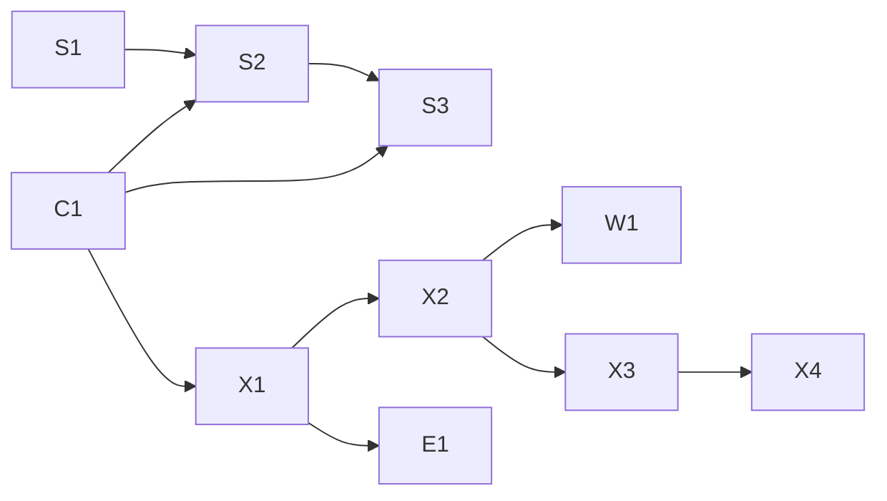

# Roadmap — Crypto Account Service (CAS)

- **Updated:** 2026-10-04
- **Kind:** living document. No version and no approval status.
- **Holds:** order of the milestones, versions, status, log.
- **Does not hold:** content and dependencies of the milestones. Their source is [BRD §7.3](brd.md#73-milestones).
- **Dates:** no target dates. Only the date a milestone was closed.

---

## 1. Milestones

| Order | ID | Milestone | Version | Branch | Status | Closed |
|---|---|---|---|---|---|---|
| 0 | — | Documentation baseline | `docs-v1.0` | `docs/v1.0` | In progress | — |
| 1 | S1 | Contracts | `v0.1.0` | `feature/v0.1.0` | Planned | — |
| 2 | C1 | Core | `v0.2.0` | `feature/v0.2.0` | Planned | — |
| 3 | S2 | card-auth | `v0.3.0` | `feature/v0.3.0` | Planned | — |
| 4 | S3 | EVM connector, reconciliation | `v0.4.0` | `feature/v0.4.0` | Planned | — |
| 5 | X1 | Binance balances | `v0.5.0` | `feature/v0.5.0` | Planned | — |
| 6 | X2 | Binance history | `v0.6.0` | `feature/v0.6.0` | Planned | — |
| 7 | W1 | Real-time triggers | `v0.7.0` | `feature/v0.7.0` | Planned | — |
| — | X3 | Second exchange | — | — | Needs spec | — |
| — | X4 | Kraken | — | — | Needs spec | — |
| — | E1 | Expense Tracker integration | — | — | Needs spec | — |

| Status | Meaning |
|---|---|
| Needs spec | Outlined in the BRD. No SRS yet; order and version are not assigned |
| Planned | Specified. Work has not started |
| In progress | The branch exists |
| Done | Merged to `main`, QA gate passed, tag set. `Closed` = date of the tag |

---

## 2. Dependencies

View of the `Depends on` column of [BRD §7.3](brd.md#73-milestones).

---

## 3. Versioning

Two independent lines of tags:

| Line | Format | Marks | Set when |
|---|---|---|---|
| Documentation | `docs-vX.Y` | The document set as a deliverable of its own | The set is approved by a merge to `main`, or reissued after a major revision |
| Service | `vX.Y.Z` | The code of a milestone, with the documents as they are at that point | The milestone is merged to `main` and its QA gate has passed |

- One minor version per milestone: `feature/vX.Y.0` → PR → merge → annotated tag.
- A version number is fixed when the branch is created. Until then the table of §1 is a plan; a change of order renames nothing.
- Infrastructure work and fixes outside a milestone ship as patch versions `vX.Y.Z`.
- Document changes made inside a milestone are covered by the tag of that milestone.
- The version in a document header changes independently of the tags.
- `v1.0.0` is not scheduled. It is decided after W1.

---

## 4. Parallel tasks

Work in other systems that a milestone needs. It runs outside the milestone branches.

| Task | System | Needed for | Status |
|---|---|---|---|
| Check which pairs to USD are served, and in which direction | CRS | S2 | Open |
| Add pairs so that card quotes work for more authorization currencies | CRS | S2 | Open |
| Add crypto pairs for the valuation of balances | CRS | E1 | Open |
| Extend the gRPC contract, frozen at v0.4.0, if E1 needs it | ET | E1 | Open |

---

## 5. Log

One line per closed milestone or significant state. Newest last.

| Date | Milestone | Result |
|---|---|---|
| 2026-10-03 | Documentation | BRD, two PRDs, four SRS, 13 ADRs, C4, glossary: pre-approved, version 0.9 |

---

## 6. How this file is updated

- In the branch of the milestone, before the merge: the tag then includes the current roadmap.
- The same commit updates the `Status` section of the root [README](../README.md).
- Per milestone: status, `Closed` date, one line in the log, status of the next milestone.
