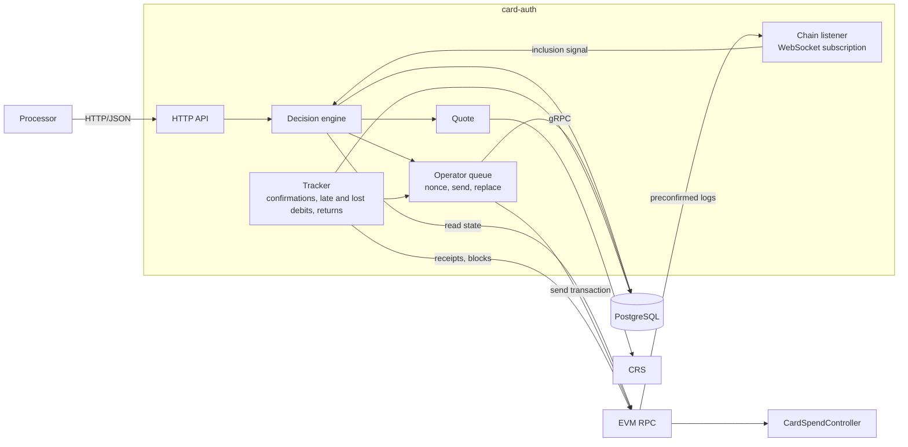
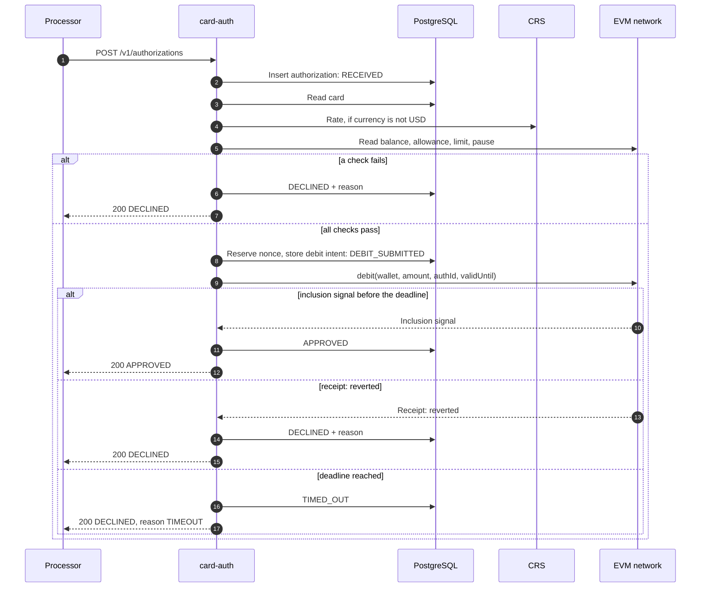
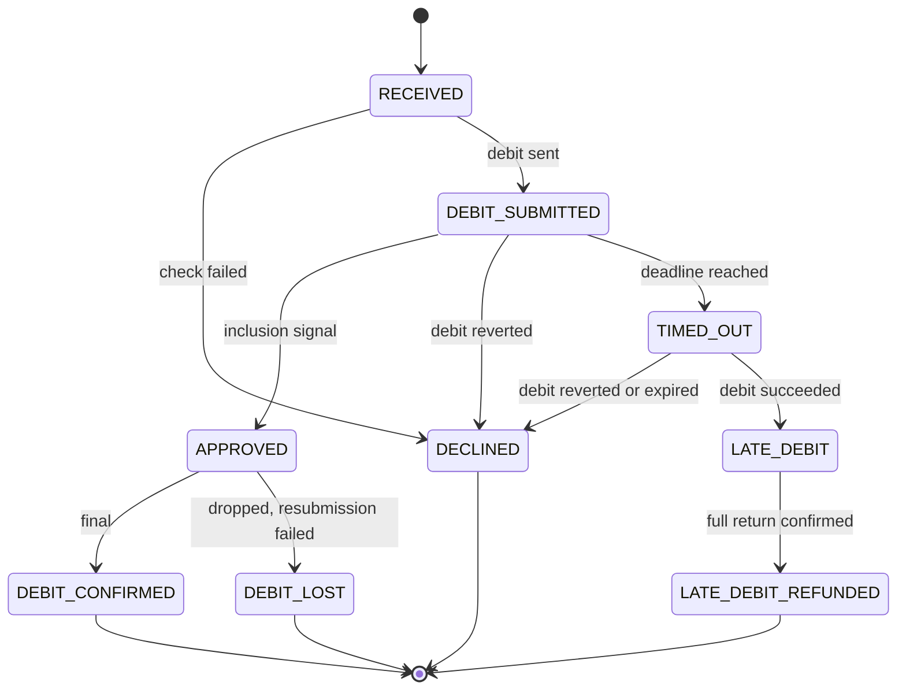
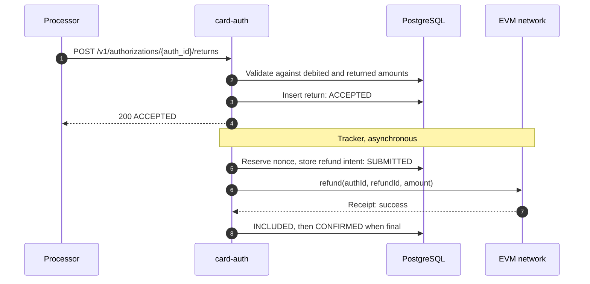
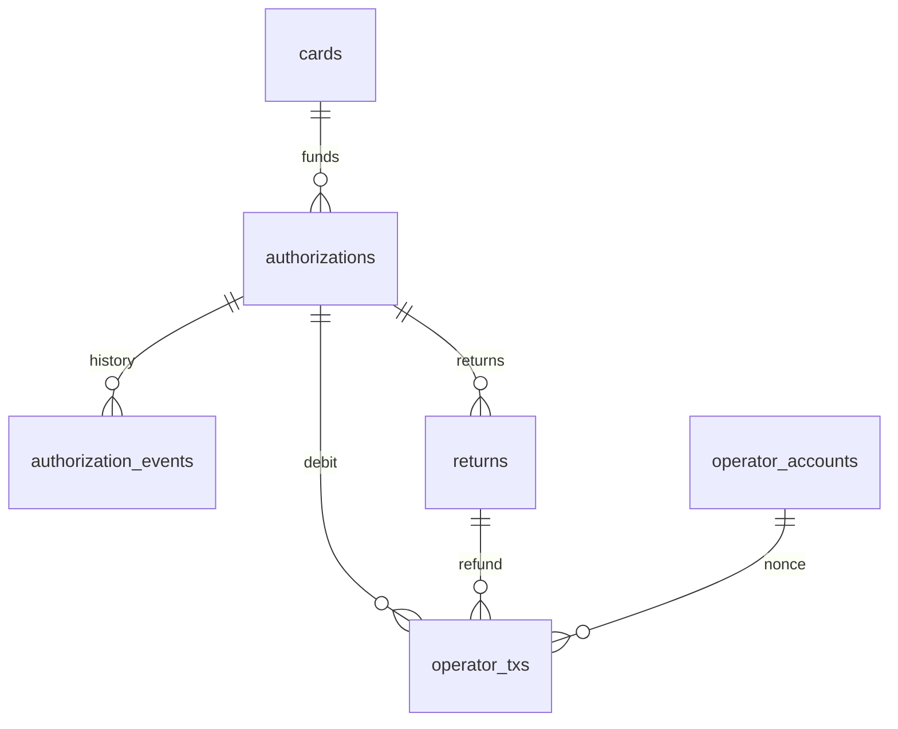

# SRS — Card Spend

---

## 1. Introduction

- **Purpose:** specify the `card-auth` service and the `CardSpendController` contract.
- **Scope:** processor-facing API, contract interface, use cases, data model, metrics, configuration.
- **Milestones:** S1 (contract), S2 (`card-auth`), S3 (reconciliation, UC-4).
- **Out of scope:** tenants, card registry (US-6) and ledger — SRS — Core; event indexer — [SRS — EVM Connector](evm-connector.md). Items marked `Design only` in the PRD are outlined in §2.3.5.
- **Parents:** [PRD — Card Spend](../prd/card-spend.md) (`US-n`, `EC-n`), [BRD](../brd.md) (`BR-n`), [ADR](../adr/README.md) 3, 7–13.
- **Version:** 1.2, 2026-10-05. Completed by the discovery of S2: error bodies and validation of the processor API, processor credentials, request normalization, lock and waiter rules, read block tag, fees, preconfirmed receipts, the `PLANNED` slot after a restart, start checks, fallback endpoint, TLS, tombstone response, rate precision and age; §4 issues 1 and 5 closed. Version 1.1, 2026-10-04: §2.1.5 completed by the discovery of S1. Version 1.0 approved 2026-10-04.

| Term | Meaning |
|---|---|
| Processor | Issuer processor: calls `card-auth` on every authorization. |
| Authorization | Request to approve one card payment, identified by `auth_id`. |
| Debit | On-chain transfer wallet → treasury for one authorization. |
| Return | On-chain transfer treasury → wallet: reversal, refund, or automatic refund of a late debit. Executed by the contract function `refund`. |
| Inclusion signal | Evidence that the debit executed: a `Debited` log with the `authId`, preconfirmed or in a sealed block, or a receipt with status `success`. |
| Preconfirmed | Executed in a Flashblock, not yet in a sealed block. A preconfirmed log or receipt carries a zero `blockHash`; a sealed one carries the real hash. |
| Flashblocks | Base's preconfirmations: a partial block every 200 ms. Served by the `pending` block tag and by the WebSocket subscription `pendingLogs` (§4, issue 1). |
| Operator | The `card-auth` key that holds the `OPERATOR` role in the contract. |
| Base units | Integer token amount. 1 USDC = 1 000 000 base units. |

---

## 2. Functional Requirements

### 2.1 SRS for API

#### 2.1.1 Card Spend

##### Components diagram



| Component | Responsibility |
|---|---|
| HTTP API | Authentication, validation, idempotency lookup, response mapping |
| Decision engine | Checks, state changes, deadline control |
| Quote | Fiat amount → token base units |
| Operator queue | Nonce allocation, signing, sending, replacement of stuck transactions |
| Tracker | Background worker: finality, late debits, lost debits, return execution |
| Chain listener | One WebSocket subscription to preconfirmed logs, filtered by the controller address and the `Debited` topic; no subscription to new blocks; reconnects on its own; passes inclusion signals to the decision engine (ADR-13) |

##### Sequence diagram



##### Common rules

- **Base path:** `/v1`. Media type: `application/json`. A request body above 16 KiB is `422`.
- **Authorization:** HTTP Basic. One credential pair maps to one tenant. The pair is issued by `casctl processor issue <tenant>` and printed once: username = `key_id`, 12 hexadecimal characters; password = 32 random bytes as 64 hexadecimal characters. Stored in `api_credentials` with `kind = PROCESSOR_BASIC` and the SHA-256 hash of the password bytes; verified in constant time (SRS — Core UC-105). `casctl processor list` and `revoke` as for service tokens. mTLS and request signing are out of MVP.
- **TLS:** terminated in front of the service by the deployment (Deployment Guide). `card-auth` itself listens on plain HTTP; S2 runs it locally that way.
- **Amounts:** fiat amounts are decimal strings; token amounts are base-unit integer strings.
- **Validation, every endpoint:** `auth_id` and `return_id` are 1 to 64 printable characters; `amount` is a decimal string greater than 0 with at most 4 decimal places and no exponent; `currency` is three upper-case letters; unknown fields are ignored.
- **Normalized request:** the body compared for idempotency is the canonical form of the request: keys sorted, no whitespace, `amount` as a decimal without trailing zeros, `currency` upper case, `merchant` canonicalized the same way. `request_hash` is the SHA-256 of that form, so `"25.40"` and `"25.4"` and a different key order are the same request.
- **HTTP status codes:**

| Code | Meaning |
|---|---|
| `200` | Request processed. For an authorization: a decision was made, approve or decline. |
| `401` | Unknown credentials. |
| `404` | `auth_id` not found (status query only). |
| `409` | Conflict: same `auth_id` or `return_id` with a different body, or a return for an authorization that is still being decided. |
| `422` | Invalid request. |

- An internal error during an authorization returns `200` with `DECLINED / INTERNAL_ERROR`: the processor always gets a decision.
- **Error body** of `401`, `404`, `409` and `422`: `{ "error": { "code": "<code>", "message": "<text>" } }`. The message carries no secret and no internal detail.

| Code | Status | When |
|---|---|---|
| `UNAUTHENTICATED` | `401` | Missing or malformed header, unknown username, wrong password, revoked pair, disabled tenant: one body for all |
| `INVALID_REQUEST` | `422` | A validation rule above fails, or the body is not JSON |
| `AUTH_ID_CONFLICT` | `409` | Known `auth_id` with a different normalized body |
| `RETURN_ID_CONFLICT` | `409` | Known `return_id` with a different normalized body |
| `AUTHORIZATION_IN_PROGRESS` | `409` | Return while the authorization is `RECEIVED` or `DEBIT_SUBMITTED` |
| `RETURN_EXCEEDS_DEBIT` | `422` | Return amount above the part not yet returned |
| `NOT_FOUND` | `404` | Unknown `auth_id` in the status query |

#### 2.1.2 Authorize

##### Description
Decides one card authorization. On approval the token amount is already debited from the cardholder's wallet.

##### Endpoint
`POST /v1/authorizations`

##### Authorization
See Common rules.

##### Request parameters
###### Request example
```json
{
  "auth_id": "9f1c2a7e-5b1d-4c58-9a57-0d2f6f1e8a11",
  "card_ref": "card_7Q2M",
  "amount": "25.40",
  "currency": "EUR",
  "merchant": { "name": "Maxi 042", "mcc": "5411", "country": "RS" }
}
```

| Parameter | Type | Required | Description | Example |
|---|---|---|---|---|
| auth_id | String, ≤ 64 | Yes | Processor's authorization ID. Unique per tenant. Reused on retries. | `9f1c2a7e-…` |
| card_ref | String | Yes | Opaque card reference registered by the partner. | `card_7Q2M` |
| amount | String, decimal | Yes | Amount in `currency`, > 0. | `25.40` |
| currency | String, ISO 4217 | Yes | Authorization currency. | `EUR` |
| merchant | Object | No | Stored for audit. Not used in the decision in MVP. | — |

##### Response parameters
###### Response body example
```json
{
  "auth_id": "9f1c2a7e-5b1d-4c58-9a57-0d2f6f1e8a11",
  "decision": "APPROVED",
  "status": "APPROVED",
  "token": "USDC",
  "token_amount": "29866387",
  "quote": { "rate": "1.1642", "buffer_bps": 100 },
  "tx_hash": "0x4be1…c7a2"
}
```

```json
{
  "auth_id": "9f1c2a7e-5b1d-4c58-9a57-0d2f6f1e8a11",
  "decision": "DECLINED",
  "status": "DECLINED",
  "reason": "INSUFFICIENT_ALLOWANCE"
}
```

| Parameter | Type | Required | Description | Example |
|---|---|---|---|---|
| auth_id | String | Yes | Echo of the request. | — |
| decision | Enum | Yes | `APPROVED` or `DECLINED`. | `APPROVED` |
| status | Enum | Yes | Authorization state, §2.3.1. | `APPROVED` |
| reason | Enum | If declined | Decline reason, table below. | `TIMEOUT` |
| token | String | If approved | Funding token symbol. | `USDC` |
| token_amount | String, integer | If approved | Debited amount in base units. | `29866387` |
| quote | Object | If approved | Rate and buffer used. `rate` = USD per one unit of `currency`; absent for USD. | — |
| tx_hash | String | If approved | Debit transaction hash. | `0x4be1…` |

Quote example: 1 EUR = 1.1642 USD. 25.40 EUR × 1.1642 × 1.01 = 29.8663868 USD → rounded up to 29 866 387 base units.

- **Rate source:** CRS serves `rate` = USD per one unit of the authorization currency, checked on 2026-10-05: pairs `EUR→USD`, `RSD→USD`, with `GBP→USD` and `CHF→USD` from the CRS package. No inversion anywhere. Until CRS serves a decimal string field, the `double` is formatted to 10 decimal places and all arithmetic is decimal from there; the stored CRS value has 10 decimal places, so nothing is lost. When the decimal field exists, it is used as it is.
- **Rate age:** CRS rates are daily. A rate may be a day old, up to three days over a weekend; accepted by the owner on 2026-10-05. `is_outdated` of CRS means a failed poll, not the age of the rate: `RATE_UNAVAILABLE` is returned on `is_outdated`, never on age alone. An intraday rate source is a backlog item.

###### Decline reasons

| Reason | When |
|---|---|
| `CARD_NOT_FOUND` | `card_ref` is unknown for the tenant |
| `CARD_FROZEN` | Card status is `FROZEN` |
| `PROGRAM_PAUSED` | The contract is paused |
| `CURRENCY_NOT_SUPPORTED` | No rate pair for the currency |
| `RATE_UNAVAILABLE` | CRS is unavailable, answers after the rate budget, or marks the rate `is_outdated` |
| `LIMIT_EXCEEDED` | Card daily limit or wallet daily limit would be exceeded |
| `INSUFFICIENT_FUNDS` | Wallet balance < token amount |
| `INSUFFICIENT_ALLOWANCE` | Allowance < token amount |
| `CHAIN_UNAVAILABLE` | RPC error or read timeout |
| `DEBIT_REVERTED` | The debit transaction reverted: state changed between read and debit |
| `TIMEOUT` | No decision by the deadline: no inclusion signal, or the card lock was not acquired in time |
| `REVERSED_BEFORE_AUTH` | A reversal for this `auth_id` arrived first |
| `INTERNAL_ERROR` | Unexpected failure |

#### 2.1.3 Return

##### Description
Returns tokens for a reversal or a refund, fully or partially. Accepted synchronously, executed on-chain asynchronously.

##### Endpoint
`POST /v1/authorizations/{auth_id}/returns`

##### Authorization
See Common rules.

##### Request parameters
###### Request example
```json
{
  "return_id": "rv-20261002-0001",
  "type": "REVERSAL",
  "amount": "10.00"
}
```

| Parameter | Type | Required | Description | Example |
|---|---|---|---|---|
| auth_id | String, path | Yes | Original authorization. | `9f1c2a7e-…` |
| return_id | String, ≤ 64 | Yes | Processor's ID of this reversal or refund. Unique per tenant. Reused on retries. | `rv-20261002-0001` |
| type | Enum | Yes | `REVERSAL` or `REFUND`. Same on-chain effect; kept for reporting. | `REVERSAL` |
| amount | String, decimal | No | Amount in the authorization currency. Omitted = everything not yet returned. | `10.00` |

##### Response parameters
###### Response body example
```json
{
  "return_id": "rv-20261002-0001",
  "auth_id": "9f1c2a7e-5b1d-4c58-9a57-0d2f6f1e8a11",
  "status": "ACCEPTED",
  "token_amount": "11758420"
}
```

| Parameter | Type | Required | Description | Example |
|---|---|---|---|---|
| return_id | String | Yes | Echo of the request. | — |
| auth_id | String | Yes | Echo of the request. | — |
| status | Enum | Yes | Return state, §2.3.2. `NOTHING_TO_RETURN` when there is nothing to return. | `ACCEPTED` |
| token_amount | String, integer | Yes | Tokens to return, base units. `0` for `NOTHING_TO_RETURN`. | `11758420` |

- `422 RETURN_EXCEEDS_DEBIT` when the amount is above the part not yet returned.
- A `NOTHING_TO_RETURN` answer is stored as a return row with that status, so a repeated `return_id` gets the same answer (step 2 of UC-2).
- Token amount example: 29 866 387 × 10.00 / 25.40 = 11 758 420, rounded down.

#### 2.1.4 Get authorization

##### Description
Returns the current state of one authorization with its returns and status history. Used by the CLI. The partner-facing equivalent is a gRPC method in SRS — Core.

##### Endpoint
`GET /v1/authorizations/{auth_id}`

##### Authorization
See Common rules.

##### Request parameters
| Parameter | Type | Required | Description | Example |
|---|---|---|---|---|
| auth_id | String, path | Yes | Authorization ID. | `9f1c2a7e-…` |

##### Response parameters
###### Response body example
```json
{
  "auth_id": "9f1c2a7e-5b1d-4c58-9a57-0d2f6f1e8a11",
  "status": "DEBIT_CONFIRMED",
  "amount": "25.40",
  "currency": "EUR",
  "token_amount": "29866387",
  "debited_amount": "29866387",
  "returned_amount": "11758420",
  "tx_hash": "0x4be1…c7a2",
  "returns": [
    { "return_id": "rv-20261002-0001", "type": "REVERSAL", "status": "CONFIRMED", "token_amount": "11758420", "tx_hash": "0x91d0…3e4f" }
  ],
  "history": [
    { "status": "RECEIVED", "at": "2026-10-02T12:00:00.120Z" },
    { "status": "DEBIT_SUBMITTED", "at": "2026-10-02T12:00:00.480Z" },
    { "status": "APPROVED", "at": "2026-10-02T12:00:00.910Z" },
    { "status": "DEBIT_CONFIRMED", "at": "2026-10-02T12:19:48.300Z" }
  ]
}
```

| Parameter | Type | Required | Description | Example |
|---|---|---|---|---|
| status | Enum | Yes | Authorization state, §2.3.1. | `DEBIT_CONFIRMED` |
| debited_amount | String, integer | Yes | Tokens debited, base units. `0` if none. | `29866387` |
| returned_amount | String, integer | Yes | Sum of accepted returns, base units. | `11758420` |
| returns | Array of objects | Yes | Returns of this authorization. | — |
| history | Array of objects | Yes | Status changes in order. | — |

- `amount`, `currency`, `token_amount`, `tx_hash` and `quote` are absent when the authorization has none: a tombstone (UC-2, step 3) answers `200` with `status: DECLINED`, `decline_reason: REVERSED_BEFORE_AUTH`, `debited_amount: "0"`, the return that created it in `returns` with status `NOTHING_TO_RETURN`, and a history of one record.
- `decline_reason` is returned for `DECLINED` and `TIMED_OUT`.
- Another tenant's `auth_id` is `404`.

#### 2.1.5 Contract interface

`CardSpendController`. Token and treasury addresses are immutable. The contract never holds tokens.

- Constructor: `(address token, address treasury, address admin, address operator)`. A zero address in any argument reverts with `ZeroAddress`. `admin` receives `ADMIN`, `operator` receives `OPERATOR`.
- Roles: `ADMIN` is OpenZeppelin `DEFAULT_ADMIN_ROLE` and is the role admin of `OPERATOR_ROLE = keccak256("OPERATOR_ROLE")`: `ADMIN` grants and revokes `OPERATOR`.

| Function | Caller | Rules | Event |
|---|---|---|---|
| `debit(address user, uint256 amount, bytes32 authId, uint64 validUntil)` | `OPERATOR`, not paused | Checks in this order; the first failure reverts: amount is 0 → `ZeroAmount`; `user` is the zero address → `ZeroAddress`; `block.timestamp > validUntil` → `AuthExpired`; `authId` already used → `AuthAlreadyUsed`; spent today + amount > daily limit of `user` → `DailyLimitExceeded`. Then pulls `amount` from `user` to the treasury. | `Debited(authId, user, amount)` |
| `refund(bytes32 authId, bytes32 refundId, uint256 amount)` | `OPERATOR` | Checks in this order: amount is 0 → `ZeroAmount`; `authId` unknown → `UnknownAuth`; `refundId` already used → `RefundAlreadyUsed`; refunded + amount > debited → `RefundExceedsDebit`. Then pulls `amount` from the treasury to the user stored for `authId`. Works while paused. | `Refunded(authId, refundId, user, amount)` |
| `setDailyLimit(address user, uint256 limit)` | `ADMIN` | Default limit is 0: no spending until set. Lowering the limit below today's spend takes nothing back; it blocks further debits until the next UTC day. | `DailyLimitSet(user, limit)` |
| `pause()`, `unpause()` | `ADMIN` | Pause blocks debits only. | `Paused(account)`, `Unpaused(account)` |

| View | Returns |
|---|---|
| `authorizations(authId)` | `(address user, uint256 debited, uint256 refunded)`. All zero for an unknown `authId` |
| `remainingDailyLimit(user)` | Limit minus today's spend; 0 if today's spend already exceeds the limit |
| `refundUsed(refundId)` | `bool` |
| `token()`, `treasury()` | The immutable addresses |

- `authId = keccak256(tenant_id, auth_id)`; `refundId = keccak256(tenant_id, return_id)`. IDs of different tenants cannot collide.
- A known `authId` is one whose stored `user` is not the zero address. This is why `debit` rejects a zero `user`. A zero `authId` has no special rule.
- Day = UTC day: `block.timestamp / 1 days`. A refund does not restore the day's limit.
- `validUntil` is a Unix time in whole seconds; it is the last second at which the debit is accepted. `block.timestamp` advances by the block time (2 s on Base), so the expiry takes effect at a block boundary.
- The refund recipient is fixed by the debit. The operator cannot redirect tokens.
- The treasury grants the contract an allowance for refunds.
- A failed token transfer — missing allowance or balance of the wallet in `debit`, of the treasury in `refund` — reverts with the token's own error. The contract adds no check of its own; `card-auth` reads balance and allowance before the debit (UC-1, step 9).
- Indexed event fields: `authId` and `user` in `Debited`; `authId`, `refundId` and `user` in `Refunded`; `user` in `DailyLimitSet`. They allow log filters by authorization and by wallet.
- Custom errors: `ZeroAddress`, `ZeroAmount`, `AuthExpired`, `AuthAlreadyUsed`, `DailyLimitExceeded`, `UnknownAuth`, `RefundAlreadyUsed`, `RefundExceedsDebit`. Errors and events of OpenZeppelin `AccessControl` and `Pausable` apply in addition: `AccessControlUnauthorizedAccount`, `EnforcedPause`, `ExpectedPause`.
- Libraries and build: OpenZeppelin `AccessControl`, `Pausable`, `SafeERC20` (ADR-9). No proxy.

`MockUSDC`, the funding token of the test networks (ADR-8):

| Item | Value |
|---|---|
| Standard | ERC-20, OpenZeppelin `ERC20` + `ERC20Burnable`. A plain token as SRS — EVM Connector §2.1.1 requires: no fee, no rebasing, a `Transfer` log on mint and burn |
| Name, symbol, decimals | `Mock USDC`, `USDC`, 6 |
| `mint(address to, uint256 amount)` | Callable by anyone. Emits `Transfer(0x0, to, amount)` |
| `burn(uint256 amount)`, `burnFrom(address account, uint256 amount)` | Emit `Transfer(from, 0x0, amount)` |

---

### 2.2 User Interface

N/A — no UI. A CLI simulates the processor.

---

### 2.3 Use Case

#### 2.3.1 UC-1 Authorize a payment (S2)

##### Sequence diagram
See §2.1.1.

##### Algorithm

| # | Step | On failure |
|---|---|---|
| 1 | Authenticate the processor, resolve the tenant | `401` |
| 2 | Validate the request | `422` |
| 3 | Look up `(tenant, auth_id)`. Tombstone of an earlier reversal → `DECLINED / REVERSED_BEFORE_AUTH`. Found with the same normalized body → wait for its decision and return it (§3.2). Found with a different body → `409`. | — |
| 4 | Insert the authorization as `RECEIVED`; `deadline_at = received_at + decision_deadline` | `INTERNAL_ERROR` |
| 5 | Take the per-card lock: one in-flight authorization per card (§3.2) | `TIMEOUT` if not acquired by the deadline |
| 6 | Load the card; check that it is `ACTIVE` | `CARD_NOT_FOUND`, `CARD_FROZEN` |
| 7 | Quote. USD: `amount × 10^decimals`. Other: `amount × rate × (1 + buffer)`, rounded up to a base unit. `rate` = USD per one unit of the authorization currency, as CRS serves it (§2.1.2) | `CURRENCY_NOT_SUPPORTED`, `RATE_UNAVAILABLE` |
| 8 | Card daily limit: today's token amounts of the card's approved authorizations (`APPROVED`, `DEBIT_CONFIRMED`, `DEBIT_LOST`) + this amount ≤ limit. Day = UTC day, as in the contract | `LIMIT_EXCEEDED` |
| 9 | Read on-chain with the `pending` block tag, the four reads in one batch: balance, allowance, remaining wallet daily limit, pause flag | `CHAIN_UNAVAILABLE`, `INSUFFICIENT_FUNDS`, `INSUFFICIENT_ALLOWANCE`, `LIMIT_EXCEEDED`, `PROGRAM_PAUSED` |
| 10 | In one database transaction: reserve the next operator nonce, store the debit intent, set `DEBIT_SUBMITTED` | `INTERNAL_ERROR` |
| 11 | Sign and send `debit` with `validUntil = received_at + debit_validity`, rounded down to a whole second; fees by §3.2 | Send result unknown → treat as sent |
| 12 | Wait until `deadline_at` for whichever comes first: the inclusion signal from the chain listener, or the receipt from polling every `receipt_poll_interval`. A preconfirmed receipt counts | — |
| 13 | Success → `APPROVED`. Reverted → `DECLINED / DEBIT_REVERTED`. Deadline → `TIMED_OUT`, response `DECLINED / TIMEOUT` | — |

##### Preconditions
- The card is registered for the tenant and bound to a wallet connection (SRS — Core).
- The wallet granted an allowance to the contract. The admin set the wallet's daily limit.
- The operator has gas. The treasury address is set in the contract.

##### Trigger
`POST /v1/authorizations` from the processor.

##### Basic Flow
Algorithm steps 1–13 with the success branch: `RECEIVED → DEBIT_SUBMITTED → APPROVED`. Finality continues in UC-3.

##### Authorization states



| State | Meaning | Processor was told |
|---|---|---|
| `RECEIVED` | Stored, checks running | — |
| `DEBIT_SUBMITTED` | Debit sent, decision pending | — |
| `APPROVED` | Debit included or preconfirmed | Approved |
| `DEBIT_CONFIRMED` | Debit is final by the finality rule of the network | Approved |
| `DECLINED` | No tokens moved | Declined |
| `TIMED_OUT` | Decline sent at the deadline; debit outcome not known yet | Declined |
| `LATE_DEBIT` | Debit landed after the decline; automatic return in progress | Declined |
| `LATE_DEBIT_REFUNDED` | Late debit fully returned | Declined |
| `DEBIT_LOST` | Approved debit dropped and could not be repeated; issuer exposure | Approved |

- Returns do not change the state. They are tracked in `returned_amount` and in the return records.

##### Exception Paths

| EC | Case | Handling |
|---|---|---|
| EC-1 | Same `auth_id`, same body | Step 3: stored decision, no new debit |
| EC-2 | Same `auth_id`, different body | Step 3: `409` |
| EC-3 | Balance or allowance too low at read | Step 9: decline, no transaction |
| EC-4 | State changed between read and debit | Step 13: `DEBIT_REVERTED` |
| EC-5 | No inclusion signal by the deadline | Step 13: `TIMED_OUT`; continues in UC-3 |
| EC-10 | RPC or CRS unavailable, rate stale | Steps 7, 9: decline |
| EC-11 | Paused, frozen, limit exceeded | Steps 6, 8, 9: decline |
| EC-13 | Two authorizations for one card at the same time | Step 5: processed one after another |
| EC-14 | Defined in UC-2: the tombstone it creates | Step 3 finds the tombstone: `REVERSED_BEFORE_AUTH` |
| EC-15 | Send result unknown (RPC timeout on send) | Step 11: treated as sent; the outcome is resolved by step 12 or UC-3 |
| EC-19 | The chain listener is disconnected | Step 12 relies on polling alone; authorizations continue. If polling sees only sealed blocks, more decisions end in `TIMEOUT`; alert on `chain_listener_connected` |

##### Acceptance Criteria

| ID | Requirement | Parent |
|---|---|---|
| FR-1 | A decision must be returned within `decision_deadline`; otherwise `DECLINED / TIMEOUT`. | US-10, BR-7 |
| FR-2 | `APPROVED` must be returned only after an inclusion signal for the debit. | US-3, BR-6 |
| FR-3 | A repeated request with the same `auth_id` and body must return the stored decision and send no debit. | US-5, BR-8 |
| FR-4 | A request with a known `auth_id` and a different body must be rejected with `409`. | BR-8 |
| FR-5 | The debit intent and its nonce must be stored before the transaction is sent. | BR-8 |
| FR-6 | Every debit must carry `validUntil`; the contract must reject it after that time. | BR-8 |
| FR-7 | The token amount must be rounded up to a base unit; the rate and buffer must be stored with the authorization. | BR-11 |
| FR-8 | The service must decline when the card is frozen, the program is paused, a daily limit would be exceeded, or the balance or allowance does not cover the amount. | US-2, US-7, US-14, BR-6, BR-9 |
| FR-9 | Any failure of the RPC or CRS during the decision must result in a decline. | BR-7 |
| FR-10 | The service must process at most one authorization per card at a time. | BR-9 |
| FR-11 | Every status change must be recorded in the append-only history. | US-8 |
| FR-23 | The inclusion signal must be taken from whichever arrives first: the WebSocket subscription or polling. A lost subscription must not stop authorizations. | BR-7 |

##### Postconditions
- Approved: tokens are in the treasury; the authorization is `APPROVED`; a debit transaction is tracked by UC-3.
- Declined: no tokens moved, or the authorization is `TIMED_OUT` and UC-3 resolves it.

#### 2.3.2 UC-2 Return tokens (S2)

##### Sequence diagram



##### Algorithm

| # | Step | On failure |
|---|---|---|
| 1 | Authenticate, validate | `401`, `422` |
| 2 | Look up `(tenant, return_id)`. Same body → stored result. Different body → `409`. | — |
| 3 | Load the authorization. Unknown `auth_id` → store a tombstone authorization `DECLINED / REVERSED_BEFORE_AUTH`, respond `NOTHING_TO_RETURN`. | — |
| 4 | Authorization in `RECEIVED` or `DEBIT_SUBMITTED` → `409 AUTHORIZATION_IN_PROGRESS`; the processor retries. In `DECLINED`, `TIMED_OUT`, `LATE_DEBIT`, `LATE_DEBIT_REFUNDED`, `DEBIT_LOST` → `NOTHING_TO_RETURN`. | — |
| 5 | Token amount = `debited_amount × amount / fiat_amount`, rounded down. A return that completes the fiat amount takes the whole remainder. | `422 RETURN_EXCEEDS_DEBIT` |
| 6 | Insert the return as `ACCEPTED`, increase `returned_amount`, respond | — |
| 7 | Tracker: send `refund`; follow it to `CONFIRMED` | Retry, step 8 |
| 8 | Refund reverted or not sent → `RETRYING`; repeat after `return_retry_interval`; alert | — |

##### Preconditions
- The treasury holds enough tokens and its allowance to the contract covers the return.

##### Trigger
`POST /v1/authorizations/{auth_id}/returns` from the processor, or the tracker for a late debit (type `LATE_DEBIT`).

##### Basic Flow
Steps 1–7: `ACCEPTED → SUBMITTED → INCLUDED → CONFIRMED`.

##### Return states

| State | Meaning |
|---|---|
| `ACCEPTED` | Stored; waiting for the tracker |
| `SUBMITTED` | Refund transaction sent |
| `INCLUDED` | Refund included or preconfirmed |
| `CONFIRMED` | Refund is final |
| `RETRYING` | Last attempt failed; will be repeated |
| `NOTHING_TO_RETURN` | Nothing to return: no tokens were debited, or a late debit is already returned in full automatically |

##### Exception Paths

| EC | Case | Handling |
|---|---|---|
| EC-8 | Full or partial reversal | Steps 5–7 |
| EC-9 | Same `return_id` again | Step 2: stored result; the contract also rejects a used `refundId` |
| EC-12 | Treasury cannot fund the refund | Step 8: `RETRYING`, alert |
| EC-14 | Reversal for an unknown `auth_id` | Step 3: tombstone |
| EC-16 | Return while the decision is pending | Step 4: `409`; the processor retries after the decision |
| EC-17 | Amount above the part not yet returned | Step 5: `422` |

##### Acceptance Criteria

| ID | Requirement | Parent |
|---|---|---|
| FR-12 | Total returned tokens must never exceed debited tokens. A full return must give back exactly the debited amount. | US-4, US-11, BR-10 |
| FR-13 | A repeated `return_id` must cause no second transfer. The service and the contract must enforce this independently. | BR-10 |
| FR-14 | An accepted return must be retried until confirmed; it must never be dropped. Only exception: the authorization becomes `DEBIT_LOST` — no tokens were debited, so its open returns close as `NOTHING_TO_RETURN`. | BR-10 |
| FR-15 | A reversal for an unknown `auth_id` must create a tombstone; a later authorization with that ID must be declined. | BR-8 |

##### Postconditions
- Tokens are back in the wallet; `returned_amount` and the on-chain `refunded` value match.

#### 2.3.3 UC-3 Track a debit to finality (S2)

##### Sequence diagram
N/A — background worker; no interaction between systems beyond RPC reads and the transactions of UC-1 and UC-2.

##### Algorithm

| # | Situation | Action |
|---|---|---|
| 1 | `APPROVED`, debit block is final | Set `DEBIT_CONFIRMED` |
| 2 | `APPROVED`, receipt disappeared (dropped preconfirmation or reorg) | Read `authorizations(authId)`. Debited > 0 → keep waiting. Debited = 0 → send a new debit with the same `authId` and a new `validUntil`, in the same nonce slot if it is still free, otherwise with the next nonce. |
| 3 | Resubmitted debit reverted | Set `DEBIT_LOST`; alert; the amount is reported as issuer exposure; open returns of the authorization become `NOTHING_TO_RETURN` |
| 4 | `TIMED_OUT`, debit succeeded before `validUntil` | Set `LATE_DEBIT`; create a full return of type `LATE_DEBIT` (UC-2); alert |
| 5 | `LATE_DEBIT`, return confirmed | Set `LATE_DEBIT_REFUNDED` |
| 6 | `TIMED_OUT`, debit reverted, or the latest block timestamp is past `validUntil` and `authorizations(authId)` shows 0 | Set `DECLINED / TIMEOUT` |
| 7 | Transaction not mined, `validUntil` not reached | Replace with the same nonce and a higher fee |
| 8 | Transaction not mined, `validUntil` passed | Replace with a zero-value self-transfer to release the nonce |
| 9 | Service start | For every non-final authorization and return: read on-chain state first, then continue from the matching row above. A `PLANNED` slot without a transaction: `validUntil` not reached → send it now; reached → `DECLINED / TIMEOUT`, and the slot is reused by the next send so that no nonce is left unused |
| 10 | Receipt or log with a zero `blockHash` | Preconfirmed: an inclusion signal, but `block_number` and `block_hash` are stored only from a sealed receipt. Finality (row 1) counts from the sealed block |

##### Preconditions
- At least one authorization or return is not in a final state.

##### Trigger
Timer, every `tracker_interval`; service start.

##### Basic Flow
Row 1.

##### Exception Paths

| EC | Case | Handling |
|---|---|---|
| EC-6 | Debit lands after the decline | Rows 4–5 |
| EC-7 | Approved debit dropped | Rows 2–3 |
| EC-5 | Defined in UC-1: after `TIMED_OUT` the transaction is stuck or expires | Rows 6–8 |
| EC-18 | Restart between send and receipt | Row 9 |

##### Acceptance Criteria

| ID | Requirement | Parent |
|---|---|---|
| FR-16 | After a restart the service must read the on-chain state of an `authId` or `refundId` before sending anything for it. | BR-8 |
| FR-17 | A debit that lands after a decline must be returned in full without manual action. | US-4, BR-10 |
| FR-18 | A dropped approved debit must be resubmitted with the same `authId`; on failure the authorization must become `DEBIT_LOST` and raise an alert. | BR-8 |
| FR-19 | `DEBIT_CONFIRMED` must be set only by the finality rule of the network. | US-3, BR-6 |
| FR-20 | A stuck transaction must not block the operator queue longer than `debit_validity`. | BR-7 |

##### Postconditions
- Every authorization ends in a final state: `DECLINED`, `DEBIT_CONFIRMED`, `LATE_DEBIT_REFUNDED` or `DEBIT_LOST`.

#### 2.3.4 UC-4 Reconcile (S3)

##### Sequence diagram
N/A — batch comparison inside `server`; inputs are database tables.

##### Algorithm

| # | Rule | Mismatch |
|---|---|---|
| 1 | Every authorization in `APPROVED` or `DEBIT_CONFIRMED` has exactly one `Debited` event with its `authId` and the same amount | `MISSING_DEBIT`, `AMOUNT_MISMATCH` |
| 2 | Every `Debited` event has an authorization | `UNKNOWN_DEBIT` |
| 3 | Every return in `CONFIRMED` has exactly one `Refunded` event with its `refundId` and the same amount | `MISSING_REFUND`, `AMOUNT_MISMATCH` |
| 4 | Every `Refunded` event has a return | `UNKNOWN_REFUND` |
| 5 | The treasury token balance equals the sum of its ledger entries: debits, refunds and other transfers. Taken from the completeness check of the treasury connection (SRS — EVM Connector UC-304) | `TREASURY_MISMATCH` |

##### Preconditions
- The indexer has stored the events and transfers of the treasury connection up to the final block ([SRS — EVM Connector](evm-connector.md) §2.4).

##### Trigger
After each indexer cycle; on demand through the CLI.

##### Basic Flow
Rules 1–5 produce an empty mismatch list.

##### Exception Paths
- Any mismatch is stored in the report and raises an alert.
- Items younger than the finality window are skipped until the next run.

##### Acceptance Criteria

| ID | Requirement | Parent |
|---|---|---|
| FR-21 | The report must list every mismatch with its type, IDs and amounts. | US-13, BR-12 |
| FR-22 | `UNKNOWN_DEBIT` and `UNKNOWN_REFUND` must raise an alert. | US-15, BR-12 |

##### Postconditions
- A stored report per run: period, totals, mismatches.

#### 2.3.5 Design-only flows

Not built. Recorded so the model does not block them.

| Flow | Design | Parent |
|---|---|---|
| Incremental authorization | New `auth_id` with `parent_auth_id`; a separate debit with its own `authId` | US-12 |
| Clearing below the debit | Return of the difference, type `CLEARING_ADJUSTMENT` | US-12 |
| Clearing above the debit | Extra debit linked by `parent_auth_id`; on failure the difference is issuer exposure | US-12 |
| Authorization expiry | No clearing after `auth_expiry` → full automatic return | US-12 |
| Partner webhooks | Each status change of §2.3.1 and §2.3.2 becomes a signed event with a unique ID; at-least-once delivery | US-9 |
| Wallet binding | SIWE signature proves wallet ownership; binding requires KYC status `approved` | US-1 |

---

### 2.4 Data Model

#### 2.4.1 Card Spend

##### Data model schema



`cards` and `tenants` belong to SRS — Core. Used here from `cards`: `card_ref`, `tenant_id`, `status`, `daily_limit`, wallet address and chain.

##### authorizations
###### Description
One row per `auth_id` of a tenant, including tombstones.

###### Data model

| Name | Type | Required | Description |
|---|---|---|---|
| id | UUID | Yes | Primary key |
| tenant_id | UUID | Yes | Tenant |
| auth_id | TEXT | Yes | Processor's ID. Unique with `tenant_id` |
| chain_auth_id | BYTEA | Yes | `keccak256(tenant_id, auth_id)`, 32 bytes |
| parent_auth_id | TEXT | No | Design only |
| card_id | UUID | No | Null for a tombstone and for an unknown `card_ref` |
| request_hash | BYTEA | No | Hash of the normalized request; detects EC-2. Null for a tombstone |
| fiat_amount | NUMERIC(18,4) | No | Null for a tombstone |
| fiat_currency | CHAR(3) | No | ISO 4217 |
| rate | NUMERIC(20,10) | No | USD per one unit of the fiat currency, as used in the quote; 10 decimal places as CRS stores it. Null for USD |
| buffer_bps | INTEGER | No | Buffer applied |
| token_amount | NUMERIC(78,0) | No | Quoted base units |
| debited_amount | NUMERIC(78,0) | Yes | 0 until the debit is included |
| returned_amount | NUMERIC(78,0) | Yes | Sum of accepted returns |
| wallet_address | BYTEA | No | 20 bytes |
| chain_id | BIGINT | No | Network |
| status | TEXT | Yes | §2.3.1 |
| decline_reason | TEXT | No | §2.1.2 |
| merchant | JSONB | No | As received |
| received_at | TIMESTAMPTZ | Yes | — |
| deadline_at | TIMESTAMPTZ | No | Decision deadline. Null for a tombstone |
| valid_until | TIMESTAMPTZ | No | On-chain expiry of the debit |
| decided_at | TIMESTAMPTZ | No | When the response was sent |

##### authorization_events
###### Description
Append-only status history. Never updated or deleted.

###### Data model

| Name | Type | Required | Description |
|---|---|---|---|
| id | BIGSERIAL | Yes | Primary key |
| authorization_id | UUID | Yes | Authorization |
| from_status | TEXT | No | Null for the first record |
| to_status | TEXT | Yes | New status |
| reason | TEXT | No | Decline reason or cause |
| details | JSONB | No | Transaction hash, block, error; no secrets |
| created_at | TIMESTAMPTZ | Yes | — |

##### returns
###### Description
One row per reversal, refund or automatic return.

###### Data model

| Name | Type | Required | Description |
|---|---|---|---|
| id | UUID | Yes | Primary key |
| tenant_id | UUID | Yes | Tenant |
| authorization_id | UUID | Yes | Authorization |
| return_id | TEXT | Yes | Processor's ID, or generated for `LATE_DEBIT`. Unique with `tenant_id` |
| chain_refund_id | BYTEA | Yes | `keccak256(tenant_id, return_id)`, 32 bytes |
| type | TEXT | Yes | `REVERSAL`, `REFUND`, `LATE_DEBIT` |
| request_hash | BYTEA | No | Hash of the normalized request; detects a changed retry. Null for `LATE_DEBIT` |
| fiat_amount | NUMERIC(18,4) | No | Null for `LATE_DEBIT` |
| token_amount | NUMERIC(78,0) | Yes | Base units |
| status | TEXT | Yes | §2.3.2 |
| attempts | INTEGER | Yes | Send attempts |
| created_at | TIMESTAMPTZ | Yes | — |

##### operator_txs
###### Description
One row per operator nonce. A replacement keeps the row: the new hash becomes current, the old one is appended to `replaced_hashes`. A release (UC-3, row 8) also keeps the row: its purpose becomes `RELEASE` and its status ends as `RELEASED`.

###### Data model

| Name | Type | Required | Description |
|---|---|---|---|
| id | UUID | Yes | Primary key |
| chain_id | BIGINT | Yes | Network |
| operator_address | BYTEA | Yes | Sender. Unique with `chain_id` and `nonce` |
| nonce | BIGINT | Yes | Operator nonce |
| purpose | TEXT | Yes | `DEBIT`, `REFUND`, `RELEASE` |
| authorization_id | UUID | No | For `DEBIT` |
| return_row_id | UUID | No | For `REFUND`: `returns.id` |
| tx_hash | BYTEA | No | Current hash; null while `PLANNED` |
| replaced_hashes | BYTEA[] | Yes | Earlier hashes of this nonce |
| status | TEXT | Yes | `PLANNED`, `SENT`, `INCLUDED`, `CONFIRMED`, `REVERTED`, `RELEASED` |
| block_number | BIGINT | No | Inclusion block, from a sealed receipt |
| block_hash | BYTEA | No | Hash of that block, never the zero hash of a preconfirmation. Detects a reorg |
| created_at | TIMESTAMPTZ | Yes | — |

##### operator_accounts
###### Description
Next nonce per operator and network. Locked while a nonce is reserved.

###### Data model

| Name | Type | Required | Description |
|---|---|---|---|
| chain_id | BIGINT | Yes | Primary key, part 1 |
| address | BYTEA | Yes | Primary key, part 2 |
| next_nonce | BIGINT | Yes | Next free nonce |

---

### 2.5 Metrics and Alerts

#### 2.5.1 Metrics

| Service | Metric name | Value | Alert | Description | Requestor |
|---|---|---|---|---|---|
| card-auth | `auth_decision_seconds` | p95 ≤ 2 s | p95 > 2 s for 5 min | Request received → response sent | BR-7 |
| card-auth | `auth_decisions_total{decision,reason}` | — | `TIMEOUT` + `CHAIN_UNAVAILABLE` > 5% for 5 min | Decisions by outcome | BR-7 |
| card-auth | `late_debits_total` | 0 | Any | Debits that landed after a decline | US-15 |
| card-auth | `debits_lost_total` | 0 | Any, critical | Approved debits that could not be repeated | US-15 |
| card-auth | `returns_not_confirmed` | 0 | Any return older than 10 min | Returns in `ACCEPTED`, `SUBMITTED`, `INCLUDED`, `RETRYING` | BR-10 |
| card-auth | `operator_tx_pending_seconds` | < `debit_validity` | Above `debit_validity` | Age of the oldest unmined operator transaction | US-15 |
| card-auth | `operator_gas_balance` | — | Below threshold | Native token balance of the operator | US-15 |
| card-auth | `chain_listener_connected` | 1 | 0 for 1 min | State of the WebSocket subscription | BR-7 |
| card-auth | `inclusion_signals_total{source}` | — | — | Signals by source: subscription or polling | BR-7 |
| card-auth | `treasury_refund_capacity` | — | Below threshold | min(treasury balance, treasury allowance) | US-15 |
| server | `reconciliation_mismatches_total{type}` | 0 | Any | Mismatches of UC-4 | BR-12 |

#### 2.5.2 Alerts
Conditions are in the Alert column above. Delivery channel: N/A — defined with the deployment.

---

## 3. Non-functional Requirements

### 3.1 Configuration

| Parameter | Default | Meaning |
|---|---|---|
All parameters come from the environment of `card-auth`; the variable names are fixed in `.env.example`. Nothing is read from `sources.config` in S2: the EVM connector of S3 decides where it takes the shared values from (SRS — EVM Connector §3.1).

| Parameter | Default | Meaning |
|---|---|---|
| `decision_deadline` | 2.5 s | Maximum time to answer the processor. One value for the service in S2; per processor later. The default fits a 3 s processor budget |
| `debit_validity` | 4 s | `validUntil − received_at`; must exceed `decision_deadline` by at least 1 s, because `validUntil` is rounded down to a whole second. The service does not start otherwise |
| `rpc_read_timeout` | 500 ms | Timeout of the on-chain read in step 9 |
| `rpc_ws_url` | — | WebSocket endpoint of the RPC provider, for the chain listener. Unset: no listener, polling only |
| `listener_subscription` | `pendingLogs` | Subscription type of the chain listener: `pendingLogs` on Base Sepolia, `logs` on a chain without Flashblocks such as Anvil |
| `receipt_poll_interval` | 200 ms | Polling beside the subscription |
| `quote_buffer_bps` | 100 | Buffer for non-USD currencies, basis points |
| `finality_mode`, `finality_tag`, `finality_confirmations` | `confirmations`, —, 10 | Finality rule for `DEBIT_CONFIRMED`, per network: a block tag or N blocks after inclusion. Same rule as the indexer (SRS — EVM Connector §2.1.1). The defaults are for the local chain; Base Sepolia uses the tag `finalized` |
| `tracker_interval` | 2 s | Tracker cycle |
| `return_retry_interval` | 30 s | Pause between return attempts |
| `chain_id`, `rpc_url`, `rpc_fallback_url` | — | Network access. `chain_id` must be in the allow-list of test networks (SRS — EVM Connector §3.1) |
| `rpc_fallback_after` | 3 | Consecutive failures of the primary endpoint after which the fallback is used (§3.2) |
| `debit_gas_limit`, `refund_gas_limit` | measured in st5 | Fixed gas limits of the two operator transactions: no `eth_estimateGas` in the decision path. A release transaction uses 21 000 |
| `fee_bump_percent` | 25 | Raise of `maxFeePerGas` and `maxPriorityFeePerGas` on a replacement |
| `controller_address`, `token_address`, `token_decimals` | — | Contract and funding token; checked at start (§3.2) |
| `OPERATOR_PRIVATE_KEY` | — | Environment only. On Anvil a default Anvil account key may be used, in `.env` only |
| `DATABASE_URL` | — | PostgreSQL, role `cas_card_auth`; environment |
| `CRS_ADDRESS` | — | gRPC address of CRS; environment |
| HTTP port | 8092 | Processor API; environment |
| Health port | 8093 | `/healthz`, `/readyz`, `/metrics`; environment |

### 3.2 General Non-functional Requirements

- **Parallel work:**
  - S2 runs one `card-auth` instance (§4, issue 6). The locks below live in memory of that instance; the database constraints are the second line;
  - same `auth_id` twice at once: the unique key `(tenant_id, auth_id)` admits one insert; the other finds the row, registers as a waiter for `(tenant, auth_id)` in memory and returns the decision when it is made, or `DECLINED / TIMEOUT` at its own deadline;
  - same card: one authorization at a time (FR-10): an in-memory mutex per card, held from step 5 to step 13;
  - nonce reservation locks the `operator_accounts` row with `SELECT … FOR UPDATE`;
  - more throughput = more operator keys, each with its own nonce sequence — out of MVP.
- **Chain access:**
  - every read of the decision path uses the `pending` block tag: on Base it sees the Flashblocks state the debit will see; on Anvil it equals `latest`;
  - transactions are EIP-1559: `maxPriorityFeePerGas` from `eth_maxPriorityFeePerGas`, `maxFeePerGas` = 2 × base fee of the pending block + the tip; a replacement raises both by `fee_bump_percent` on the same nonce (ADR-10);
  - fallback endpoint: after `rpc_fallback_after` consecutive failures of the primary, reads and sends go to `rpc_fallback_url`; every tracker cycle probes the primary with `eth_chainId` and switches back on success. No retry inside the read budget of step 9: a failed read is `CHAIN_UNAVAILABLE`. The fallback has no WebSocket; the listener stays on the primary;
  - start checks, the service does not start otherwise: `eth_chainId` of the primary and of the fallback equals `chain_id` and is in the allow-list; `token()` of the controller equals `token_address`; `decimals()` of the token equals `token_decimals`; `next_nonce` of the operator is raised to the chain's transaction count when it is below it.
- **Audit log:**
  - `authorization_events`: every status change;
  - `operator_txs`: every transaction hash ever sent, including replaced ones;
  - request bodies are stored as received; no secrets, no card numbers.
- **Performance:** decision p95 ≤ 2 s. Budget: checks and database ≤ 100 ms, rate ≤ 100 ms, on-chain read ≤ 300 ms, send and inclusion signal ≤ 1.5 s.
- **Reliability:**
  - fail-closed (FR-9);
  - restart-safe: intent before send (FR-5), chain before resend (FR-16);
  - the chain listener is optional at run time: without it decisions use receipt polling (FR-23);
  - a late or lost debit never needs manual action to detect (FR-17, FR-18).
- **Security:**
  - the operator key is read from the environment, used only for signing, never logged;
  - the `card-auth` database role cannot read exchange secrets: it has no right on the column `connections.credentials_enc` (SRS — Core §3.2);
  - processor credentials are stored hashed;
  - admin transactions of the contract — `setDailyLimit`, `pause`, `unpause` — are sent with `cast` and the `ADMIN` key from the environment, by the Deployment Guide; no service and no CLI of S2 holds that key;
  - the contract bounds a compromised operator: debits go only to the treasury, within allowance and daily limit, and only until `ADMIN` pauses; refunds go only to the wallet that was debited.

---

## 4. Open Issues

| # | Issue | Proposal |
|---|---|---|
| 1 | RPC access to preconfirmed data on Base Sepolia. Base documentation, checked 2026-10-03: the public endpoints serve preconfirmed state to reads with the `pending` block tag, but are HTTP only and rate-limited; a subscription to preconfirmed logs needs an RPC provider with WebSocket or an own node | **Closed 2026-10-05.** Provider: Alchemy, app with Base Sepolia only, free plan; fallback `https://sepolia.base.org`, HTTP only. Checked by the owner on the free plan: `eth_chainId` 84532; the `pending` block is `latest + 1`; `eth_subscribe ["pendingLogs", {address, topics}]` delivers preconfirmed logs about every 200 ms, the filter works; `eth_getTransactionReceipt` returns a preconfirmed receipt in 6 of 10 tries, 206–247 ms after the hash appeared, with `blockNumber = latest + 1` and a zero `blockHash`; after sealing the same receipt carries the real hash. The fallback of sealed blocks and a 3 s deadline is not needed. Unfiltered `pendingLogs` is about 140 logs per second: the listener subscribes with the controller address and the `Debited` topic only, and never to new blocks (budget: 30M CU per month on the free plan) |
| 2 | Finality rule: N confirmations or a block tag. Ten L2 blocks are not finality on Base | Decided: tag `finalized` on Base Sepolia (L1 batch final, about 20 minutes), N confirmations on the local chain. `card-auth` and the indexer use the same rule (SRS — EVM Connector §2.1.1) |
| 3 | Should a same-day return restore the card daily limit | No, same as the contract |
| 4 | A contract event that matches no authorization of any tenant: where it is reported | In the reconciliation run of the platform tenant, as `UNKNOWN_DEBIT` or `UNKNOWN_REFUND` |
| 5 | Rates to USD in CRS: which pairs it serves and in which direction. A lesson from ET: its rate is the inverse of the CRS rate | **Closed 2026-10-05.** Checked against the CRS contract: `rate` = USD per one unit of the authorization currency, no inversion; pairs `EUR→USD`, `RSD→USD`, with `GBP→USD` and `CHF→USD` from the CRS package; `rate` is a `double` stored with 10 decimal places, formatted to 10 places before decimal arithmetic until the decimal field exists; the rate is daily (§2.1.2). A currency without a pair is declined as `CURRENCY_NOT_SUPPORTED` |
| 6 | Several `card-auth` instances: the per-card lock and the waiter of a repeated `auth_id` live in memory of one instance (§3.2) | S2 runs one instance. Later: a session advisory lock per card and a waiter that polls the row; `docs/backlog.md` |
