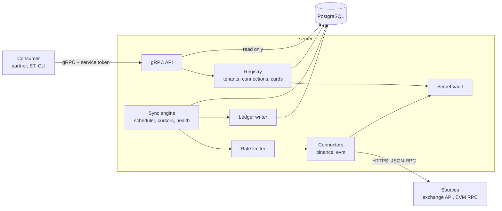
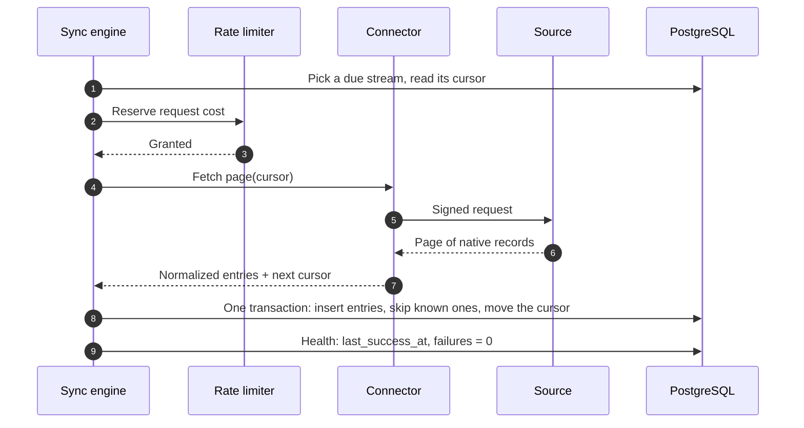
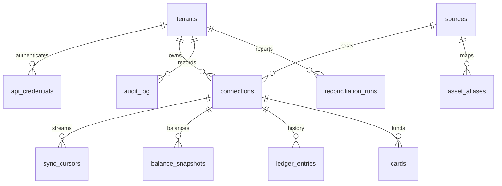

# SRS — Core

---

## 1. Introduction

- **Purpose:** specify the `server` binary: what every source and every consumer shares.
- **Scope:** tenants and access, connections, secrets, sync engine, balances, ledger, card registry, gRPC API, data model.
- **Milestones:** C1 (tenants, connections, engine, API), S2 (card registry), S3 (on-chain connector, reconciliation report), X1–X2 (first exchange connector).
- **Out of scope:**
  - exchange-specific behaviour — SRS — Binance;
  - authorization flow and contract — [SRS — Card Spend](card-spend.md);
  - the EVM connector (event indexer) — [SRS — EVM Connector](evm-connector.md);
  - tenant self-onboarding, credential rotation through the API, data retention jobs — §4.
- **Parents:** [BRD](../brd.md) BR-1 … BR-5, BR-13; [PRD — Card Spend](../prd/card-spend.md) US-6, US-7, US-8, US-13; [PRD — Exchange Accounts](../prd/exchange-accounts.md) US-204, US-205, US-208 … US-210, US-213; [ADR](../adr/README.md) 1–7, 11, 13.
- **Version:** 1.0, 2026-10-04, approved.

| Term | Meaning |
|---|---|
| Tenant | A consuming system: a partner, ET, the demo. Owns all its data. |
| Owner | The tenant's user, known to CAS only as an opaque `owner_ref`. |
| Source | An exchange or an EVM network that CAS can read. |
| Connection | One account at one source: an exchange API key or a wallet address. |
| Connector | Code adapter of one source behind the common interface (ADR-2). |
| Stream | One kind of data of a connection with its own cursor: balances, deposits, trades of a pair, event logs. Streams of one kind form a family: `trades:BTCUSDT` and `trades:ETHUSDT` belong to `trades`. |
| Snapshot | Balances of a connection at one moment. |
| Ledger entry | One immutable movement of one asset. An operation with several assets has several entries: legs. |
| Canonical asset | Asset code used across sources: `BTC`, `USDC`. The source's own code is the native asset. |

---

## 2. Functional Requirements

### 2.1 SRS for API

#### 2.1.1 Core

##### Components diagram



| Component | Responsibility |
|---|---|
| gRPC API | Authentication, tenant scoping, validation, reads from the database |
| Registry | Tenants, credentials, connections, cards |
| Secret vault | Encrypts and decrypts exchange secrets (ADR-4) |
| Sync engine | Schedules streams, keeps cursors and health, drives connectors |
| Rate limiter | One limiter per source. Its budgets are defined by the connector and shared by the connections they cover |
| Connectors | Source-specific requests, signing, pagination, normalization |
| Ledger writer | Single writer of ledger entries and snapshots |

##### Sequence diagram

One sync step of one stream.



##### Common rules

- **Protocol:** gRPC, package `cas.v1`. The `.proto` files in `proto/cas/v1/` are the contract; `buf lint` and `buf breaking` run in CI.
- **Authorization:** metadata `authorization: Bearer <service token>`. The token resolves to one tenant.
- **Tenant scope:** every request reads and writes only the caller's tenant. A resource of another tenant is reported as `NOT_FOUND`.
- **Reads never call a source.** Balances and ledger come from the database; freshness is reported, not forced.
- **Amounts:** decimal strings in asset units. Token base units where stated.
- **Pagination:** `page_size` (default 100, maximum 500) and `page_token`.
- **Errors:**

| gRPC status | Meaning |
|---|---|
| `UNAUTHENTICATED` | Missing, unknown or revoked token |
| `INVALID_ARGUMENT` | Validation failed |
| `NOT_FOUND` | No such resource in the caller's tenant |
| `ALREADY_EXISTS` | The account is already connected, or the card is already registered with different data |
| `FAILED_PRECONDITION` | The request is valid but not allowed in the current state; the reason is in the error detail |
| `RESOURCE_EXHAUSTED` | Manual sync requested inside the cooldown |
| `UNAVAILABLE` | The source cannot be reached during key verification |
| `INTERNAL` | Unexpected failure; nothing was stored |

##### Method catalogue

| Service | Method | Purpose | Milestone |
|---|---|---|---|
| `ConnectionService` | `ListSources` | Enabled exchanges and networks | C1 |
| | `CreateConnection` | Register an exchange key or a wallet address | C1 |
| | `ListConnections` | Connections of the tenant, filter by `owner_ref` | C1 |
| | `GetConnection` | One connection with the health of its streams | C1 |
| | `DeleteConnection` | Remove a connection and its data | C1 |
| | `TriggerSync` | Run the streams of a connection now | C1 |
| `AccountDataService` | `GetBalances` | Latest balances with freshness | C1 |
| | `ListLedgerEntries` | Operation history | C1 |
| `CardService` | `RegisterCard` | Bind a `card_ref` to a wallet connection | S2 |
| | `UpdateCard` | Change the daily limit; freeze or unfreeze | S2 |
| | `GetCard`, `ListCards` | Read cards | S2 |
| | `GetAuthorization`, `ListAuthorizations` | Status and history of authorizations | S2 |
| | `GetReconciliationReport` | Result of a reconciliation run | S3 |

Methods with non-obvious rules are specified below. The others follow the common rules and the `.proto` definitions.

#### 2.1.2 CreateConnection

##### Description
Registers one account at one source for an owner and starts its first sync.

##### Endpoint
`cas.v1.ConnectionService/CreateConnection`

##### Authorization
See Common rules.

##### Request parameters
###### Request example
```json
{
  "owner_ref": "user-4821",
  "source": "binance",
  "label": "Main account",
  "exchange_key": { "api_key": "vmPUZE6mv9SD…", "api_secret": "NhqPtmdSJYdK…" }
}
```

```json
{
  "owner_ref": "user-4821",
  "source": "base-sepolia",
  "label": "Card wallet",
  "wallet": { "address": "0x9aF3…41cE" }
}
```

| Parameter | Type | Required | Description | Example |
|---|---|---|---|---|
| owner_ref | String, ≤ 128 | Yes | Opaque owner ID of the tenant | `user-4821` |
| source | String | Yes | Source code from `ListSources` | `binance` |
| label | String, ≤ 64 | No | Display name | `Main account` |
| exchange_key | Object | For exchanges | API key and secret. Never returned. | — |
| wallet | Object | For EVM networks | Wallet address | — |

##### Response parameters
###### Response body example
```json
{
  "connection_id": "0c9e6a1e-7f41-4f0a-9d5e-1b2f3c4d5e6f",
  "source": "binance",
  "kind": "EXCHANGE",
  "owner_ref": "user-4821",
  "label": "Main account",
  "status": "ACTIVE",
  "key_fingerprint": "…9SDq",
  "permissions": ["READ"],
  "created_at": "2026-10-03T10:00:00Z"
}
```

| Parameter | Type | Required | Description | Example |
|---|---|---|---|---|
| connection_id | String, UUID | Yes | Connection ID | — |
| kind | Enum | Yes | `EXCHANGE` or `EVM_WALLET` | `EXCHANGE` |
| status | Enum | Yes | Connection state, §2.3.1 | `ACTIVE` |
| key_fingerprint | String | For exchanges | Last characters of the API key | `…9SDq` |
| permissions | Array of strings | For exchanges | Permissions reported by the source | `["READ"]` |

- `FAILED_PRECONDITION / KEY_NOT_READ_ONLY`: the key allows trading, withdrawal or transfer.
- `FAILED_PRECONDITION / KEY_INVALID`: the source rejects the key.
- `ALREADY_EXISTS`: this exchange account or wallet address is already connected in the tenant.

#### 2.1.3 GetBalances

##### Description
Returns the latest snapshot of each selected connection. Never calls the source.

##### Endpoint
`cas.v1.AccountDataService/GetBalances`

##### Authorization
See Common rules.

##### Request parameters
###### Request example
```json
{ "owner_ref": "user-4821" }
```

| Parameter | Type | Required | Description | Example |
|---|---|---|---|---|
| owner_ref | String | One of the two | All connections of the owner | `user-4821` |
| connection_id | String, UUID | One of the two | One connection | — |

##### Response parameters
###### Response body example
```json
{
  "connections": [
    { "connection_id": "0c9e6a1e-…", "source": "binance", "as_of": "2026-10-03T10:15:00Z", "stale": false },
    { "connection_id": "5b7d2c90-…", "source": "base-sepolia", "as_of": "2026-10-03T09:40:00Z", "stale": true }
  ],
  "balances": [
    { "connection_id": "0c9e6a1e-…", "account_type": "SPOT", "asset": "BTC", "native_asset": "BTC", "free": "0.0125", "locked": "0" },
    { "connection_id": "0c9e6a1e-…", "account_type": "EARN_FLEXIBLE", "asset": "USDT", "native_asset": "USDT", "free": "150", "locked": "0" },
    { "connection_id": "5b7d2c90-…", "account_type": "WALLET", "asset": "USDC", "native_asset": "0x7a1c…e9b2", "free": "70.133613", "locked": "0" }
  ]
}
```

| Parameter | Type | Required | Description | Example |
|---|---|---|---|---|
| connections[].as_of | Timestamp | After the first sync | Time of the returned snapshot | — |
| connections[].stale | Boolean | Yes | `true` when the last successful sync is older than `stale_after` | `false` |
| balances[].account_type | Enum | Yes | `SPOT`, `FUNDING`, `EARN_FLEXIBLE`, `EARN_LOCKED`, `WALLET` | `SPOT` |
| balances[].asset | String | Yes | Canonical asset | `BTC` |
| balances[].native_asset | String | Yes | Code or token address at the source | `BTC` |
| balances[].free | String, decimal | Yes | Available amount | `0.0125` |
| balances[].locked | String, decimal | Yes | Amount in orders or lock-up | `0` |

- An asset absent from the snapshot has a zero balance.
- A connection that has never synced appears in `connections` with `stale: true`, no `as_of` and no balances.
- CAS returns no fiat valuation (ADR-1).

#### 2.1.4 ListLedgerEntries

##### Description
Returns ledger entries of the tenant. Built for incremental pull: the consumer keeps the last `seq` and asks for what came after it.

##### Endpoint
`cas.v1.AccountDataService/ListLedgerEntries`

##### Authorization
See Common rules.

##### Request parameters
###### Request example
```json
{ "owner_ref": "user-4821", "after_seq": "18220", "page_size": 100 }
```

| Parameter | Type | Required | Description | Example |
|---|---|---|---|---|
| owner_ref | String | No | Filter by owner | `user-4821` |
| connection_id | String, UUID | No | Filter by connection | — |
| after_seq | String, integer | No | Return entries with `seq` above this value. Default 0. | `18220` |
| types | Array of enums | No | Filter by entry type | `["TRADE"]` |
| occurred_from, occurred_to | Timestamp | No | Filter by operation time | — |
| page_size | Integer | No | Default 100, maximum 500 | `100` |

##### Response parameters
###### Response body example
```json
{
  "entries": [
    {
      "seq": "18221", "connection_id": "0c9e6a1e-…", "type": "TRADE", "leg": "BASE",
      "direction": "IN", "asset": "BTC", "amount": "0.0125",
      "group_id": "trades:BTCUSDT:3491027", "external_id": "BTCUSDT:3491027",
      "occurred_at": "2026-10-01T08:12:44Z"
    },
    {
      "seq": "18222", "connection_id": "0c9e6a1e-…", "type": "TRADE", "leg": "QUOTE",
      "direction": "OUT", "asset": "USDT", "amount": "1493.75",
      "group_id": "trades:BTCUSDT:3491027", "external_id": "BTCUSDT:3491027",
      "occurred_at": "2026-10-01T08:12:44Z"
    },
    {
      "seq": "18223", "connection_id": "5b7d2c90-…", "type": "CARD_DEBIT", "leg": "SINGLE",
      "direction": "OUT", "asset": "USDC", "amount": "29.866387",
      "group_id": "logs:0x4be1…c7a2:3", "external_id": "0x4be1…c7a2:3",
      "occurred_at": "2026-10-02T12:00:00Z"
    }
  ],
  "last_seq": "18223",
  "has_more": false
}
```

| Parameter | Type | Required | Description | Example |
|---|---|---|---|---|
| entries[].seq | String, integer | Yes | Position in the order of arrival. Grows only. | `18221` |
| entries[].type | Enum | Yes | `DEPOSIT`, `WITHDRAWAL`, `TRADE`, `FEE`, `CONVERT`, `REWARD`, `CARD_DEBIT`, `CARD_REFUND` | `TRADE` |
| entries[].leg | Enum | Yes | `SINGLE`, `BASE`, `QUOTE`, `FEE` | `BASE` |
| entries[].direction | Enum | Yes | `IN` or `OUT`, from the account's point of view | `IN` |
| entries[].amount | String, decimal | Yes | Always positive | `0.0125` |
| entries[].group_id | String | Yes | Same for all legs of one operation: stream family + `external_id` | — |
| entries[].external_id | String | Yes | ID at the source | — |
| entries[].occurred_at | Timestamp | Yes | Time at the source | — |
| last_seq | String, integer | Yes | Highest `seq` in the response; next `after_seq` | `18223` |
| has_more | Boolean | Yes | More entries exist after `last_seq` | `false` |

- Order: ascending `seq`. A backfilled old operation gets a new, higher `seq`, so an incremental consumer never misses it.
- Entries are immutable. Only final operations of the source are imported (ADR-5).
- The raw source payload is stored but not returned by this method.

#### 2.1.5 RegisterCard

##### Description
Binds a processor card reference to a wallet connection. `card-auth` reads this registry on every authorization.

##### Endpoint
`cas.v1.CardService/RegisterCard`

##### Authorization
See Common rules.

##### Request parameters
###### Request example
```json
{
  "card_ref": "card_7Q2M",
  "owner_ref": "user-4821",
  "connection_id": "5b7d2c90-…",
  "daily_limit": "200000000"
}
```

| Parameter | Type | Required | Description | Example |
|---|---|---|---|---|
| card_ref | String, ≤ 64 | Yes | Opaque card reference from the processor. Unique per tenant. No card number. | `card_7Q2M` |
| owner_ref | String | Yes | Must equal the owner of the connection | `user-4821` |
| connection_id | String, UUID | Yes | An `ACTIVE` connection of kind `EVM_WALLET` | — |
| daily_limit | String, integer | Yes | Card daily limit in base units of the funding token | `200000000` |

##### Response parameters
###### Response body example
```json
{
  "card_ref": "card_7Q2M",
  "owner_ref": "user-4821",
  "connection_id": "5b7d2c90-…",
  "wallet_address": "0x9aF3…41cE",
  "status": "ACTIVE",
  "daily_limit": "200000000"
}
```

| Parameter | Type | Required | Description | Example |
|---|---|---|---|---|
| status | Enum | Yes | `ACTIVE` or `FROZEN` | `ACTIVE` |
| wallet_address | String | Yes | Address of the bound wallet | — |

- The same request repeated returns the existing card. A different body for a known `card_ref` → `ALREADY_EXISTS`.
- Several cards may share one wallet. The wallet daily limit in the contract caps them together (SRS — Card Spend §2.1.5).
- The wallet daily limit is set on-chain by the admin, not by this method.
- Proof of wallet ownership and the KYC status check are design only (US-1).

---

### 2.2 User Interface

N/A — no UI. Administration goes through the CLI and the gRPC API.

---

### 2.3 Use Case

#### 2.3.1 UC-101 Create a connection (C1)

##### Sequence diagram
N/A — one request, one optional call to the source; the steps are in the algorithm.

##### Algorithm

| # | Step | On failure |
|---|---|---|
| 1 | Authenticate, resolve the tenant, validate | `UNAUTHENTICATED`, `INVALID_ARGUMENT` |
| 2 | Check that the source exists and is enabled | `NOT_FOUND`, `FAILED_PRECONDITION` |
| 3 | Exchange: call the connector's key check. It returns the account ID and the permissions. | `KEY_INVALID`, `UNAVAILABLE` |
| 4 | Exchange: reject a key with any permission beyond reading | `KEY_NOT_READ_ONLY` |
| 5 | Wallet: validate the address format and checksum | `INVALID_ARGUMENT` |
| 6 | Check uniqueness of `(tenant, source, account)`: exchange account ID or wallet address | `ALREADY_EXISTS` |
| 7 | Exchange: encrypt key and secret; keep the fingerprint | `INTERNAL` |
| 8 | Insert the connection as `ACTIVE`, create a cursor per stream, write the audit record | `INTERNAL` |
| 9 | Schedule the first sync at once; respond | — |

##### Preconditions
- The tenant exists and holds a valid service token.

##### Trigger
`CreateConnection`.

##### Basic Flow
Steps 1–9.

##### Connection states

| State | Meaning | Sync |
|---|---|---|
| `ACTIVE` | Usable | Runs |
| `DEGRADED` | `failure_threshold` consecutive failures on a stream | Runs with backoff |
| `CREDENTIALS_INVALID` | The source rejected the key, or the key is no longer read-only | Stopped until the connection is replaced |

##### Exception Paths

| EC | Case | Handling |
|---|---|---|
| EC-101 | Key with trade, withdrawal or transfer permission | Step 4: rejected; no connection and no key are stored |
| EC-102 | Same account or address registered again | Step 6: `ALREADY_EXISTS` |
| EC-103 | The source cannot report key permissions | The connector declares it; the connection is created with `permissions: ["UNVERIFIED"]` and the audit record says so |
| EC-104 | Source unreachable during the key check | Step 3: `UNAVAILABLE`, nothing stored |

##### Acceptance Criteria

| ID | Requirement | Parent |
|---|---|---|
| FR-101 | A tenant must be able to create, list, read and delete connections of both kinds. | BR-1 |
| FR-102 | An exchange key with any permission beyond reading must be rejected and not stored. | BR-2 |
| FR-103 | Key and secret must be stored only encrypted; responses, logs and errors must contain at most the fingerprint. | BRD §9.2 Security |
| FR-104 | One exchange account or wallet address must be connected at most once per tenant. | BR-1 |
| FR-105 | Every request must be limited to the caller's tenant; another tenant's resource must look non-existent. | BR-13 |

##### Postconditions
- The connection exists with one cursor per stream; its first sync is scheduled.

#### 2.3.2 UC-102 Sync a stream (C1)

##### Sequence diagram
See §2.1.1.

##### Algorithm

| # | Step | On failure |
|---|---|---|
| 1 | The scheduler picks a stream whose `next_run_at` has come | — |
| 2 | Reserve the request cost in the source's rate limiter; wait if the budget is spent | — |
| 3 | The connector fetches one page from the cursor | Step 8 |
| 4 | The connector maps native records to canonical entries or a snapshot; native asset codes are resolved through `asset_aliases` | An unknown code is kept as the canonical code and counted |
| 5 | Ledger stream: in one transaction insert the entries, skip those whose idempotency key exists, move the cursor | Rollback; step 8 |
| 6 | Balance stream: insert a new snapshot | Rollback; step 8 |
| 7 | More pages → step 2. Otherwise set `last_success_at`, zero the failure counter, set `next_run_at` | — |
| 8 | Failure: store `last_error`, increase the failure counter, set `next_run_at` with exponential backoff | — |

##### Preconditions
- The connection is `ACTIVE` or `DEGRADED`.

##### Trigger
Timer per stream; `TriggerSync`; connection created; an event of the source (ADR-13).

##### Basic Flow
Steps 1–7.

##### Stream modes

| Mode | Cursor moves | Ends when |
|---|---|---|
| `BACKFILL` | Through history, window by window: backwards from now for exchanges, forwards from `backfill_floor` for EVM networks | The other end of history is reached; the stream switches to `INCREMENTAL` |
| `INCREMENTAL` | Forwards from the newest known record | Never |

##### Exception Paths

| EC | Case | Handling |
|---|---|---|
| EC-105 | The same record arrives again (overlapping window, retry, restart) | Step 5: skipped by the idempotency key |
| EC-106 | The service stops in the middle of a backfill | The cursor moved only with committed pages; the next run continues from it |
| EC-107 | The source answers "rate limit exceeded" | The limiter pauses the affected budget for the time the source demands; no retry before that |
| EC-108 | The source rejects the key | Connection → `CREDENTIALS_INVALID`; all its streams stop; audit record |
| EC-109 | Unknown native asset code | Step 4: imported under its native code; metric and log |
| EC-110 | An operation at the source is not final yet | Not imported; picked up by a later run once final |
| EC-111 | A stream keeps failing | After `failure_threshold` failures the connection is `DEGRADED`; reads keep returning the last snapshot, stale by the age rule of §2.1.3 |
| EC-112 | `TriggerSync` called again inside the cooldown | `RESOURCE_EXHAUSTED` |
| EC-116 | The key gains a trade, withdrawal or transfer permission after the connection was created | Found by the periodic key check; connection → `CREDENTIALS_INVALID`; audit record |

##### Acceptance Criteria

| ID | Requirement | Parent |
|---|---|---|
| FR-106 | A repeated sync must add no duplicate ledger entries. | BR-4 |
| FR-107 | Ledger entries and the cursor must be committed in the same transaction. | BR-4 |
| FR-108 | After a restart a stream must continue from its stored cursor. | BRD §9.2 Reliability |
| FR-109 | When a sync fails, the last snapshot must still be returned; it must be marked stale once it is older than `stale_after`. | US-204, BR-3 |
| FR-110 | All requests to one source must pass through one rate limiter; the limiter must exist before the first live call. | BRD §9.2 Rate limits |
| FR-111 | Only final operations must be imported; a ledger entry must never be updated or deleted by a sync. | BR-4 |
| FR-112 | A new source must be added as a connector and seed data, with no change to the engine, the ledger schema or the API. | US-208, US-213, BR-5 |
| FR-113 | The raw source record must be stored with every ledger entry. | BRD §9.2 Audit |
| FR-114 | Ledger entries must receive `seq` in commit order, so a consumer reading `after_seq` misses nothing. | US-209, BR-4 |
| FR-119 | Key permissions must be re-checked every `key_check_interval`; a key that is no longer read-only must stop the connection. | BR-2 |
| FR-120 | A consumer must be able to start the sync of a connection on demand, at most once per `trigger_sync_cooldown`. | US-210, BR-3 |

##### Postconditions
- New entries or a new snapshot are stored; the cursor and health of the stream are up to date.

#### 2.3.3 UC-103 Manage a card (S2)

##### Sequence diagram
N/A — database operations only.

##### Algorithm

| # | Operation | Rules |
|---|---|---|
| 1 | Register | §2.1.5 |
| 2 | Change the daily limit | New value applies to the next authorization |
| 3 | Freeze, unfreeze | `ACTIVE` ↔ `FROZEN`; a frozen card is declined by `card-auth` |
| 4 | Read authorizations | Data of [SRS — Card Spend](card-spend.md) §2.4, read-only |

##### Preconditions
- An `ACTIVE` wallet connection of the same tenant and owner.

##### Trigger
`CardService` methods, called by the partner backend or the CLI.

##### Basic Flow
Row 1, then `card-auth` uses the card.

##### Exception Paths

| EC | Case | Handling |
|---|---|---|
| EC-113 | The connection is not a wallet, not `ACTIVE`, or belongs to another owner | `FAILED_PRECONDITION` |
| EC-114 | Delete a connection that has cards | `FAILED_PRECONDITION`; the cards must be removed first |
| EC-115 | Change a card while an authorization is in progress | The authorization keeps the values it read; the change applies to the next one |

##### Acceptance Criteria

| ID | Requirement | Parent |
|---|---|---|
| FR-115 | A partner must be able to register a card for a wallet, change its daily limit, and freeze and unfreeze it. | US-6, US-7 |
| FR-116 | A partner must be able to read the status and history of its authorizations. | US-8 |
| FR-117 | Every change of a connection or a card must be written to the audit log with the acting credential. | BRD §9.2 Audit |

FR-117 applies to connections from C1.

##### Postconditions
- The card registry reflects the change; an audit record exists.

#### 2.3.4 UC-104 Delete a connection (C1)

##### Sequence diagram
N/A — database operations only.

##### Algorithm

| # | Step | On failure |
|---|---|---|
| 1 | Check that no card references the connection | `FAILED_PRECONDITION` (EC-114) |
| 2 | In one transaction: delete the connection, its secret, cursors, snapshots and ledger entries; write the audit record | Rollback |
| 3 | Running sync of the connection stops at its next step | — |

##### Preconditions
- The connection belongs to the caller's tenant.

##### Trigger
`DeleteConnection`.

##### Basic Flow
Steps 1–3.

##### Exception Paths
- EC-114, above.

##### Acceptance Criteria

| ID | Requirement | Parent |
|---|---|---|
| FR-118 | After deletion no secret, balance or ledger entry of the connection must remain readable. | US-205, BR-1 |

##### Postconditions
- Only the audit record of the deletion remains.
- Consumers learn about the removal from `ListConnections`; entries they already pulled are theirs to drop.

---

### 2.4 Data Model

#### 2.4.1 Core

##### Data model schema



`cards` is the parent of `authorizations` in SRS — Card Spend §2.4.

##### tenants
###### Description
A consuming system. Created through the CLI.

###### Data model

| Name | Type | Required | Description |
|---|---|---|---|
| id | UUID | Yes | Primary key |
| name | TEXT | Yes | Unique |
| status | TEXT | Yes | `ACTIVE`, `DISABLED` |
| created_at | TIMESTAMPTZ | Yes | — |

##### api_credentials
###### Description
Service tokens for gRPC and Basic credentials for the processor API of `card-auth`. Only hashes are stored.

###### Data model

| Name | Type | Required | Description |
|---|---|---|---|
| id | UUID | Yes | Primary key |
| tenant_id | UUID | Yes | Tenant |
| kind | TEXT | Yes | `SERVICE_TOKEN`, `PROCESSOR_BASIC` |
| key_id | TEXT | Yes | Token prefix or username. Unique. |
| secret_hash | BYTEA | Yes | Hash of the token or password |
| created_at | TIMESTAMPTZ | Yes | — |
| revoked_at | TIMESTAMPTZ | No | Set when revoked |

##### sources
###### Description
Exchanges and EVM networks. Business configuration lives here; system configuration lives in the environment.

###### Data model

| Name | Type | Required | Description |
|---|---|---|---|
| id | SMALLINT | Yes | Primary key |
| code | TEXT | Yes | Unique: `binance`, `base-sepolia` |
| kind | TEXT | Yes | `EXCHANGE`, `EVM` |
| enabled | BOOLEAN | Yes | Offered to tenants |
| config | JSONB | Yes | Base URL or chain ID, sync intervals, rate-limit settings, backfill floor |

##### connections
###### Description
One account at one source.

###### Data model

| Name | Type | Required | Description |
|---|---|---|---|
| id | UUID | Yes | Primary key |
| tenant_id | UUID | Yes | Tenant |
| owner_ref | TEXT | Yes | Opaque owner ID |
| source_id | SMALLINT | Yes | Source |
| external_account | TEXT | Yes | Exchange account ID or wallet address. Unique with `tenant_id` and `source_id`. |
| label | TEXT | No | Display name |
| status | TEXT | Yes | §2.3.1 |
| credentials_enc | BYTEA | No | Envelope-encrypted key and secret (ADR-4). Null for wallets. |
| kek_version | SMALLINT | No | Master key version used |
| key_fingerprint | TEXT | No | Last characters of the API key |
| permissions | TEXT[] | No | As reported by the source |
| permissions_checked_at | TIMESTAMPTZ | No | Last key check |
| created_at | TIMESTAMPTZ | Yes | — |

##### asset_aliases
###### Description
Native asset code or token address of a source → canonical asset.

###### Data model

| Name | Type | Required | Description |
|---|---|---|---|
| source_id | SMALLINT | Yes | Primary key, part 1 |
| native_asset | TEXT | Yes | Primary key, part 2. Code or token address. |
| asset | TEXT | Yes | Canonical code |
| decimals | SMALLINT | No | For tokens: base-unit exponent |

##### sync_cursors
###### Description
Position and health of one stream of one connection.

###### Data model

| Name | Type | Required | Description |
|---|---|---|---|
| connection_id | UUID | Yes | Primary key, part 1 |
| stream | TEXT | Yes | Primary key, part 2: `balances`, `deposits`, `trades:BTCUSDT`, `logs` |
| mode | TEXT | Yes | `BACKFILL`, `INCREMENTAL` |
| cursor | JSONB | Yes | Connector-defined: last ID, time window, block number |
| next_run_at | TIMESTAMPTZ | Yes | When the stream is due |
| last_success_at | TIMESTAMPTZ | No | Last successful run |
| last_error | TEXT | No | Last error, without secrets |
| consecutive_failures | INTEGER | Yes | Zeroed on success |

##### balance_snapshots
###### Description
Append-only. One sync of the balance stream writes one snapshot: rows with the same `snapshot_id`.

###### Data model

| Name | Type | Required | Description |
|---|---|---|---|
| snapshot_id | UUID | Yes | Primary key, part 1 |
| connection_id | UUID | Yes | Connection |
| account_type | TEXT | Yes | Primary key, part 2 |
| native_asset | TEXT | Yes | Primary key, part 3 |
| asset | TEXT | Yes | Canonical code |
| free | NUMERIC(38,18) | Yes | Available |
| locked | NUMERIC(38,18) | Yes | In orders or lock-up |
| taken_at | TIMESTAMPTZ | Yes | Snapshot time |

##### ledger_entries
###### Description
Append-only canonical ledger. Idempotency key: `(connection_id, stream, external_id, leg)`.

###### Data model

| Name | Type | Required | Description |
|---|---|---|---|
| seq | BIGINT | Yes | Primary key. Assigned by the single ledger writer in commit order. |
| tenant_id | UUID | Yes | Tenant |
| connection_id | UUID | Yes | Connection |
| stream | TEXT | Yes | Stream family that produced the entry: `trades`, `deposits`, `logs` |
| external_id | TEXT | Yes | ID at the source: `BTCUSDT:3491027`, `tx_hash:log_index` |
| leg | TEXT | Yes | `SINGLE`, `BASE`, `QUOTE`, `FEE` |
| group_id | TEXT | Yes | Same for all legs of one operation |
| type | TEXT | Yes | §2.1.4 |
| direction | TEXT | Yes | `IN`, `OUT` |
| asset | TEXT | Yes | Canonical code |
| native_asset | TEXT | Yes | Code or token address at the source |
| amount | NUMERIC(38,18) | Yes | Positive |
| occurred_at | TIMESTAMPTZ | Yes | Time at the source |
| raw | JSONB | Yes | Source record as received |
| created_at | TIMESTAMPTZ | Yes | Import time |

##### cards
###### Description
Card registry read by `card-auth`.

###### Data model

| Name | Type | Required | Description |
|---|---|---|---|
| id | UUID | Yes | Primary key |
| tenant_id | UUID | Yes | Tenant |
| card_ref | TEXT | Yes | Unique with `tenant_id` |
| owner_ref | TEXT | Yes | Equals the owner of the connection |
| connection_id | UUID | Yes | Wallet connection |
| status | TEXT | Yes | `ACTIVE`, `FROZEN` |
| daily_limit | NUMERIC(78,0) | Yes | Base units of the funding token |
| created_at | TIMESTAMPTZ | Yes | — |
| updated_at | TIMESTAMPTZ | Yes | — |

##### audit_log
###### Description
Append-only record of changes made through the API or the CLI.

###### Data model

| Name | Type | Required | Description |
|---|---|---|---|
| id | BIGSERIAL | Yes | Primary key |
| tenant_id | UUID | Yes | Tenant |
| credential_id | UUID | No | Acting credential; null for the CLI |
| action | TEXT | Yes | `CONNECTION_CREATED`, `CONNECTION_DELETED`, `CREDENTIALS_INVALID`, `CARD_REGISTERED`, `CARD_UPDATED` |
| object_id | TEXT | Yes | Connection ID or `card_ref` |
| details | JSONB | No | Changed fields; no secrets |
| created_at | TIMESTAMPTZ | Yes | — |

##### reconciliation_runs
###### Description
One row per reconciliation run (SRS — Card Spend UC-4). Milestone S3.

###### Data model

| Name | Type | Required | Description |
|---|---|---|---|
| id | UUID | Yes | Primary key |
| tenant_id | UUID | Yes | Tenant |
| period_from | TIMESTAMPTZ | Yes | Start of the checked period |
| period_to | TIMESTAMPTZ | Yes | End of the checked period |
| totals | JSONB | Yes | Counts and sums of debits and refunds |
| mismatches | JSONB | Yes | List of mismatches: type, IDs, amounts |
| created_at | TIMESTAMPTZ | Yes | — |

---

### 2.5 Metrics and Alerts

#### 2.5.1 Metrics

| Service | Metric name | Value | Alert | Description | Requestor |
|---|---|---|---|---|---|
| server | `sync_runs_total{source,stream,result}` | — | Failure share > 20% for 15 min | Sync runs by outcome | BR-3 |
| server | `sync_staleness_seconds{source}` | < `stale_after` | Above `stale_after` | Now minus the oldest `last_success_at` | BR-3 |
| server | `connections{status}` | — | Any `CREDENTIALS_INVALID` | Connections by state | BR-1 |
| server | `ledger_entries_inserted_total{source}` | — | — | New entries | BR-4 |
| server | `ledger_duplicates_skipped_total{source}` | — | — | Records skipped by the idempotency key | BR-4 |
| server | `unmapped_assets_total{source}` | 0 | Any | Native codes without an alias | BR-4 |
| server | `rate_limit_wait_seconds{source}` | — | p95 > 30 s | Time spent waiting for the budget | BRD §9.2 |
| server | `rate_limit_rejections_total{source}` | 0 | Any | "Rate limit exceeded" answers from the source | BRD §9.2 |
| server | `grpc_request_seconds{method}` | Reads p95 ≤ 100 ms | p95 > 300 ms for 5 min | API latency | BR-3 |

#### 2.5.2 Alerts
Conditions are in the Alert column above. Delivery channel: N/A — defined with the deployment.

---

## 3. Non-functional Requirements

### 3.1 Configuration

| Parameter | Where | Default | Meaning |
|---|---|---|---|
| `CAS_MASTER_KEY`, `CAS_MASTER_KEY_VERSION` | Environment | — | Key that wraps the data keys of exchange secrets |
| `DATABASE_URL` | Environment | — | PostgreSQL, role `server` |
| gRPC port | Environment | 50053 | Consumer API |
| Health port | Environment | 8091 | `/healthz`, `/readyz` |
| `sync_interval` per stream family | `sources.config` | Balances 15 min, ledger 1 h | Period of a stream |
| `stale_after` | `sources.config` | 2 × balance interval | Age after which balances are stale |
| `backfill_floor` | `sources.config` | Per source | Earliest point a backfill reaches: a date or a block number; see the source's SRS |
| Rate-limit settings | `sources.config` | Per source | Defined in the source's SRS: `budget_share` for Binance, `rpc_rate_limit` for EVM networks |
| `failure_threshold` | Environment | 5 | Failures before `DEGRADED` |
| `backoff` | Environment | 30 s, doubling, cap 1 h | Delay after a failed run |
| `trigger_sync_cooldown` | Environment | 60 s | Minimum gap between manual syncs of a connection |
| `key_check_interval` | Environment | 24 h | Period of the key permission re-check |

### 3.2 General Non-functional Requirements

- **Parallel work:**
  - the sync engine runs in one `server` instance at a time, guarded by a database advisory lock: one process owns the rate budgets of each source;
  - API instances are stateless and can be many;
  - the ledger has one writer, so `seq` order equals commit order (FR-114);
  - streams of different connections run concurrently; a stream never runs twice at once.
- **Audit log:** `audit_log` for changes; `ledger_entries.raw` for imported data; no secrets in either.
- **Performance:** read methods p95 ≤ 100 ms: database only. Sync speed is bounded by the source's rate budget, not by CAS.
- **Reliability:**
  - a failed source never fails a read: last data plus the stale flag;
  - cursors move only with committed data (FR-107);
  - a rate-limit answer pauses the affected budget instead of retrying (EC-107).
- **Security:**
  - envelope encryption of exchange secrets; the master key only in the environment (ADR-4);
  - service tokens and processor passwords stored as hashes;
  - tenant filter on every query (FR-105), covered by an automated test with two tenants;
  - the `server` database role reads card-auth tables but cannot write them; the operator key is not in the database.
- **Compliance:** no personal data. `owner_ref`, `card_ref` and labels are supplied by the tenant and must not contain any.

---

## 4. Open Issues

| # | Issue | Proposal |
|---|---|---|
| 1 | Tenant onboarding through the API | CLI only for now; an admin API when a second real tenant appears |
| 2 | Rotation of an exchange key without losing history | `RotateCredentials` method: same connection, new encrypted key; after C1 |
| 3 | Retention of balance snapshots | Keep everything for now; thinning of old snapshots later |
| 4 | Erasing all data of one owner | `DeleteOwnerData` method; after C1 |
