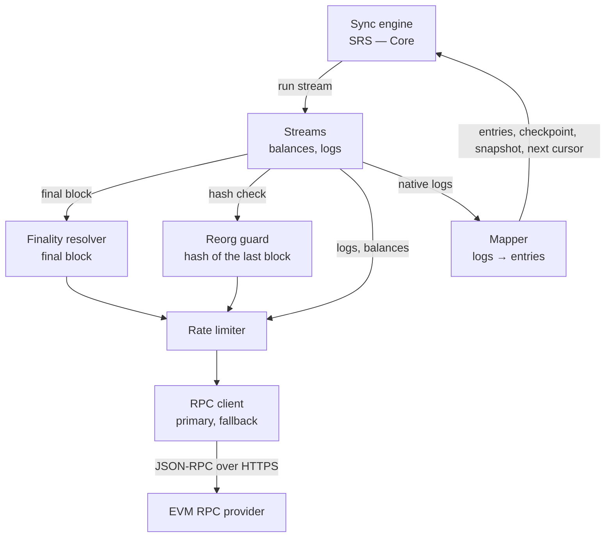
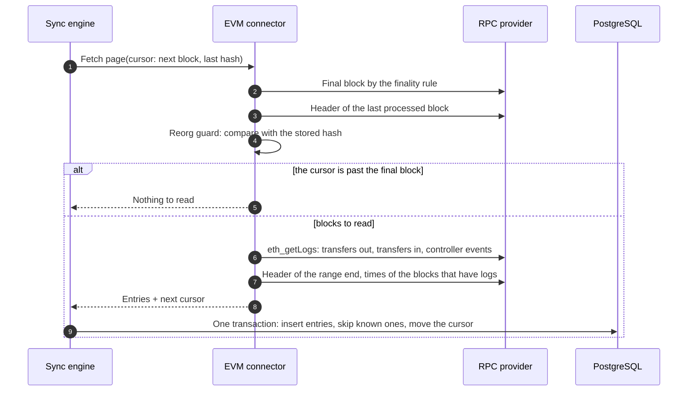

# SRS — EVM Connector

---

## 1. Introduction

- **Purpose:** specify the EVM connector of `server`: how a wallet address becomes balances and ledger entries, and how contract events reach reconciliation.
- **Scope:** address check, finality rule, balance snapshot, event log import, reorg guard, completeness check, test approach.
- **Milestones:** C1 (address check, chain allow-list), S3 (streams, completeness check, treasury connection).
- **Out of scope:**
  - everything shared by all sources — engine, cursors, ledger schema, consumer API: [SRS — Core](core.md);
  - the authorization flow, the contract and the reconciliation rules: [SRS — Card Spend](card-spend.md);
  - real-time signals: `card-auth` tracks its own transactions (ADR-13). This connector reads logs from final blocks only.
- **Parents:** [BRD](../brd.md) BR-1, BR-3, BR-4, BR-5, BR-12; [PRD — Card Spend](../prd/card-spend.md) US-13; [ADR](../adr/README.md) 2, 3, 5, 6, 8, 11, 13.
- **Version:** 1.3, 2026-10-07. Completed by the discovery of S3 (decisions S3 D-n): platform tenant and treasury connection (S3 D-1, S3 D-2, S3 D-22); balance checkpoint and its storage (S3 D-3, S3 D-5); one read of the final block for `card-auth` and the connector (S3 D-4); finality configured twice (S3 D-18); `last_time` in the cursor (S3 D-7); values of `sources.config` per network and the alias of the tracked token (S3 D-12, S3 D-17, S3 D-27); source without an RPC URL (S3 D-16); start checks (S3 D-23); endpoint variables and network errors of `sources.config` (S3 D-29, S3 D-30); tracked tokens with the source, `treasury_address`, endpoint choice per source, call timeout and rate-limit pause, required `controller_address` and `backfill_floor` (S3 D-31 … S3 D-34, S3 D-36); an oversized balance refuses the snapshot, EC-319 (S3 D-37); alerts as metrics (S3 D-11); fixtures and the shared connector test suite (S3 D-13, S3 D-14); EC-316 out of S3 (S3 D-15); the gap metric in SRS — Core (S3 D-19). Version 1.2, 2026-10-05. One clarification by the discovery of S2: which milestone fills `sources.config` (§2.4). Version 1.1, 2026-10-04. Completed by the discovery of C1: allow-list check from C1 (FR-318), source rows of C1, address input rules. Version 1.0 approved 2026-10-04.
- **Network facts:** finality stages and their timing are taken from the Base documentation for Base mainnet, checked on 2026-10-03. Base Sepolia may differ; the values are measured at S3.

| Term | Meaning |
|---|---|
| Event log | Record emitted by a contract during a transaction. Identified by transaction hash and log index. |
| Topic | Filterable field of an event log. Topic 0 is the event signature; topics 1–3 are its indexed fields. |
| Head | The newest block of the network. |
| Block tag | Named block in an RPC request: `latest`, `pending`, `safe`, `finalized`. |
| L1, batch | Base is an L2 network: it posts its transactions in batches to Ethereum (L1) and takes its finality from there. |
| Final block | The newest block whose logs the connector may read, set by the finality rule. |
| Tracked token | ERC-20 token listed in `asset_aliases` for the network. Only tracked tokens are read. |
| Controller | The `CardSpendController` contract of the network. |
| Treasury connection | The connection that watches the settlement treasury of the controller. Owned by the platform tenant. |
| Platform tenant | The platform's own tenant, `cas-platform` (S3 D-1). An ordinary tenant: CAS knows it only as the tenant of the connection named in `treasury_connection` of a source. |
| Balance checkpoint | Balances of the tracked tokens of a connection at the final block, returned with a `logs` page (UC-304). |

---

## 2. Functional Requirements

### 2.1 SRS for API

The connector exposes no API of its own. This section specifies its use of the Ethereum JSON-RPC API.

#### 2.1.1 EVM connector

##### Components diagram



##### Sequence diagram

One run of the `logs` stream.



##### Common rules

- **Protocol:** Ethereum JSON-RPC over HTTPS. One primary endpoint and one fallback per network.
- **Source without an endpoint:** an enabled source of the allow-list without `EVM_RPC_URL_<SOURCE>` in the environment stays available: wallet connections and cards work. The connector declares no streams for it, and `server` writes one WARN line at start. The next start after the URL is set creates the cursors (SRS — Core FR-122) (S3 D-16).
- **Read-only:** the connector holds no key and sends no transaction (ADR-3).
- **Test networks only:** the chain ID of a source must be in the allow-list `EVM_ALLOWED_CHAIN_IDS`: 31337 (Anvil) and 84532 (Base Sepolia) by default (BRD §9.2). A source outside the list is not available: it is not offered and no connection is created on it. Checked from C1 (FR-318).
- **Address:** 20 bytes. Stored and returned in EIP-55 form; compared without regard to case.
- **Tracked tokens:** only tokens listed in `asset_aliases` are read; the connector gets them with the source (SRS — Core Connector contract, S3 D-31). MVP: `MockUSDC`. A tracked token must be a plain ERC-20: 0 to 18 decimals in its alias row, checked by the start check `token`, no fee on transfer, no rebasing, a `Transfer` log for every balance change including mint and burn.
- **Amounts:** `uint256` base units → decimal amount with the token's `decimals` from `asset_aliases`. No floats.
- **Logs: final blocks only.** No log above the final block is read (ADR-11).
- **Balances: at the head.** A snapshot is replaced by the next one, so a reorg cannot leave a wrong value behind.
- **One endpoint per run:** a run uses the primary, or the fallback if the previous run failed on the primary. The final block, the headers and the logs of one run come from the same endpoint. The run after a successful fallback run tries the primary again. The choice is kept in memory per source, not per connection: a run of any connection of the source that failed on the primary sends the next run of the source to the fallback. A failure is an RPC error — transport, HTTP status, JSON-RPC error, timeout, rate limit —, not a reorg guard hit and not a failed start check (S3 D-33).
- **Roles of a connection:**
  - a wallet connection sees the transfers of its address and the `Debited` and `Refunded` events where it is the `user`;
  - the treasury connection is the one named in `treasury_connection` of the source, in the platform tenant `cas-platform`. It sees the transfers of the treasury and every `Debited` and `Refunded` event. Reconciliation reads its entries (§2.4).
- **Start checks per network** (S3 D-23):
  - the chain ID of the endpoint equals `chain_id` of the source and is in the allow-list;
  - `token()` of the controller is a tracked token, and every alias row of the source has 0 to 18 decimals; a controller without code (`eth_call` answers no data) fails this check, and `treasury()` the next one;
  - the address of the treasury connection, `treasury_address` of `sources.config`, equals `treasury()` of the controller (S3 D-32).
- **When the checks run:** before the first run of a stream of the network after `server` starts, and again before each run while a check fails. Checks that passed are kept until `server` stops. The fallback endpoint is checked when a run first uses it (UC-303 step 1). A change of `controller_address`, `treasury_address` or an alias row while `server` runs is checked after the next start.
- **A failed check** fails the run: nothing else is read, the failure counts as any failed run (SRS — Core UC-102 step 8: backoff, `DEGRADED` after the threshold), `evm_start_check_failed{source,check}` is 1, critical alert.
- **An RPC error during a check** is an RPC error of the run (S3 D-33): the endpoint of the next run changes, the check stays to be done. A wrong value is a failed check.
- **No treasury connection yet:** `treasury_connection` of the source is not set. The treasury check is skipped with one WARN line per start; wallet streams run; reconciliation of the source does not run (SRS — Card Spend UC-4).
- **C1 and S2:** the connector checked the address only and declared no streams: a wallet connection existed for the card registry, without balances and history. From S3 it declares `balances` and `logs`; existing connections get their cursors at the next start of the engine (SRS — Core FR-122).

##### Finality rule

Set per network in `sources.config`. `card-auth` uses the same rule for its final status (SRS — Card Spend §3.1).

- **One read, two configurations:** the read of the final block is one function of `internal/chain`, called by the tracker of `card-auth` and by this connector (S3 D-4). Each service takes the rule from its own configuration: `card-auth` from `CARD_AUTH_FINALITY_*`, the connector from `sources.config`. Both must hold the same rule for a network; nothing checks it (S3 D-18).
- In mode `confirmations`, while the chain is shorter than `finality_confirmations`, no block is final: a run reads nothing and does not fail.

| Mode | Final block | Distance from the head | Use |
|---|---|---|---|
| `tag`, `finalized` | Newest block whose batch on L1 is final | Base: about 20 minutes | Base Sepolia |
| `tag`, `safe` | Newest block whose batch is posted to L1 | Base: about 2 minutes | Not used. Such a block can still change if L1 reorganizes |
| `confirmations` | Head minus `finality_confirmations` | N blocks | Local chain |

- Why `finalized`: ledger entries are never changed (ADR-5) and consumers have already pulled them. A rule that can be reverted would need rewrites.
- Cost: ledger entries, `DEBIT_CONFIRMED` and reconciliation follow the chain about 20 minutes later. Nothing in the payment path waits for them: the card decision, balances and returns do not depend on finality.
- `safe` would save about 18 minutes but needs two mechanisms that are not built: a repair of the ledger with a notice to consumers, and a watch on confirmed debits until L1 finality.
- While L1 finality is stalled the final block does not move: the ledger and reconciliation pause and continue afterwards.
- The reorg guard (UC-303) is the second line of defence. With `finalized` it is expected never to fire.
- Reading well behind the head also protects against an RPC node that lags: such a node may answer a log query for blocks it has not seen with an empty list instead of an error.

#### 2.1.2 Method catalogue

| Purpose | Method | Used by |
|---|---|---|
| Network identity | `eth_chainId` | Start checks; a run on another endpoint than the previous run |
| Head | `eth_blockNumber` | `confirmations` mode |
| Final block, head block, block hash and time | `eth_getBlockByNumber` with a tag or a number, without transactions | Finality rule, reorg guard, snapshot, `last_time` of the cursor |
| Block time of a log | `eth_getBlockByHash` with the block hash the log carries | `occurred_at` |
| Event logs | `eth_getLogs` with a block range, contract addresses and topics | `logs` |
| Token balance | `eth_call` of `balanceOf(address)`, pinned to a block by its hash | `balances`, balance checkpoint |
| Contract constants | `eth_call` of `token()` and `treasury()` of the controller | Start checks |

Log filters of one run. All of them use the same block range.

| Filter | Contracts | Topic 0 | Other topics |
|---|---|---|---|
| Transfers out | All tracked tokens | `Transfer(from, to, value)` | Topic 1 `from` = address |
| Transfers in | All tracked tokens | `Transfer(from, to, value)` | Topic 2 `to` = address |
| Debits of a wallet | Controller | `Debited(authId, user, amount)` | Topic 2 `user` = address |
| Refunds of a wallet | Controller | `Refunded(authId, refundId, user, amount)` | Topic 3 `user` = address |
| Treasury connection | Controller | `Debited` or `Refunded` | None: every debit and refund |

- `user` is an indexed field of both controller events (SRS — Card Spend §2.1.5). It sits at different topic positions, so a wallet needs two controller queries.
- Other controller events — limits, pause, roles — are not read.

---

### 2.2 User Interface

N/A — no UI.

---

### 2.3 Use Case

#### 2.3.1 UC-301 Check a wallet address (C1)

##### Sequence diagram
N/A — local validation, no call to the network.

##### Algorithm

| # | Step | On failure |
|---|---|---|
| 1 | Check the format: lower-case `0x` + 40 hexadecimal characters. The input is not trimmed: surrounding whitespace fails the check | `INVALID_ARGUMENT` |
| 2 | Mixed-case input: verify the EIP-55 checksum. Single-case input has no checksum and is accepted | `INVALID_ARGUMENT` |
| 3 | Reject the zero address | `INVALID_ARGUMENT` |
| 4 | Return the address in EIP-55 form as the account identity; no permissions, no secret | — |

##### Preconditions
- The source is an available EVM network: enabled, with a chain ID of the allow-list (SRS — Core §2.1.1, Common rules).

##### Trigger
`CreateConnection` with a `wallet` (SRS — Core UC-101, step 5).

##### Basic Flow
Steps 1–4.

##### Exception Paths

| EC | Case | Handling |
|---|---|---|
| EC-301 | Mixed-case address with a wrong checksum | Step 2: rejected. Protects against a mistyped address |
| EC-302 | Zero address | Step 3: rejected |
| EC-303 | The same address in another letter case is already connected | Same account identity: `ALREADY_EXISTS` (SRS — Core EC-102) |
| EC-318 | The chain ID of the source is outside the allow-list | The source is not available: absent from `ListSources`; `CreateConnection` → `FAILED_PRECONDITION / SOURCE_DISABLED` (SRS — Core UC-101, step 2). Logged when `server` starts |

##### Acceptance Criteria

| ID | Requirement | Parent |
|---|---|---|
| FR-301 | A wallet address must be accepted only when it is well formed and, if written in mixed case, passes the EIP-55 checksum. | BR-1 |
| FR-302 | The account identity of a wallet connection must be its address in EIP-55 form; two spellings of one address must be one account. | BR-1 |
| FR-318 | A source whose chain ID is outside the allow-list must not be offered, and no connection must be created on it. | BRD §9.2 Environments |

##### Postconditions
- The engine knows the account identity. No key is stored: `credentials_enc` stays empty.

#### 2.3.2 UC-302 Take a balance snapshot (S3)

##### Sequence diagram
See §2.1.1; one read of the head block, then one `eth_call` per tracked token.

##### Algorithm

| # | Step | Result |
|---|---|---|
| 1 | Choose the endpoint (Common rules). Read the head block: number, hash, time | — |
| 2 | For each tracked token: `balanceOf(address)` at that block, pinned by its hash | Base units |
| 3 | Convert to decimal amounts. One row per tracked token, zero balances included | Account type `WALLET`, all in `free`, `locked` = 0 |
| 4 | All reads succeeded → write one snapshot with `taken_at` = time of that block. Otherwise write nothing and report the failure | — |

##### Preconditions
- The connection is `ACTIVE` or `DEGRADED`. The start checks of the network passed.

##### Trigger
Stream `balances`, every 15 minutes; `TriggerSync`; connection created.

##### Basic Flow
Steps 1–4.

##### Exception Paths

| EC | Case | Handling |
|---|---|---|
| EC-304 | One of the reads fails | Step 4: no partial snapshot; the previous one is still returned and becomes stale by age (SRS — Core §2.1.3). A `balanceOf` without data (no contract at the address of an alias row) fails the run without an endpoint switch |
| EC-305 | The endpoint reports another chain ID | Nothing is read; the stream fails; critical alert |
| EC-319 | A balance has more than 20 integer digits. Anyone can mint `MockUSDC`, so a wallet can be given such a balance | Accepted as a limit of the demo (S3 D-37): the ledger writer refuses the whole snapshot (SRS — Core EC-117), the previous one stays and becomes stale by age. `docs/backlog.md` |

##### Acceptance Criteria

| ID | Requirement | Parent |
|---|---|---|
| FR-303 | A snapshot must contain the balance of every tracked token at one block, zero balances included, or not be written at all. | BR-3 |
| FR-304 | `as_of` of a wallet connection must be the time of the block the balances were read at. | BR-3 |
| FR-305 | The connector must read nothing from an endpoint whose chain ID differs from the source's. | BRD §9.2 Environments |

##### Postconditions
- A new snapshot as of one block, or the previous snapshot unchanged.

#### 2.3.3 UC-303 Import event logs (S3)

##### Sequence diagram
See §2.1.1.

##### Algorithm

| # | Step | On failure |
|---|---|---|
| 1 | Choose the endpoint (Common rules). Its chain ID is checked when a run of the process first uses it (start checks, S3 D-23) | Stream failure |
| 2 | Resolve the final block F | Stream failure |
| 3 | Reorg guard: read the header of block `next_block − 1`. It must exist and its hash must equal `last_hash` of the cursor. Skipped on the first run | `REORG_BELOW_FINAL`: step 10 |
| 4 | `next_block` > F → end the run: nothing to read | — |
| 5 | Range = `next_block` … min(`next_block` + range size − 1, F) | — |
| 6 | Run the log filters of §2.1.2 for the range. Every log must be not removed, inside the range and from a contract of its filter | Range or answer rejected as too large → halve the range and repeat. A log that breaks the rule, or other errors → stream failure |
| 7 | Read the header of the range end: it must exist; its hash becomes the new `last_hash`, its time the new `last_time` (S3 D-7). Read the time of every block that has logs | Stream failure |
| 8 | Map the logs to ledger entries (table below) | — |
| 9 | Return the entries and the new cursor: `next_block` = range end + 1. The engine commits both in one transaction (SRS — Core FR-107). A range that ends at F also returns the balance checkpoint of UC-304 when its step 1 holds | Rollback |
| 10 | `REORG_BELOW_FINAL`: the cursor does not move, no entry is changed, the stream stays failed until an operator acts (§4, issue 3: no tool in S3) | — |

##### Mapping to ledger entries

All entries have leg `SINGLE`.

| Log | Connection | Entry |
|---|---|---|
| `Debited` | Wallet that is the `user` | `CARD_DEBIT`, `OUT` |
| `Debited` | Treasury connection | `CARD_DEBIT`, `IN` |
| `Refunded` | Wallet that is the `user` | `CARD_REFUND`, `IN` |
| `Refunded` | Treasury connection | `CARD_REFUND`, `OUT` |
| `Transfer` of a tracked token to the address, not paired with a controller event | Any | `DEPOSIT`, `IN` |
| `Transfer` of a tracked token from the address, not paired with a controller event | Any | `WITHDRAWAL`, `OUT` |
| `Transfer` with `from` = `to`, or with value 0 | Any | Not imported |

- **One operation, one entry:** a debit emits a `Transfer` from the token and a `Debited` from the controller in the same transaction. Each controller event is paired with one `Transfer` of its transaction that has the same token, parties and amount; among several candidates, the one nearest by log index that is not paired yet. A paired `Transfer` produces no entry of its own.
- **Parties:** a `Debited` pairs with a `Transfer` from `user` to the treasury, a `Refunded` with a `Transfer` from the treasury to `user`. The treasury address is `treasury()` of the controller, read with the start checks; without a treasury connection it is read once per process, when a range first holds a controller event, without the comparison of the check.
- **Mint and burn** are transfers from and to the zero address: `DEPOSIT` and `WITHDRAWAL`.
- **Fields:** `external_id` = `tx_hash:log_index` of the log that produced the entry; `group_id` = `logs:` + `external_id`; `occurred_at` = block time; `asset` and `amount` from the token and its decimals; `raw` = the log with decoded fields (§2.4).

##### Preconditions
- The connection is `ACTIVE` or `DEGRADED`. The start checks of the network passed.

##### Trigger
Stream `logs`, every 5 minutes; `TriggerSync`; connection created.

##### Basic Flow
- Backfill: from `backfill_floor` forwards, range by range, until the cursor reaches the final block for the first time. The stream is `INCREMENTAL` from then on.
- Incremental runs: steps 1–9 for the blocks that became final since the last run.

##### Exception Paths

| EC | Case | Handling |
|---|---|---|
| EC-306 | The provider rejects the block range or the size of the answer: HTTP 413, or a message of `eth_getLogs` that names a block range, a result count or a response size, recognised before a rate limit | Step 6: the range is halved, down to one block. The smaller size is kept in memory per network until a restart and starts the next run; it grows back only at a restart. One block still rejected: the run fails with an RPC error, so the next run uses the fallback (S3 D-33) |
| EC-307 | The RPC node lags: it does not have the end of the range yet | Step 7: failure, not "no logs". An empty answer taken as final would skip blocks for good |
| EC-308 | The last processed block is missing or its hash changed | Steps 3 and 10: critical alert; nothing is rewritten automatically |
| EC-309 | The same log is read twice: retry, restart, overlapping range | Skipped by the idempotency key (SRS — Core EC-105) |
| EC-310 | Several controller events in one transaction | Each event is paired with its own `Transfer` by the nearest log index |
| EC-311 | A controller event has no matching `Transfer` | The entry is still created from the event; counted; alert |
| EC-312 | Transfer of a token that is not tracked | Never read: the filters name the tracked tokens |
| EC-313 | The primary endpoint fails or answers "too many requests" | The run fails; its limiter budget pauses; the next run uses the fallback |
| EC-314 | The service stops in the middle of a backfill | The cursor moved only with committed ranges; the next run continues from it (SRS — Core EC-106) |
| EC-315 | An amount does not fit the ledger amount type: more than 20 integer digits | The log is not imported; counted; alert; the cursor moves on. Anyone can mint `MockUSDC`, so one such transfer must not stop the stream |
| EC-316 | A token becomes tracked after connections exist | Not built in S3, which tracks one token (S3 D-15); `docs/backlog.md`. Planned: the `logs` cursors of the network are reset to `backfill_floor`; known entries are skipped by the idempotency key |

##### Acceptance Criteria

| ID | Requirement | Parent |
|---|---|---|
| FR-306 | The connector must never read logs above the final block of the configured finality rule. | BR-4 |
| FR-307 | Every `Debited` and `Refunded` log that concerns a connection — its address is the `user`, or it is the treasury connection — must produce exactly one entry of that connection; the token `Transfer` of the same operation must produce none. | US-13, BR-4, BR-12 |
| FR-308 | Every other `Transfer` of a tracked token to or from the address must produce exactly one `DEPOSIT` or `WITHDRAWAL` entry. Self-transfers and zero-value transfers must produce none. | BR-4 |
| FR-309 | A log whose amount does not fit the ledger must be skipped, counted and reported; it must not stop the stream. | BR-4 |
| FR-310 | `external_id` must be `tx_hash:log_index`; a repeated read of a block range must add no entries. | BR-4 |
| FR-311 | A block range must be split when the provider rejects it and must never be skipped; the cursor must move only past blocks whose logs were committed. | BR-4 |
| FR-312 | A missing or changed last processed block must stop the stream and raise an alert; stored entries must not be changed or deleted. | BR-4 |
| FR-313 | The connector must contain no call that sends a transaction or needs a key. | BRD §9.2 Security |
| FR-314 | The connector must not start the streams of a network whose chain ID is outside the allow-list or whose start checks fail. | BRD §9.2 Environments |

##### Postconditions
- Ledger entries exist for every log of the connection up to block `next_block − 1`; the cursor holds the next block and the hash of the last one.

#### 2.3.4 UC-304 Check completeness (S3)

##### Sequence diagram
N/A — one read per tracked token at the end of a `logs` run, then a comparison in the database.

##### Algorithm

| # | Step |
|---|---|
| 1 | A run of an `INCREMENTAL` `logs` stream ended at the final block F, and `completeness_interval` has passed since the last check |
| 2 | The connector reads `balanceOf(address)` at block F, pinned by its hash, for every tracked token and returns them with the page as a balance checkpoint: block number, block hash, balance per native asset (`Page.Checkpoint`, SRS — Core Connector contract, S3 D-3) |
| 3 | In the transaction that commits the page, the ledger writer computes per token: ledger total = Σ `IN` − Σ `OUT` over the entries of the connection, those of the page included. All of them are at or below block F |
| 4 | Gap = checkpoint balance − ledger total |
| 5 | Store the checkpoint per connection and token in `balance_checkpoints` of SRS — Core: block, balance, ledger total, gap, time; it replaces the previous one (S3 D-5). Expose the gap as the metric `ledger_gap` (SRS — Core §2.5, S3 D-19). Reconciliation reads the stored checkpoint of the treasury connection (SRS — Card Spend UC-4 rule 5) |

- The comparison is source-independent: the engine compares any checkpoint a connector returns with the ledger. No branch by source (ADR-2).

##### Preconditions
- The backfill is finished. `backfill_floor` is not above the deployment block of any tracked token.

##### Trigger
Step 9 of UC-303.

##### Basic Flow
Steps 1–5 with every gap equal to 0.

##### Exception Paths

| EC | Case | Handling |
|---|---|---|
| EC-317 | The node no longer serves the state of block F | The check is skipped and counted; the import is not affected. See §4, issue 2 |

- Unlike an exchange (SRS — Binance UC-204), a chain keeps its whole history: a non-zero gap is an error. Causes: a skipped log (EC-315), a token that is not a plain ERC-20, a `backfill_floor` set too late.

##### Acceptance Criteria

| ID | Requirement | Parent |
|---|---|---|
| FR-315 | For every tracked token the ledger total of a connection must equal its on-chain balance at the same final block; any gap must raise an alert. | BR-4, BR-12 |

##### Postconditions
- The last checkpoint per connection and token is stored; its gap is in the metric.

---

### 2.4 Data Model

#### 2.4.1 EVM connector

##### Data model schema
The connector adds no tables. It uses `sources`, `connections`, `sync_cursors`, `balance_snapshots`, `snapshot_balances`, `ledger_entries`, `asset_aliases` and `balance_checkpoints` of SRS — Core.

##### Seed data

###### Description
Rows added by the migration that introduces a network, and the tenant and connection created by operations.

###### Data model

| Table | Row |
|---|---|
| `sources` | One row per network: `code = anvil` or `base-sepolia`, `kind = EVM`, `config` with the values of §3.1. The migrations of C1 add both rows, enabled, with `chain_id` only. A migration of S3 adds the values of §3.1 that do not depend on a deployment to both rows, and `controller_address` and `backfill_floor` to `base-sepolia`; it keeps a `treasury_connection` already written. The values of `anvil` that depend on its deployment are set with `casctl source set` (S3 D-17). S2 adds nothing here: `card-auth` reads the shared values from its own environment (SRS — Card Spend §3.1) |
| `asset_aliases` | One row per tracked token: `native_asset` = token address in EIP-55 form, `asset` = `USDC`, `decimals` = 6 for `MockUSDC`. `base-sepolia`: added by the migration of S3. `anvil`: the address depends on the deployment, so `casctl source set anvil token_address=<address>` writes the row (S3 D-27) |
| `tenants` | The platform tenant `cas-platform`: created once per database with `casctl tenant create cas-platform` (S3 D-1) |
| `connections` | The treasury connection, after the contract is deployed: created through the API in the platform tenant, `CreateConnection` with the treasury address as `wallet`, `owner_ref` `treasury`, label `Treasury` (S3 D-22). Then `casctl source set-treasury <source> <connection_id>` checks that it is an `EVM_WALLET` connection of that source and writes its ID to `treasury_connection` and its address to `treasury_address`, in one transaction (S3 D-2, S3 D-32) |

##### Cursor formats

###### Description
Content of `sync_cursors.cursor` per stream.

###### Data model

| Stream | Cursor | Example |
|---|---|---|
| `logs` | Next block to read; hash and time of the block before it | `{"next_block": 31250045, "last_hash": "0x6c1f…90ab", "last_time": "2026-10-02T12:19:48Z"}` |
| `balances` | Empty | `{}` |

- First run: `next_block` = `backfill_floor`, no `last_hash`, no `last_time`. The connector declares the stream with an empty cursor `{}` and reads `backfill_floor` at the first run, so a floor set after the engine started is used (S3 D-36).
- `last_time` is the boundary of reconciliation: the newest block time whose logs are stored (SRS — Card Spend UC-4, S3 D-7). A cursor without it gets it at its next range.
- Mode `BACKFILL` until the cursor reaches the final block for the first time; `INCREMENTAL` from then on (SRS — Core UC-102).

##### Stored log

###### Description
Content of `ledger_entries.raw` for an entry of this connector: the log object as returned by the RPC, every member kept, with the decoded event name and fields added.

###### Data model

```json
{
  "address": "0x51c2…7d0e",
  "blockNumber": "0x1dcd67c",
  "blockHash": "0x6c1f…90ab",
  "transactionHash": "0x4be1…c7a2",
  "logIndex": "0x3",
  "topics": ["0x5f0a…e1d4", "0x8d3a…f1b6", "0x0000…9af3…41ce"],
  "data": "0x0000…01c7b993",
  "event": "Debited",
  "args": { "authId": "0x8d3a…f1b6", "user": "0x9aF3…41cE", "amount": "29866387" }
}
```

##### Inputs for reconciliation

###### Description
What SRS — Card Spend UC-4 reads from this connector.

###### Data model

| UC-4 needs | Source |
|---|---|
| Every `Debited` and `Refunded` event | Entries of the treasury connection with type `CARD_DEBIT` and `CARD_REFUND`; `authId` and `refundId` in `raw.args` |
| Other movements of the treasury | Entries of the treasury connection with type `DEPOSIT` and `WITHDRAWAL` |
| Treasury balance against its movements (rule 5) | Stored checkpoint of the treasury connection (UC-304, `balance_checkpoints`): a zero gap |
| Up to which block the data is complete | `next_block − 1` and `last_time` of the treasury's `logs` cursor |

---

### 2.5 Metrics and Alerts

#### 2.5.1 Metrics

Added to the metrics of SRS — Core §2.5. The gap of UC-304 is the metric `ledger_gap{source,connection,asset}` of SRS — Core §2.5: the engine computes it for any source (S3 D-19).

| Service | Metric name | Value | Alert | Description | Requestor |
|---|---|---|---|---|---|
| server | `evm_final_block{source}` | — | Not growing for 30 min on a public network | Final block by the finality rule | BR-4 |
| server | `evm_indexer_lag_blocks{source}` | At most the blocks of one `sync_interval.logs` | More than 3 intervals | Final block minus the oldest `logs` cursor in mode `INCREMENTAL` | BR-4 |
| server | `evm_reorg_below_final_total{source}` | 0 | Any, critical | Reorg guard hits | BR-4 |
| server | `evm_start_check_failed{source,check}` | 0 | Any, critical | 1 while a start check fails; `check`: `config`, `chain_id`, `token`, `treasury` | BRD §9.2 |
| server | `evm_completeness_skipped_total{source}` | 0 | No completed check for 24 h | Checks skipped because the state was not served | BR-12 |
| server | `evm_unmatched_controller_events_total{source}` | 0 | Any | Controller events without their `Transfer` | BR-12 |
| server | `evm_skipped_logs_total{source,reason}` | 0 | Any | Logs not imported (EC-315) | BR-4 |
| server | `evm_log_range_blocks{source}` | `log_range_max` | — | Range size in use after splitting | BR-4 |
| server | `evm_rpc_requests_total{source,endpoint,method,result}` | — | Error share > 20% for 15 min | RPC calls by outcome; `endpoint`: `primary`, `fallback`; `result`: `success`, `failure`, `rate_limit` | BR-3 |
| server | `evm_rpc_fallback_active{source}` | 0 | 1 for 30 min | The last run used the fallback endpoint | BR-3 |

#### 2.5.2 Alerts
Conditions are in the Alert column above. S3 exposes the metrics only (S3 D-11). Delivery channel: N/A — defined with the deployment.

---

### 2.6 Test Approach

| Level | Data | Covers |
|---|---|---|
| Unit | Recorded RPC answers in `testdata/fixtures/evm/` | Address check, mapping, pairing of controller events with transfers, range splitting, reorg guard |
| Connector test suite | Fake JSON-RPC server that serves the fixtures | The behaviour every connector must show: idempotency, cursor resume, limit handling. Shared suite `internal/connector/connectortest`, built in S3; X1 reuses and extends it (S3 D-14) |
| Local chain | Anvil with `MockUSDC` and the controller deployed, on the test database; scripted mint, transfers, debit, refund, then enough blocks to make them final | End to end: entries, snapshot, gap = 0. A reorg below the cursor is produced by returning the chain to a saved state and mining other blocks |
| Public test network | Base Sepolia with the contracts deployed in S2 | Finality tags and their real distance from the head, range limits of the provider, state reads at the final block (§4) |

- **Fixtures** (S3 D-13, S3 D-28): one JSON file per case, the ordered list of `{method, params, result | error | http_status}`; `http_status` is an HTTP answer without a JSON-RPC body, such as a rate limit (429), written by hand. A batch request takes one entry per element, in order. Recorded from Anvil by a recording transport that stores no URL; error answers of a provider — range too large, rate limit, lagging node — are written by hand. Nothing is recorded from a public network. `testdata/` is scanned for secrets in CI.

FR-316 and FR-317 apply from S3.

| ID | Requirement | Parent |
|---|---|---|
| FR-316 | The connector must pass the shared connector test suite on fixtures, with no network access. | BR-5 |
| FR-317 | On the local chain a scripted scenario of mint, transfer in, transfer out, debit and refund must end with the expected entries and a zero gap for the wallet and for the treasury. | BR-4, BR-12 |

---

## 3. Non-functional Requirements

### 3.1 Configuration

| Parameter | Where | Default | Meaning |
|---|---|---|---|
| `EVM_ALLOWED_CHAIN_IDS` | Environment | 31337, 84532 | Allow-list of test networks: chain IDs separated by commas. Read from C1 |
| `EVM_RPC_URL_<SOURCE>`, `EVM_RPC_FALLBACK_URL_<SOURCE>` | Environment | — | Endpoints; `<SOURCE>` is the source code in upper case with `_` for `-`. Kept out of the database: a provider URL usually contains an API key. No primary URL: the source declares no streams (S3 D-16). A variable with one of the two prefixes whose suffix is not upper-case letters, digits and `_` stops the start of `server`: a misspelt name does not leave a source without its endpoint unnoticed (S3 D-29) |
| `chain_id` | `sources.config` | — | Chain ID of the network. No default: missing or malformed is an error of the network, its runs fail by the start checks (S3 D-30) |
| `finality_mode` | `sources.config` | Per network | `tag` or `confirmations` (§2.1.1). No default: missing or malformed is an error of the network, as `chain_id` (S3 D-30) |
| `finality_tag` | `sources.config` | `finalized` | `finalized` or `safe`; used in mode `tag` |
| `finality_confirmations` | `sources.config` | 10 | Used in mode `confirmations` |
| `controller_address` | `sources.config` | — | `CardSpendController` of the network. Unset or malformed: an error of the network, as `chain_id` (S3 D-36) |
| `treasury_connection` | `sources.config` | — | ID of the treasury connection; written by `casctl source set-treasury` (S3 D-2) |
| `treasury_address` | `sources.config` | — | Wallet address of the treasury connection, EIP-55; written with `treasury_connection`; compared with `treasury()` by the start checks (S3 D-32) |
| `backfill_floor` | `sources.config` | — | First block of the backfill: the deployment block of the oldest tracked contract. Unset or malformed: an error of the network, as `chain_id` (S3 D-36) |
| `log_range_max` | `sources.config` | 2000 | Blocks per log query before splitting |
| `rpc_rate_limit` | `sources.config` | 5 per second | Requests the connector may send to one endpoint; set below the provider's plan. Both networks in S3; revised with the measurements of S3 (S3 D-12) |
| `completeness_interval` | `sources.config` | 1 h | Minimum time between completeness checks of a connection |
| `sync_interval.balances` | `sources.config` | 15 min | Balance stream |
| `sync_interval.logs` | `sources.config` | 5 min | Log stream |

Values per network (S3 D-17). A dash: the default applies.

| Parameter | `anvil` | `base-sepolia` |
|---|---|---|
| `chain_id` | 31337 | 84532 |
| `finality_mode` | `confirmations` | `tag` |
| `finality_tag` | — | `finalized` |
| `finality_confirmations` | 10 | — |
| `controller_address` | `casctl source set`, from the deployment | `0xF75D58dc6E33487dB994D81D0d870D61Eac45F37` |
| `backfill_floor` | `casctl source set`, from the deployment | 47768907: deployment block of `MockUSDC` |
| `treasury_connection`, `treasury_address` | `casctl source set-treasury` | `casctl source set-treasury` |
| `log_range_max`, `rpc_rate_limit`, `completeness_interval`, `sync_interval` | — | — until the measurements of S3 (§4, issue 6) |

- `casctl source set <source> <key>=<value>` accepts `controller_address`, `backfill_floor` and `token_address` only; `token_address` writes the alias row of the tracked token (§2.4, S3 D-27); tests write their own values.

### 3.2 General Non-functional Requirements

- **Parallel work:** the two streams of a connection run one after another; connections run in parallel within `rpc_rate_limit`.
- **Audit log:** `ledger_entries.raw` keeps every imported log with its block hash. Reorg guard hits are logged with both hashes.
- **Performance:**
  - one `logs` run of a wallet costs one final-block read, two header reads, four log queries per range and one header read per block with logs;
  - one snapshot costs one block read and one `eth_call` per tracked token;
  - one balance checkpoint costs one `eth_call` per tracked token, at most once per `completeness_interval`;
  - on-chain operations appear in the ledger after the finality distance plus one sync interval. The card decision does not wait for them (ADR-11).
- **Reliability:**
  - final blocks only, cursor and entries in one transaction: a restart or a retry changes nothing that is stored;
  - a failed endpoint never fails a read of the API: last data plus the stale flag (SRS — Core);
  - each endpoint has its own budget in the limiter; a paused primary does not block the fallback;
  - `card-auth` calls the same provider account outside this limiter: `rpc_rate_limit` must leave room for the decision path;
  - each RPC call is bounded by 10 s; a rate-limit answer pauses the budget of its endpoint for the `Retry-After` of the answer, else for 60 s. Constants of the code, as the backoff of the listener of `card-auth`, until a network needs other values (S3 D-34).
- **Security:**
  - no key, no transaction, read methods only (FR-313);
  - endpoint URLs are read from the environment and logged without path and query;
  - the chain ID allow-list keeps the connector off any mainnet (FR-314, FR-318).

---

## 4. Open Issues

| # | Issue | Proposal |
|---|---|---|
| 1 | Finality rule for Base Sepolia | Decided: `finalized` (§2.1.1). The real distance from the head on Base Sepolia is measured at S3 |
| 2 | The completeness check reads `balanceOf` at the final block. With `finalized` that block is about 600 blocks old; a node may not keep its state | Verify with the provider at S3. If the state is not served: an archive endpoint, or the check runs on the local chain only |
| 3 | Recovery after a reorg guard hit is not automated. With `finalized` it needs a failure of L1 finality | Not specified in v1. Later: a CLI command that removes the entries of the connection from the changed block on and resets the cursor; consumers pull the connection again. The same command covers a local chain restarted under a long-lived database (S3 D-17). `docs/backlog.md` |
| 4 | Log queries are made per connection: the request count grows with the number of wallets | Enough for the reference scope. Next step: one query per network with a list of addresses in the topic filter |
| 5 | Native coin: balance and gas spending are not covered, because native transfers emit no logs (ADR-11) | Later: native balance in the snapshot through `eth_getBalance`; no history |
| 6 | Block range and answer size limits of the chosen provider | Measure at S3 and set `log_range_max`; the splitting of EC-306 covers the rest |
