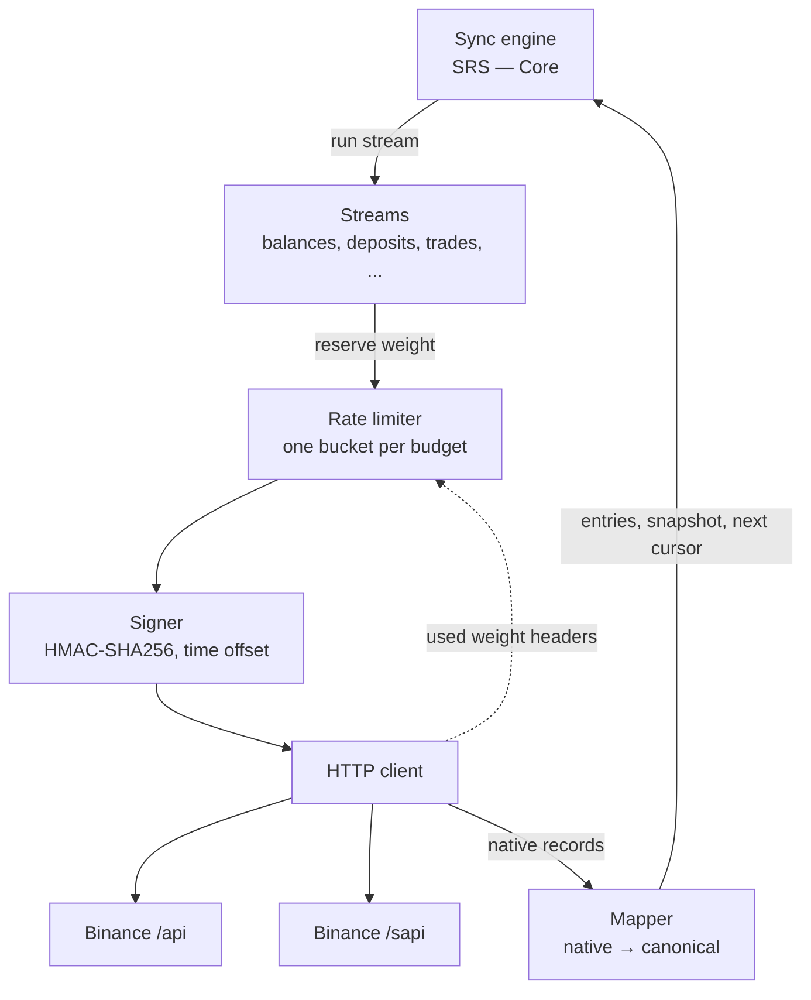
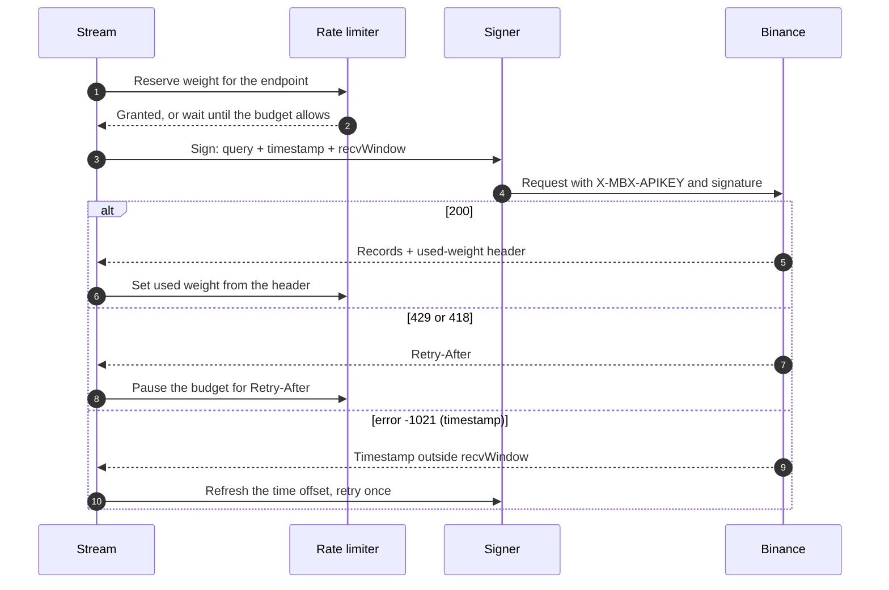
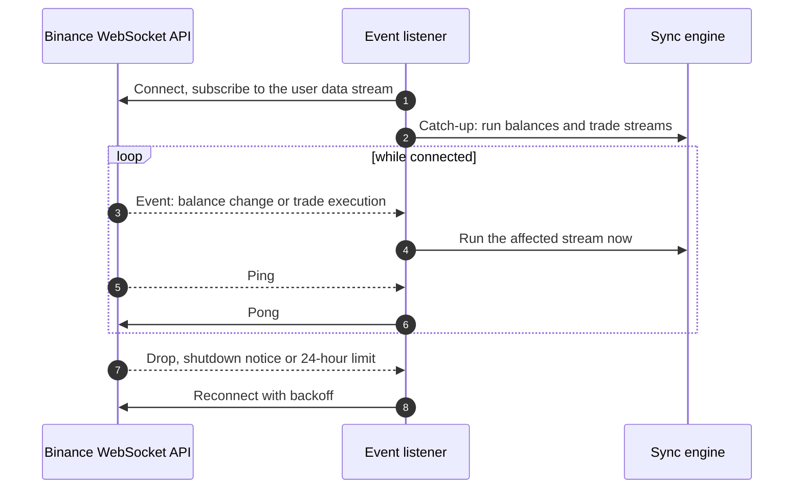

# SRS — Binance

---

## 1. Introduction

- **Purpose:** specify the Binance connector: what it calls, how it stays inside the limits, how Binance records become balances and ledger entries.
- **Scope:** key check, signing, rate limiting, balance snapshot, history streams, completeness check, test approach.
- **Milestones:** X1 (key check, balances), X2 (history, completeness check), W1 (event triggers).
- **Out of scope:** everything shared by all sources — engine, cursors, ledger schema, consumer API: [SRS — Core](core.md).
- **Parents:** [PRD — Exchange Accounts](../prd/exchange-accounts.md) (`US-2xx`, `EC-2xx`), [BRD](../brd.md) BR-2 … BR-5, [ADR](../adr/README.md) 2, 3, 5, 6, 13.
- **Version:** 1.0, 2026-10-04, approved.
- **API facts:** checked against the official Binance documentation on 2026-10-03. They are re-checked on recorded responses before each milestone.

| Term | Meaning |
|---|---|
| Weight | Cost of a request in Binance's rate limit. |
| IP budget | Weight limit counted per calling IP, shared by all connections. |
| UID budget | Weight limit counted per Binance account. |
| Wrapper asset | Code `LD` + asset in the spot wallet: a flexible Earn position shown as a balance, e.g. `LDUSDT`. |
| Final record | A record whose outcome and amounts will not change: credited deposit, completed withdrawal, executed trade. |

---

## 2. Functional Requirements

### 2.1 SRS for API

The connector exposes no API of its own. This section specifies its use of the Binance API.

#### 2.1.1 Binance connector

##### Components diagram

##### Sequence diagram

One signed request.

##### Common rules

- **Base URL:** `https://api.binance.com`. Test network: `https://testnet.binance.vision`, `/api` only.
- **WebSocket API:** `wss://ws-api.binance.com:443/ws-api/v3`. Test network: `wss://ws-api.testnet.binance.vision/ws-api/v3`. Used only for account events (UC-205). The server pings every 20 s and expects a pong within 60 s; a connection lives 24 hours.
- **Authentication:** header `X-MBX-APIKEY`; every private request is signed.
- **Signature:** HMAC-SHA256 with the API secret in X1. Binance also supports RSA and Ed25519 and recommends Ed25519 — §4, issue 1.
- **Time:** `timestamp` in milliseconds, corrected by the offset from `GET /api/v3/time`; `recvWindow` 5000 ms.
- **Amounts:** Binance returns decimal strings; they are parsed as decimals, never as floats.

##### Rate limits

| Family | Limit | Counted per | Used weight header | On excess |
|---|---|---|---|---|
| `/api/*` | One budget for all endpoints: 6000 per minute, read from `exchangeInfo.rateLimits` | IP | `X-MBX-USED-WEIGHT-1M` | `429`; continuing leads to `418`, an IP ban from 2 minutes to 3 days |
| `/sapi/*`, IP-limited | 12000 per minute, separate for each endpoint | IP | `X-SAPI-USED-IP-WEIGHT-1M` | `429` |
| `/sapi/*`, UID-limited | 180000 per minute, separate for each endpoint | Account | `X-SAPI-USED-UID-WEIGHT-1M` | `429` |

- The limiter keeps one bucket per budget: `/api` per IP, each `/sapi` endpoint per IP or per connection.
- Before a request the weight is reserved; after the response the bucket is set from the header: Binance's count wins.
- The connector uses at most `budget_share` of each limit: the IP is shared with other services.
- `429` or `418`: every request of that budget stops for `Retry-After` seconds.

#### 2.1.2 Endpoint catalogue

| Purpose | Endpoint | Weight | Paging and window | Imported when |
|---|---|---|---|---|
| Server time | `GET /api/v3/time` | 1 | — | — |
| Limits, trading pairs | `GET /api/v3/exchangeInfo` | 20 | — | — |
| Key permissions | `GET /sapi/v1/account/apiRestrictions` | 1 | — | — |
| Account ID, spot balances | `GET /api/v3/account` | 20 | — | — |
| Funding balances | `POST /sapi/v1/asset/get-funding-asset` | 1 | — | — |
| Earn flexible positions | `GET /sapi/v1/simple-earn/flexible/position` | 150 | Pages of 100 | — |
| Earn locked positions | `GET /sapi/v1/simple-earn/locked/position` | 150 | Pages of 100 | — |
| Deposits | `GET /sapi/v1/capital/deposit/hisrec` | 1 | Window < 90 days, 1000 per request | Status `1` success, `6` credited |
| Withdrawals | `GET /sapi/v1/capital/withdraw/history` | 18000, UID | Window < 90 days, 1000 per request | Status `6` completed |
| Trades | `GET /api/v3/myTrades` | 20 | One pair per request; by `fromId`, 1000 per request | Always |
| Convert | `GET /sapi/v1/convert/tradeFlow` | 3000, UID | Window ≤ 30 days, 1000 per request | Order status `SUCCESS` |
| Small-balance conversion | `GET /sapi/v1/asset/dribblet` | 1 | Last 100 records only | Always |
| Distributions | `GET /sapi/v1/asset/assetDividend` | 10 | Window ≤ 180 days, 500 per request | Always |
| Earn rewards, flexible | `GET /sapi/v1/simple-earn/flexible/history/rewardsRecord` | 150 | Window ≤ 30 days, pages of 100 | Always |
| Earn rewards, locked | `GET /sapi/v1/simple-earn/locked/history/rewardsRecord` | 150 | Window ≤ 30 days, pages of 100 | Always |
| Account events | WebSocket API: `userDataStream.subscribe.signature` | 2 | Push | Never: an event only triggers a sync |

- All of these are read endpoints. The connector contains no call that needs a trade, withdrawal or transfer permission (ADR-3).
- The test network serves only the `/api` rows. The `/sapi` rows are tested on recorded fixtures.

---

### 2.2 User Interface

N/A — no UI.

---

### 2.3 Use Case

#### 2.3.1 UC-201 Check a key (X1)

##### Sequence diagram
See §2.1.1; two requests in a row.

##### Algorithm

| # | Step | On failure |
|---|---|---|
| 1 | `apiRestrictions` with the given key | Binance rejects the key → `KEY_INVALID`, with a hint that the key may be restricted to another IP |
| 2 | Require `enableReading = true` | `KEY_INVALID` |
| 3 | Reject if any of these is `true`: `enableWithdrawals`, `enableInternalTransfer`, `permitsUniversalTransfer`, `enableSpotAndMarginTrading`, `enableMargin`, `enableFutures`, `enableVanillaOptions`, `enablePortfolioMarginTrading`, `enableFixApiTrade` | `KEY_NOT_READ_ONLY`, with the names of the enabled permissions |
| 4 | `account`: take `uid` as the account identity | `KEY_INVALID` |
| 5 | Return permissions `["READ"]`, the `uid` and `ipRestrict` | — |

##### Preconditions
- The time offset is known.

##### Trigger
`CreateConnection` (SRS — Core UC-101); the periodic key check, every `key_check_interval`.

##### Basic Flow
Steps 1–5.

##### Exception Paths

| EC | Case | Handling |
|---|---|---|
| EC-201 | The key can trade, withdraw or transfer | Step 3 |
| EC-202 | The key is restricted to another IP, or mistyped | Step 1 |
| EC-203 | The key is revoked or expires later | The periodic check fails at step 1 → connection `CREDENTIALS_INVALID` |
| EC-204 | The key gains a permission later | The periodic check fails at step 3 → connection `CREDENTIALS_INVALID` |
| EC-213 | The key is not restricted to an IP | Accepted; the audit record of the connection notes it. The key guide advises restricting the key to the sync IP |
| EC-214 | Binance adds a new permission flag | Any unknown flag that is `true` is treated as non-read: rejected |

##### Acceptance Criteria

| ID | Requirement | Parent |
|---|---|---|
| FR-201 | A key with any enabled permission other than reading must be rejected, including permissions unknown to the connector. | US-201, US-202, BR-2 |
| FR-202 | The Binance account `uid` must be the account identity of the connection. | US-201, BR-1 |
| FR-203 | The same check must run every `key_check_interval` for every active connection. | US-212, BR-2 |

##### Postconditions
- The engine knows the account identity and that the key is read-only.

#### 2.3.2 UC-202 Take a balance snapshot (X1)

##### Sequence diagram
See §2.1.1; four requests, some paged.

##### Algorithm

| # | Step | Result |
|---|---|---|
| 1 | Spot: `account`, balances with `free` or `locked` above 0 | Account type `SPOT` |
| 2 | Funding: `get-funding-asset`. `locked` = `locked` + `freeze` + `withdrawing` | Account type `FUNDING` |
| 3 | Earn flexible: all pages of `flexible/position`; `totalAmount` → `free` | Account type `EARN_FLEXIBLE` |
| 4 | Earn locked: all pages of `locked/position`; `amount` → `locked`, summed per asset | Account type `EARN_LOCKED` |
| 5 | Drop spot balances that are wrapper assets: code `LD` + an asset that has a flexible position in step 3, and that is not a real asset in `asset_aliases` | No double counting |
| 6 | Resolve native codes to canonical assets | — |
| 7 | All four sources succeeded → write one snapshot. An asset of the previous snapshot that is now 0 gets a row with zero amounts. Otherwise write nothing and report the failure | — |

##### Preconditions
- The connection is `ACTIVE` or `DEGRADED`.

##### Trigger
Stream `balances`, every 15 minutes; `TriggerSync`; connection created.

##### Basic Flow
Steps 1–7.

##### Exception Paths

| EC | Case | Handling |
|---|---|---|
| EC-208 | Unknown asset code | Kept under its native code; counted (SRS — Core EC-109) |
| EC-209 | Earn position also shown in the spot wallet | Step 5 |
| EC-211 | Binance down or under maintenance | Step 7: no snapshot; the previous one is still returned and becomes stale by age (SRS — Core §2.1.3) |
| EC-215 | One of the four sources fails | Step 7: no partial snapshot |
| EC-216 | A real asset whose code starts with `LD`, e.g. `LDO` | Step 5: kept, because it is listed in `asset_aliases` |
| EC-228 | A balance drops to zero | Step 7: a zero row, so the last non-zero value does not stay the latest one |

##### Acceptance Criteria

| ID | Requirement | Parent |
|---|---|---|
| FR-204 | A snapshot must contain spot, funding, Earn flexible and Earn locked balances, or not be written at all. | US-203, BR-3 |
| FR-205 | An Earn position must be counted once. | US-203, BR-3 |
| FR-206 | The sum per asset over all account types must equal the total shown by the exchange at snapshot time. | US-203, BR-3 |

##### Postconditions
- A new complete snapshot, or the previous snapshot unchanged.

#### 2.3.3 UC-203 Import history (X2)

##### Sequence diagram
See §2.1.1 and SRS — Core §2.1.1.

##### Streams

| Stream | Cursor | Reads |
|---|---|---|
| `deposits` | End of the last imported window | Windows below 90 days |
| `withdrawals` | End of the last imported window | Windows below 90 days |
| `trade_discovery` | Position in the list of pairs | Every listed pair once: first page of trades |
| `trades:{pair}` | Last trade ID | From `fromId` = last ID + 1; exists only for pairs with trades |
| `convert` | End of the last imported window | Windows of up to 30 days |
| `dust` | None | The last 100 records, every run |
| `distributions` | End of the last imported window | Windows of up to 180 days |
| `earn_rewards` | End of the last imported window | Windows of up to 30 days, flexible and locked |

##### Algorithm

| # | Rule |
|---|---|
| 1 | **Backfill of windowed streams:** from now backwards, window by window, down to `backfill_floor`. |
| 2 | **Incremental run of windowed streams:** from the cursor minus `finality_lookback` to now. Records that became final late are caught; known ones are skipped by the idempotency key. |
| 3 | **Trade discovery at connection start:** one pass over all pairs of `exchangeInfo`. A pair with at least one trade gets its own stream `trades:{pair}`. |
| 4 | **Trade discovery later:** pairs of a new asset as soon as a snapshot shows an asset never seen before; a full pass every `discovery_interval`. |
| 5 | **Trades of a pair:** pages by `fromId` from the cursor until a page is not full. |
| 6 | **Final records only**, by the "Imported when" column of §2.1.2. |
| 7 | **Account level:** movements between wallets of the same account — spot, funding, Earn subscription and redemption — are not imported. |

##### Mapping to ledger entries

| Stream | Entries per record | `external_id` | `occurred_at` |
|---|---|---|---|
| `deposits` | `DEPOSIT`, `IN`, leg `SINGLE` | Deposit `id` | `completeTime`, else `insertTime` |
| `withdrawals` | `WITHDRAWAL`, `OUT`, leg `SINGLE`: `amount`. `FEE`, `OUT`, leg `FEE`: `transactionFee`, same asset | Withdrawal `id` | `completeTime`, else `applyTime` |
| `trades:{pair}` | `TRADE` leg `BASE`: `qty`, `IN` for a buy, `OUT` for a sell. `TRADE` leg `QUOTE`: `quoteQty`, opposite direction. `FEE` leg `FEE`: `commission` in `commissionAsset`, `OUT`, when above 0 | `{pair}:{trade id}` | `time` |
| `convert` | `CONVERT` leg `BASE`: `fromAmount` of `fromAsset`, `OUT`. `CONVERT` leg `QUOTE`: `toAmount` of `toAsset`, `IN` | `orderId` | `createTime` |
| `dust` | Per converted asset: `CONVERT` leg `BASE`: the asset, `OUT`. `CONVERT` leg `QUOTE`: received BNB, `IN`. `FEE` leg `FEE`: service charge in BNB, `OUT` | `{transId}:{asset}` | `operateTime` |
| `distributions` | `REWARD`, `IN`, leg `SINGLE` | Record `id` | `divTime` |
| `earn_rewards` | `REWARD`, `IN`, leg `SINGLE` | Flexible: `{projectId}:{type}:{time}`. Locked: `{positionId}:{type}:{time}` | `time` |

- All legs of one record share `group_id` = stream family + `external_id`.
- The whole native record is stored in `raw` of each leg.

##### Preconditions
- The key check passed. The pair list from `exchangeInfo` is not older than one day.

##### Trigger
Stream timers, every hour; `TriggerSync`; connection created.

##### Basic Flow
Backfill to `backfill_floor` and the first discovery pass, then incremental runs.

##### Exception Paths

| EC | Case | Handling |
|---|---|---|
| EC-205 | "Rate limit exceeded" | §2.1.1 Rate limits: the budget pauses for `Retry-After` |
| EC-206 | Same record returned twice | Skipped by the idempotency key (SRS — Core EC-105) |
| EC-207 | Deposit or withdrawal still pending | Rule 6; picked up later through rule 2 |
| EC-210 | Backfill interrupted | Continues from the cursor (SRS — Core EC-106) |
| EC-212 | Trades on a delisted pair | The pair is not in `exchangeInfo`: not reachable. Known gap, visible in UC-204 |
| EC-217 | A pair with a stream disappears from `exchangeInfo` | The stream stops; its cursor is kept |
| EC-218 | More than 100 small-balance conversions | Older ones are not reachable. Known gap, visible in UC-204 |
| EC-219 | Fee paid in a third asset, e.g. BNB | The `FEE` leg carries that asset |
| EC-220 | Rejected or cancelled withdrawal | Never imported: it does not reach status `6` |
| EC-221 | Clock drift: error `-1021` | Refresh the time offset, retry once; a second failure is a normal stream failure |

##### Acceptance Criteria

| ID | Requirement | Parent |
|---|---|---|
| FR-207 | Each stream must import only final records. | US-206, BR-4 |
| FR-208 | A trade must produce a base leg, a quote leg and, when a commission exists, a fee leg, all with one `group_id`. | US-206, BR-4 |
| FR-209 | Trade history must be discovered over all listed pairs at connection start, for new assets when they appear, and fully every `discovery_interval`. | US-207, BR-4 |
| FR-210 | Windowed streams must cover the period from `backfill_floor` to now with windows inside the endpoint's maximum. | US-207, BR-4 |
| FR-211 | Incremental runs must re-read `finality_lookback` so that records finalized late are imported. | US-206, BR-4 |
| FR-212 | Movements between wallets of the same account must not be imported. | BR-4 |
| FR-213 | Used weight must be taken from the response headers; each budget must stay under `budget_share` of its limit. | US-211, BRD §9.2 |
| FR-214 | After `429` or `418` the connector must send no request of that budget before `Retry-After` has passed. | US-211, BRD §9.2 |

FR-213 and FR-214 apply from X1: the limiter exists before the first live call (SRS — Core FR-110).

##### Postconditions
- Ledger entries exist for every reachable final record; cursors are stored.

#### 2.3.4 UC-204 Check completeness (X2)

##### Sequence diagram
N/A — database only.

##### Algorithm

| # | Step |
|---|---|
| 1 | Per asset: ledger total = Σ `IN` − Σ `OUT` over all entries of the connection |
| 2 | Per asset: balance total = sum over all account types in the latest snapshot |
| 3 | Gap = balance total − ledger total |
| 4 | Expose the gaps as the metric `ledger_gap{asset}` and through the CLI. Nothing is stored: a gap is computed from the ledger and the latest snapshot |

##### Preconditions
- Backfill and the first discovery pass are finished; a fresh snapshot exists.

##### Trigger
End of the backfill; then daily.

##### Basic Flow
Steps 1–4 with every gap equal to 0.

##### Exception Paths
- A non-zero gap is not an error. It points at history the connector cannot read: delisted pairs, old small-balance conversions, operation kinds outside the scope (§4, issue 5).

##### Acceptance Criteria

| ID | Requirement | Parent |
|---|---|---|
| FR-215 | The gap between ledger and balance must be computed per asset and be visible to operations. | PRD §2.4, BR-4 |

##### Postconditions
- A current gap value per asset in the metric.

#### 2.3.5 UC-205 React to account events (W1)

##### Sequence diagram

##### Algorithm

| # | Step |
|---|---|
| 1 | For each `ACTIVE` connection open one WebSocket API connection and subscribe to the user data stream with a signed request |
| 2 | After every successful subscription: one catch-up run of `balances` and of every `trades:{pair}` stream |
| 3 | `outboundAccountPosition` or `balanceUpdate` → request a run of `balances` |
| 4 | `executionReport` that reports a trade → request a run of `trades:{pair}`; create the stream if the pair has none |
| 5 | Requests for the same stream inside `events.merge_window` become one run. Runs go through the rate limiter like scheduled ones |
| 6 | Answer every server ping with a pong |
| 7 | Reconnect on a drop, on `serverShutdown`, on `eventStreamTerminated`, and after `events.renew_after`; wait by `events.reconnect_backoff` |

##### Preconditions
- The connection is `ACTIVE`. This instance runs the sync engine.

##### Trigger
Engine start; connection created; reconnect.

##### Basic Flow
Steps 1–6, until step 7 restarts the cycle.

##### Exception Paths

| EC | Case | Handling |
|---|---|---|
| EC-222 | The WebSocket connection drops | Step 7; scheduled polling is not affected |
| EC-223 | Events arrive in a burst | Step 5: one run per stream per window |
| EC-224 | Trade on a pair that has no stream | Step 4: the stream is created at once |
| EC-225 | Binance rejects the subscription for this key type | The listener is switched off for the connection; polling only; visible in metrics and the log |
| EC-226 | Events were missed while disconnected | Step 2: catch-up run |
| EC-227 | Many connections reconnect at once after an outage | Reconnects are spread by jitter; Binance allows 300 connection attempts per 5 minutes per IP |

##### Acceptance Criteria

| ID | Requirement | Parent |
|---|---|---|
| FR-218 | An event must only start the sync of the affected stream. Nothing may be stored from an event payload. | US-215, BR-3 |
| FR-219 | After every connect and reconnect a catch-up run must be made. | US-215, BR-3 |
| FR-220 | Losing the WebSocket connection must not stop or delay scheduled sync. | US-215, BR-3 |
| FR-221 | Triggered runs must pass through the rate limiter; events for one stream inside `events.merge_window` must produce one run. | US-211, BRD §9.2 |

##### Postconditions
- Balances and trades are synced within seconds of the event; the listener is connected or reconnecting.

---

### 2.4 Data Model

#### 2.4.1 Binance connector

##### Data model schema
N/A — the connector adds no tables. It uses `connections`, `sync_cursors`, `balance_snapshots`, `snapshot_balances`, `ledger_entries` and `asset_aliases` of SRS — Core.

##### Seed data

###### Description
Rows added by the migration that introduces the source.

###### Data model

| Table | Row |
|---|---|
| `sources` | `code = binance`, `kind = EXCHANGE`, `config` with the values of §3.1 |
| `asset_aliases` | Identity rows for the assets known at release; real assets whose code starts with `LD` |

##### Cursor formats

###### Description
Content of `sync_cursors.cursor` per stream.

###### Data model

| Stream | Cursor | Example |
|---|---|---|
| Windowed streams | End of the last imported window, ms | `{"until": 1790000000000}` |
| `trades:{pair}` | Last imported trade ID | `{"last_trade_id": 3491027}` |
| `trade_discovery` | Next pair to probe and start of the pass | `{"next": "ETHUSDT", "pass_started": 1790000000000}` |
| `balances`, `dust` | Empty | `{}` |

---

### 2.5 Metrics and Alerts

#### 2.5.1 Metrics

Added to the metrics of SRS — Core §2.5.

| Service | Metric name | Value | Alert | Description | Requestor |
|---|---|---|---|---|---|
| server | `binance_used_weight{budget}` | < `budget_share` of the limit | Above 80% of the limit | Last used weight reported by Binance | US-211 |
| server | `binance_rate_limit_responses_total{code}` | 0 | Any `429`; any `418` is critical | Limit answers from Binance | US-211 |
| server | `binance_time_offset_ms` | — | Above 1000 | Local clock minus Binance clock | US-212 |
| server | `binance_trade_discovery_progress` | 0–1 | — | Share of pairs probed in the current pass | US-207 |
| server | `ledger_gap{asset}` | 0 | — | Result of UC-204 | PRD §2.4 |
| server | `binance_events_connected` | 1 per active connection | 0 for 10 min | State of the event listener | US-215 |
| server | `binance_events_reconnects_total` | — | More than 6 per hour | Reconnects of the event listener | US-215 |
| server | `sync_triggered_total{stream}` | — | — | Runs started by events | US-215 |

#### 2.5.2 Alerts
Conditions are in the Alert column above. Delivery channel: N/A — defined with the deployment.

---

### 2.6 Test Approach

| Level | Data | Covers |
|---|---|---|
| Unit | Recorded Binance responses with scrambled IDs and amounts, in `testdata/fixtures/binance/` | Mapping, paging, windows, wrapper rule, key check |
| Connector test suite | Fake HTTP server that serves the fixtures and counts weight | The behaviour every connector must show: idempotency, cursor resume, limit handling |
| Test network | `testnet.binance.vision` | Signing, time offset, `/api` limits, trades |
| Fake WebSocket server | Scripted events, drops, pings | Listener lifecycle, catch-up, merging of events (UC-205) |
| Real account | Read-only key | Balances against the exchange UI (FR-206); facts of §4 |

FR-216 and FR-217 apply from X1.

| ID | Requirement | Parent |
|---|---|---|
| FR-216 | The connector must pass the shared connector test suite on fixtures, with no network access. | US-213, BR-5 |
| FR-217 | Fixtures must contain no key, secret or real account identifier; CI must scan `testdata/` for secrets. | BRD §9.2 Security |

---

## 3. Non-functional Requirements

### 3.1 Configuration

Stored in `sources.config` of the `binance` row.

| Parameter | Default | Meaning |
|---|---|---|
| `base_url` | `https://api.binance.com` | Test network URL in development |
| `budget_share` | 0.5 | Part of each limit the connector may use |
| `recv_window_ms` | 5000 | `recvWindow` of signed requests |
| `time_sync_interval` | 1 h | Refresh of the time offset |
| `sync_interval.balances` | 15 min | Balance stream |
| `sync_interval.ledger` | 1 h | History streams |
| `finality_lookback` | 7 days | Overlap re-read by incremental runs |
| `backfill_floor` | 2017-07-01 | Earliest date of the backfill |
| `discovery_interval` | 7 days | Full trade discovery pass |
| `events.enabled` | `true` from W1 | Event listener on or off |
| `events.merge_window` | 2 s | Events for one stream inside this window start one run |
| `events.renew_after` | 23 h | Planned reconnect before the 24-hour limit |
| `events.reconnect_backoff` | 1 s, doubling, cap 5 min, with jitter | Delay between reconnect attempts |

### 3.2 General Non-functional Requirements

- **Parallel work:** streams of one connection run one after another; connections run in parallel within the shared budgets. A discovery pass yields to balance and incremental streams. One event listener runs per connection (UC-205).
- **Audit log:** key check results go to `audit_log` (SRS — Core). Raw Binance records are kept in `ledger_entries.raw`.
- **Performance:**
  - one balance snapshot costs about 320 weight plus 150 per extra Earn page;
  - a full discovery pass costs 20 per listed pair: minutes, not seconds, at half of the 6000 budget;
  - withdrawals: at most 5 requests per minute per account, half of the UID budget.
- **Security:**
  - the key and secret are decrypted only for signing and never logged; signed URLs are logged without the signature;
  - production sync runs from one static IP; the owner is advised to restrict the key to it.

---

## 4. Open Issues

| # | Issue | Proposal |
|---|---|---|
| 1 | Ed25519 keys, recommended by Binance. `userDataStream.subscribe` needs a session authenticated with an Ed25519 key. `userDataStream.subscribe.signature` is a signed request instead; the documentation does not list the key types it accepts | Verify with an HMAC key on the test network before W1. If it is refused, Ed25519 becomes a second credential type |
| 2 | Wrapper assets: is `LD` + asset the only form, and does it always mirror the flexible position | Verify on the real account at X1 |
| 3 | Withdrawal `amount`: with or without the fee | Verify on fixtures at X2 before the mapping is final |
| 4 | Overlap between distributions and Earn rewards | Verify on fixtures at X2; if they overlap, one stream is dropped |
| 5 | Operation kinds outside the scope: fiat deposits and card purchases, P2P, Pay, sub-accounts | Added when the completeness check shows they matter |
| 6 | API restrictions for the owner's region and account type | Verify on the real account at X1 |
